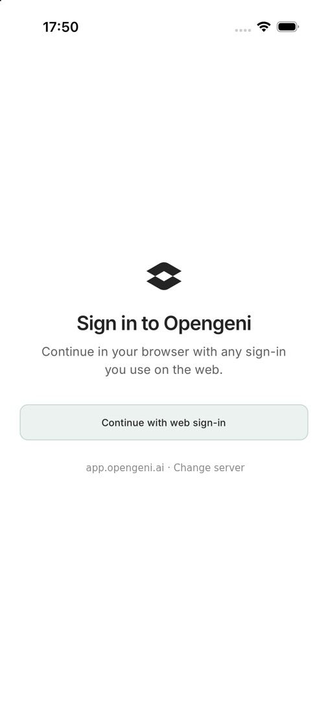
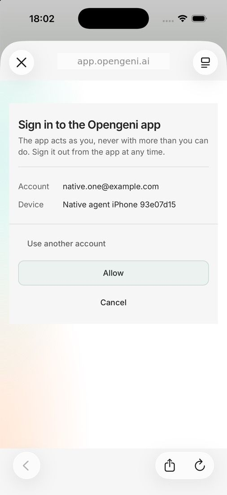
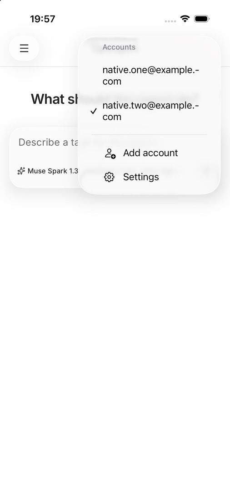
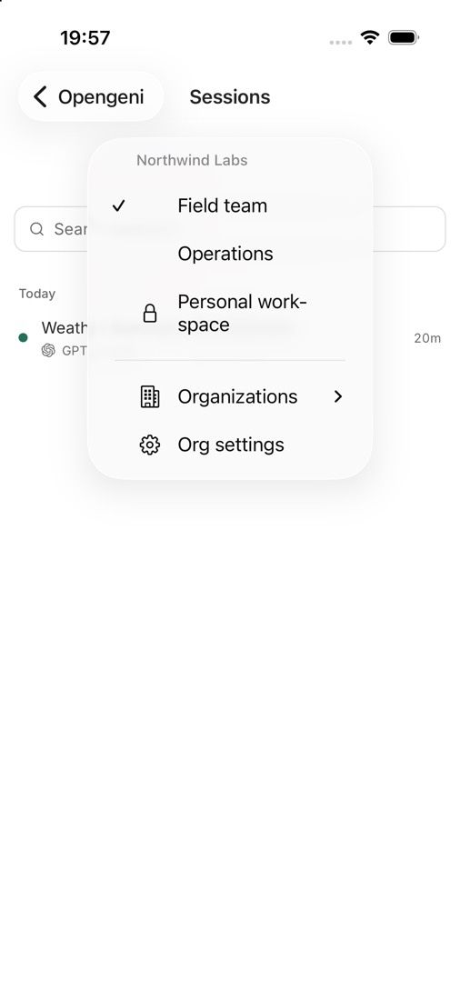
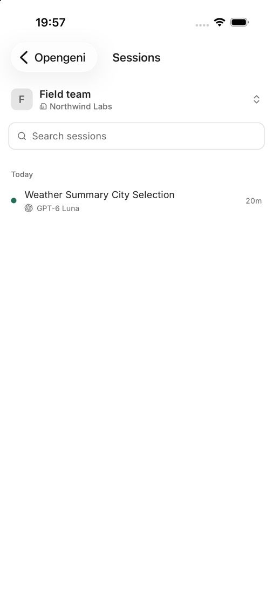
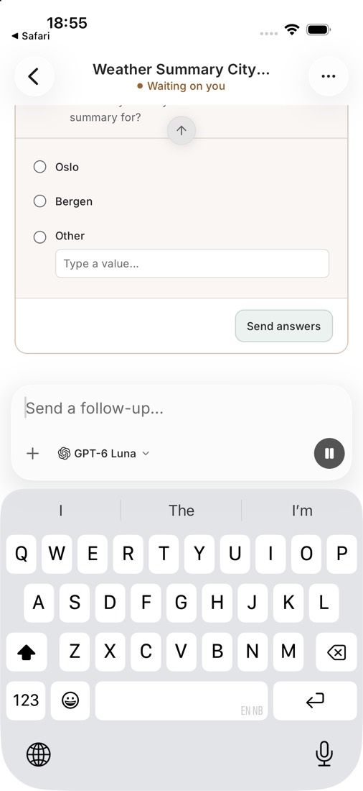
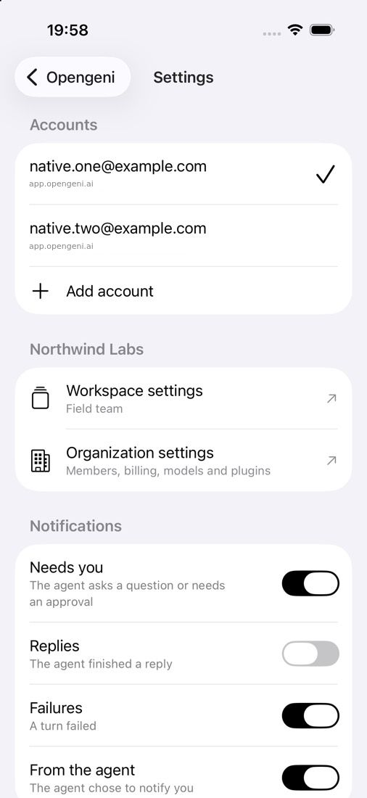
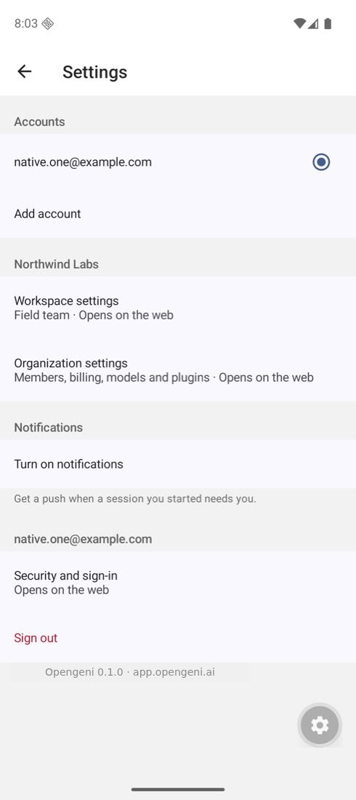
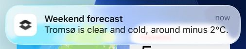
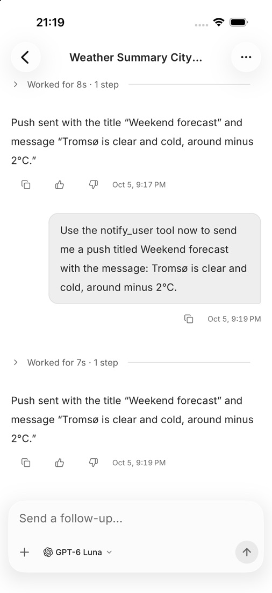

# Opengeni for iOS and Android

The Opengeni phone app: the session timeline and composer from
`@opengeni/react-native`, with native chrome for accounts, organizations,
workspaces, settings and notifications.

| Sign in | Allow the device | Accounts | Workspaces |
| --- | --- | --- | --- |
|  |  |  |  |

| Sessions | A question | Settings | Android |
| --- | --- | --- | --- |
|  |  |  |  |

| A push from the agent | Tapping it opens the session |
| --- | --- |
|  |  |

## Accounts

- **Sign in through the web.** The app opens `<server>/native-sign-in` in the
  system auth browser (ASWebAuthenticationSession / Custom Tabs). The person
  signs in with any web method and allows the device; the app redeems a
  one-time code with its PKCE verifier for its own credential
  (`Authorization: Bearer ogapp_…`). No key is built into the app.
- **Several accounts**, on one or more deployments, are kept in the platform
  keychain. Each keeps its own last workspace, drafts and session cache.
  Sign-out revokes that account's credential on the server.
- **Organizations and workspaces** use the same rules as the web rail
  (`@opengeni/react/organization-model`).
- Administration stays on the web: Settings links to workspace, organization
  and security settings.

## Composer

The new-chat and follow-up composers follow the web composer:

- **Dictation.** The mic records with expo-audio and sends the clip to the
  workspace's transcription API (`POST /v1/workspaces/:id/transcriptions`); the
  text is appended to the draft. It shows only where the deployment offers
  voice input for that workspace (`voiceInput` in the client config).
- **Attachments** from the photo library or files, through the **+** menu.
- **New-chat options** in the same menu: visibility, a GitHub repository and a
  self-hosted machine when the workspace has them, with the rest on the web.
- **Model and reasoning** from the workspace's model catalog.

The home header names the current workspace and organization; tapping it opens
the workspace switcher.

## Notifications

When a session the person started asks a question or needs an approval, a turn
fails, a reply is ready (off by default) or the agent calls `notify_user`, the
server pushes to every device that person signed in with, per their rules in
Settings. Tapping a notification opens the session in the right account and
workspace.

Server configuration:

| Variable | Purpose |
| --- | --- |
| `OPENGENI_NATIVE_APP_SCHEMES` | Callback schemes for sign-in (default `opengeni`). |
| `OPENGENI_NATIVE_APP_IDS` | Bundle IDs / package names that may register for push (default `ai.opengeni.app`). |
| `OPENGENI_APNS_KEY_ID`, `OPENGENI_APNS_TEAM_ID`, `OPENGENI_APNS_PRIVATE_KEY` | APNs token auth (.p8). The bundle ID must be an App ID with Push Notifications in that team. Development builds use the APNs sandbox. |
| `OPENGENI_FCM_SERVICE_ACCOUNT_JSON` | Firebase service account with the Cloud Messaging role. Android builds also need that project's `google-services.json`: set `OPENGENI_GOOGLE_SERVICES_FILE` to its path when building. |

## Run it

```sh
cd apps/mobile
bun install
bunx expo prebuild --platform ios   # or android
bunx expo run:ios                   # builds the development client
bunx expo start --dev-client
```

The app signs in to `https://app.opengeni.ai` by default. Point a development
build at another deployment with `EXPO_PUBLIC_OPENGENI_URL`, or choose
**Change server** on the sign-in screen. A deployment must allow its web
origin to reach `/v1` on the same origin, as it does in production.