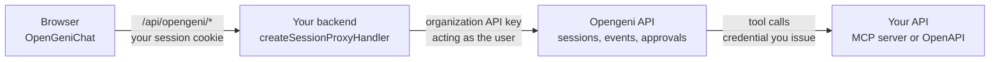

Your product keeps its users, tenants, data, and pages. Opengeni runs the agent sessions. They meet at one backend route and at the tools you expose.

1. The browser talks to your own origin at `/api/opengeni`.
2. Your proxy checks your session and forwards the request to Opengeni as that user.
3. Opengeni runs the agent, which calls your API through the tools you gave it.

The API key stays on your server.

## Mapping your product onto Opengeni

| Your product                   | Opengeni                          | Created                                 |
| ------------------------------ | --------------------------------- | --------------------------------------- |
| Your company                   | Organization                      | At sign-up                              |
| A customer, team, or tenant    | Workspace                         | Automatically, on first use             |
| A signed-in user               | Workspace member                  | Automatically, on their first request   |
| A chat, ticket, or task thread | Session                           | When the user or your server starts one |
| Your API                       | MCP server or OpenAPI Integration | By you, selected per session in `tools` |

What your proxy's `resolve` returns picks the workspace: one per tenant, one per user, or one you name. See [Users, tenants & privacy](/integrate/users-and-tenants).

## Who does what

| Your product                         | Opengeni                                  |
| ------------------------------------ | ----------------------------------------- |
| Authenticates users                  | Checks workspace membership on every call |
| Says who the user and tenant are     | Stores sessions, events, and files        |
| Picks tools, skills, and model       | Runs turns and streams events             |
| Authorizes tool calls on its own API | Pauses for approvals and questions        |
| Places the conversation in its UI    | Renders it through `@opengeni/react`      |

<Tip>Using a coding agent? The [opengeni-client skill](/reference/for-ai-agents) covers this.</Tip>
