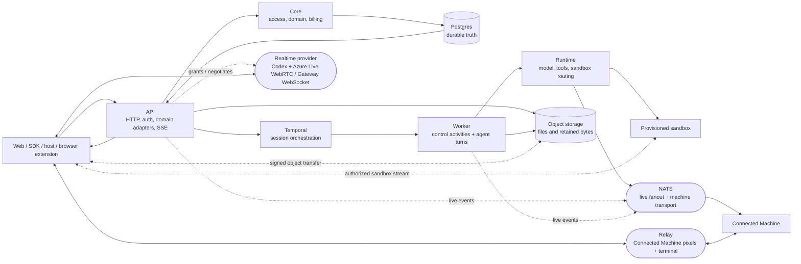
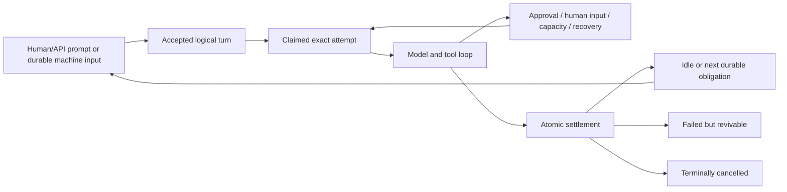

# Opengeni architecture reference

> Setup: [`../AGENTS.md`](../AGENTS.md). Documentation index: [`README.md`](README.md).

## Navigation

Overview: §2–4/§6; subsystems: §13; updates: §14.

---

Keys/coupons: [providers](model-providers.md), [billing](deployment.md).

## 1. Startup

Preflight: `scripts/run-development-stack.ts`; ownership: `scripts/dev-stack-lock.ts`; readiness: `scripts/dev-stack.sh`.

---

## 2. Opengeni

External users require live membership/`asUser()`; an organization key holding
`members:manage` creates a missing shared-workspace membership on the user's first
request (`provisionExternalMemberOnFirstUse` in `packages/core/src/access`, never
changing an existing one; SDK per-user workspaces stay single-user). Visibility differs from `agentAccess`;
Personal Knowledge follows the verified active-turn user. Links never merge users.
[Product integration](product-integration.md),
[embedding authority](embedding-authority-internals.md),
[Skills](skills-lifecycle.md), [run lifecycle](run-lifecycle.md).
Skill removal deletes scoped heads/revisions with exact approval/Learning
enforcement, preserving context.
Embedded workers can supply an attempt-owned Skill catalog through
`PreparedAgentTools.skillCatalog` before the worker freezes its durable history
snapshot. The same prepared tools own the reader; a conflicting frozen snapshot
is refused before agent construction. Host descriptors can carry immutable
`modelSourceRefs`; the worker persists these outside the visible catalog in its
history source basis, including an exact check on frozen retries. Skill tool
results carry the same origins before spill. Copied and compacted descendants
retain those references. Native validation names exact Cendra Skill origins as
`HOST_AUTHORITY_REQUIRED`, never native permission; the host checks current
availability before dispatch. Legacy native Skill catalogs/results without
origins remain visible as historical transcripts but refuse a complete source
receipt. See [embedding](embedding.md).

`mcpApprovalPolicies` requires session-control authority. Frozen policies
retain catalog floors, granting no capabilities/credentials.

[Account binding](remote-mcp-credentials.md).

[`resolveTurnToolPolicy`](../packages/core/src/domain/session-tool-policy.ts)
owns turn refs: ordinary work uses session policy; scheduled work retains frozen
selection. Credential-provider targeting/MCP preparation consume these refs,
never omitted-tools queue arrays. Connection-backed MCPs use native authentication, including historical work.
Signed callbacks retain accepted initiators; children inherit bounded lineage.
Continuations freeze causal-turn provenance at claim; renewals preserve snapshots
and service principals. See
[`workspace-integrations.md`](workspace-integrations.md).

---

## 3. Core invariants

Hosted tool-call `status` survives replay; other annotations are stripped
(`packages/codex/src/hosted-call-status.ts`).

### 3.1 Postgres is durable truth; NATS is transport

Every new worker model request has an immutable native source receipt committed
before provider dispatch. Its exact `sourceKey` binds ordered input digests,
durable history owners and copy/import/summary ancestry; raw tool results retain
source references before projection or spill. A missing owner, unavailable input
or exceeded cap cannot be recorded as complete. Native completeness describes
input graph coverage, never a host's Knowledge authorization or business outcome.
An exact session-authorized API/SDK read returns one call's receipt; it does not
substitute a latest attempt snapshot. Historical facts remain unattributed. Receipt ancestry is memoized only inside
one fenced persistence transaction: successful walks share a dependency graph,
index leaf references and replay only replaced node writes. Cycle/depth limits
and purpose checks remain in force. Before insertion, authenticated history
content and source bases are rechecked under retained row locks; receipt parents
are retained through their exact attempt foreign keys and receipts are revalidated.
Every later request resolves durable owners again. Worker preparation spans separately measure
`model_source_receipt_persistence` and `model_source_authorization`.

Embedded workers may install the public `activityDependencies.authorizeModelCallSource`
callback. The shared native producer awaits it after committing the exact receipt
and before every AGENT, COMPACTION or TITLE provider call; rejection or cancellation
prevents dispatch. Its exact-source callback is rechecked at each literal
transport attempt, including SDK HTTP retries, inside a per-request async scope.
The hook receives the stored call identity and cancellation
signal, never a latest-attempt snapshot, and owns no native business rules. A host
that requires admission installs the callback in trusted process composition.
Hosts may attach typed `initialMessageModelSourceRefs` on session creation and
`messageModelSourceRefs` on Send/Steer. These identities cover the accepted message
and its model context; native admission freezes them in the event/turn and first
history row before inference. Attributed keyed retries must preserve the exact
content and ordered references. Queue editing retains the hidden context's origins.
References are evidence only: the same current host source admission remains
mandatory, including inherited history; they grant no authority by themselves.

Local MCP registrations may derive `modelSourceRefs` from the exact raw result
and host execution context; the runtime awaits these before projection/spill and
source emission. The exact `nativeModelSourceKey` is set after caller transport
metadata, which cannot replace it or synthesize an absent key.

Model-generated history persists a `HISTORY_ROW` basis with its exact producing
AGENT call receipt as parent. The history writer resolves that receipt under the
current attempt/generation fence; provider JSON carries no source authority.
Streaming SDK projections restore only exact outputs from the live capture
registry and refuse ambiguous matches. Selective copies/imports retain receipt
ancestry, so retained Skill and Knowledge sources reach the current host validator.
Lazy native search and generic dispatch use that same model-call capture owner:
input bindings are restored before historical dispatch projection, the receipt
covers the exact post-hide request, and transformed response items retain that
call's producer. Restored generic-dispatch names and arguments are registered
as exact output projections, with their own content digest and the same producer;
unrecognized or changed input cannot acquire an origin by recalculating a digest.
Literal provider attempts, including retries, recheck the same
source before bytes; lazy tool disclosure never bypasses source admission.
Native client tool-search schema disclosure is a `TOOL_RESULT` from the existing
native catalog owner, not model-authored output. The exact selected declarations
and producing search call bind only their installed SDK envelope projections;
changed schemas, unowned calls and unsupported namespaces refuse attribution.
The durable search result retains its raw-result identity and traverses the exact
producing AGENT receipt, including current host sources, even when retained alone.
Legacy generated rows with source-aware calls or earlier Skill use but no producer
basis remain readable as transcripts and are refused as model context.

Postgres commits precede notifications. NATS carries fanout, invalidations,
request/reply and machine streams, never commit evidence.

`session_event_cursors` transactionally verifies appends/monotonic sequencing/public
`lastSequence`; `sessions.last_sequence` is compatibility-only. Semantic writers
lock sessions for atomic state/events. Exact-attempt raw batches fence attempts,
hold session `FOR KEY SHARE`, serialize cursors, never update sessions. Legacy
SQL rebases at the DB boundary; late raw events roll back/retry semantic admission
before rejected audit persistence.

Unread/tree attention use `packages/db/src/session-meaningful-events.ts`'s indexed
non-bookkeeping frontier. Claimed lifecycle/exact parent reads acknowledge only
the frozen human's direct-child content. Finals cover earlier activity, not newer
answers; filtered reads cannot skip unseen content. Manual unread survives replay
until newer consumed activity or explicit mark-read.
[Bounded reads/reconciliation](session-monitoring-mcp.md).

SSE replays/backfills Postgres and subscribes to fanout. Reads byte-bound prefixes
before transfer; oversized events travel intact/alone. Short pages never prove
EOF. NATS restarts affect delivery/reachability, never history/queued obligations.

Raw-isolation rollback:
`OPENGENI_SESSION_EVENT_RAW_LANE_ENABLED=false` keeps cursor allocation and
validation active while restoring wide-session locking and compatibility writes.

Task-tree [locking invariants](run-lifecycle.md).

Heartbeats refresh desktop availability without reconnecting or granting consent;
see `docs/connected-machines.md`.

Control revisions increase.

Canonical: `packages/events/src/index.ts`, `apps/api/src/http/sse.ts`,
`packages/sdk/src/stream.ts`, [`run-lifecycle.md`](run-lifecycle.md).

### 3.2 Temporal coordinates; streams stay outside workflow history

Temporal coordinates; activities read Postgres obligations, not signals.
Conversation/goals/queues/usage/provider/tool transcripts never enter workflow history.

Canonical: `apps/worker/src/workflows/session.ts`,
[`run-lifecycle.md`](run-lifecycle.md).

Stalled finalization requests host-owned graceful shutdown: peers checkpoint
before the shutdown ceiling contains stuck writers. Cleanup can consume exact,
independently committed retained-process terminal proof, never manufacture
quiescence or replay unknown commands.

Unavailable control reads/owned attempts retain bounded, interruptible waits,
not idle/settlement, writer revocation or successor dispatch. Temporal metadata
never proves writer quiescence.
Settled-owner recovery re-inspects original dispatch and atomically closes
only the exact current owner under control and physical/inference writer fences,
committing quiescence receipt, same-turn recovery and durable wake.

Idle [omits grace](run-lifecycle.md), retaining durable fences.

### 3.3 Logical turns and physical attempts are different

**Turns** are accepted work; replaceable **attempts** append ordered,
exactly-once atomic history batches.

`wait_for_input` settles tool-batch execution, preserving trusted authority and
immutable same-turn deadlines. Command results wake only explicit waits; notices
never block inbox input. Ordinary same-human agent messages and lifecycle results use the receiving
chat's last started request context, so different sender account selections do not
split a batch or replace credentials. Restricted/foreign requests and Steer retain
their explicit authority. Each update keeps its own lineage. [Details](run-lifecycle.md).

Agent-created sessions inherit omitted model/reasoning from the calling turn;
latency defaults to `standard`.

`runAgentTurn` is non-retryable and attempt-fenced: retry settlement, never
unknown effects ([fences and recovery](run-lifecycle.md)).
Structured PostgreSQL outages escape executing activities into the existing
exact-attempt DB-only recovery lane, not terminal turn failure or old-attempt
tool replay; physical/inference settlement gates remain independent.
Replay: [notices/catalogs](run-lifecycle.md),
[compaction](context-compaction.md). `packages/runtime/src/prepared-compaction-request.ts`
shares prepared prefixes with both Responses compaction modes; Chat retains
its transcript adapter. Both modes retain recent system-role input batches
within existing budgets, preserving chronological accepted goal snapshots.

Failed-session retry (`packages/db/src/session-retry.ts`) fences failure identity,
reserves actor-scoped receipts, rejects unresolved execution/safety refusals,
and re-enables original turn/history/authority/selected model policy—not
Pause/Resume, prompt admission or synthetic input.

Active-run writes require exact attempt/generation; stale workers cannot write
or settle replacements. Temporal cancellation is intent, not quiescence;
unresolved writers fence capture, rotation and physical settlement.
Exact committed workspace-mutation settlement carries a physical receipt when
mutable authority rejects output. This remains non-replayable; missing or
contradictory admissions, failed commits, caller-owned savepoints, and partial
batches retain the uncertainty fence. See [run-lifecycle.md](run-lifecycle.md).
Legacy Modal exec observations on lease-lost attempts allow same-machine
inference only under exact actor/turn/generation checks; agents inspect before
replay. Finalization stages carry heartbeat/metric evidence
(`agent-turn/finalization-monitor.ts`).

Recoverable shutdown transactionally creates a Postgres workflow wake that
stays unacknowledged until closed-attempt quiescence, so close/exit races cannot
orphan recovery.

A command stays attempt-owned until durable exact-provider-identity adoption.
The reaper recovers missed adoption for closed legacy Modal commands under its
exact claim. Original identity, output and unknown outcome remain intact;
the durable wake permits later inference without replay or invented exit.
Turn completion/Steer then detach; command cancellation, Pause and terminal
Cancel govern lifetime. Instance stop/revocation/replacement marks Connected
Machine tracking `lost`, never process death; temporary outages preserve it.
Reconciliation batches a fixed due-time frontier, sharing per-instance offline
observations. Historical retirement retains records without input/wakes.
Terminal proof atomically commits settlement/audit. Unobserved nonterminal
sessions receive fallback input. Terminal reads suppress pending notifications,
not history; running reads suppress neither. Failed/cancelled sessions retain
audit only. Replaceable fanout follows commit. Separate conversation history
uses sequence cursors; `packages/db/src/session-event-slices.ts` transfers bounded
message-scalar slices, never whole histories. Full-history Find
(`packages/db/src/session-message-search.ts`) coalesces authorized scalar windows
into bounded snippets/cursors, not histories. See
[`session-message-search.md`](session-message-search.md).

Docker/local SDK processes expose bounded-wait, turn-scoped handles, stay
cancellation-fenced and stop before finalization; agents can test preview
servers without awaiting exit.

Internal filesystem completion is owned by
`packages/runtime/src/sandbox/synchronous-command.ts`: one invocation,
complete separate-stream pages and provider terminal/EOF proof. SDK-native
collection in `sandbox/native-synchronous-collection.ts` begins before Start,
on the original process streams, rather than parsing bounded shell presentation.
Provider adapters own trusted page identities and cursors; routing captures
those pages before acknowledging or settling the original process. Physical
exit can settle process custody without proving complete output, but cannot
authorize a successful filesystem result. Channel A and routing
keep this separate from interactive/background shell execution; the worker
reuses its turn cancellation registration for Skill filesystem commands.

Registered Daytona clients bind the same authenticated native sandbox before
filesystem dispatch (`sandbox/providers/daytona-command-binding.ts`). Framed
native sessions preserve exact stream bytes and require original-command exit
plus both stream EOFs; lossy native log projections are not completion proof.
Routing awaits retryable namespace cleanup only after durable output settlement.
Session deletion or absence cannot prove cancellation or output completeness.

OpenSandbox's `sandbox/providers/opensandbox-command-stream.ts` validates the
original SSE/NDJSON frames before SDK projection and records invocation-local
dispatch evidence at the bound transport. The adapter pins the first execution
identity and launch client. Its control-only observer can reconcile physical
exit after output loss without reading or acknowledging retained output.
Attempted dispatch without an authenticated execution identity remains unknown
and joined; absent headers, ambiguous HTTP errors or a missing ID cannot create
terminal proof. Only a genuinely bound, unchanged default SDK command path that
failed before command transport grants local non-dispatch proof.

`wait_for_input` retains its turn/deadline until input/timeout; acknowledgment
cannot strand eligible input/due waits. `Session.inputWait` drives working/recheck
UI, not unread. `session_wait`/`command_wait` read in-turn; child results carry
final answers. See
[durable-agent-inputs.md](durable-agent-inputs.md).

Canonical: `apps/worker/src/activities/agent-turn/`,
`apps/worker/src/activities/session-state.ts`, and
[`run-lifecycle.md`](run-lifecycle.md).

### 3.4 Long runs are bounded by policy and intent, not arbitrary loop caps

Duration never proves stalled progress. Budget admission, provider capacity,
Pause/Cancel, goals and host policy govern; recovery preserves logical work.
Postgres owns continuations, not Temporal. Goal edits apply unless review
applies; human-owned constraints remain. Goals never live in
`Agent.instructions` or solely workflow memory. Generic caps cannot replace
lifecycle fixes.

Empty finals after goal completion get one handoff, then a typed notice.
See [run lifecycle](run-lifecycle.md).

Non-transient preclaim rejection parks accepted work behind a durable admission
block. Resume/Send/Steer rechecks without granting authority; operational outages
retain backoff.

Canonical: [`goals.md`](goals.md) and [`run-lifecycle.md`](run-lifecycle.md).

Reports default to chat; large ones use native documents (Documents Skill).
Goal/artifact domains validate requirements/inspection proof.
See [`goals.md`](goals.md).

### 3.5 Each durable store has one job

| Store | Owns | Must not become |
| --- | --- | --- |
| `session_history_items` | Model conversation truth preserving protocol | Audit projections/mutable UI caches |
| `session_pending_tool_calls` | In-flight call/result receipts and resumable open suffix | Conversation history |
| `agent_run_states` | Control snapshots/open-suffix sentinel | Model memory |
| `session_events` | Append-only human/audit timeline, SSE replay | Model input |
| `session_system_updates` | Durable machine inputs: child results/schedules | Synthetic human messages |
| `session_goals` | Standing objective/continuation obligation | Workflow-local state |
| Sandbox leases/envelopes | Provider identity/routing/recovery/workspace-generation truth | Conversation state |
| Knowledge/instructions/Skills/organization identity | Scoped retrieval/governance authorities and lifecycle | Conversation history/temporary task notes |

The wake reaper repairs already-pending authentic terminal results for idle
goalless parents through bounded identity-only discovery and scoped, fenced
queue/wake registration. It never replays child work; see
[durable inputs](durable-agent-inputs.md).

[Archived imports](../packages/core/src/application/archived-session-imports.ts)
use server-only `@opengeni/sdk/session-history-import` for idempotent
`session_events`, never model history/turns/active goals/wakes. Lifecycle seams
establish `asUser` ownership/visibility; upload files first. Imports refuse rolling
deployments. React's projection remains unchanged; `SessionConversation` hides
execution controls. [Product integration](product-integration.md).

[Chat delivery](run-lifecycle.md): lossless content, windowed history.

Knowledge revisions/evidence/receipts live in Postgres; originals in object storage.
Access precedes ranking. Attachments remain conversation resources; agents select
lasting findings/references. Discovery excludes supporting evidence; read-only save
preparation fetches collections and published/pending matches. See [`knowledge.md`](knowledge.md).

Unconditional CORE routes persistent behavior to instructions or Skills, not
Knowledge, preserving destination scope and review; see
[`company-brain-write-routing.md`](company-brain-write-routing.md).

Agent learning governs Knowledge/instructions/Skills: Automatic, Review first,
Off; sparse chat/task overrides and accepted-turn policies freeze.
The worker renders the frozen effective modes and Knowledge destination in the
governance prompt, without attempt IDs or human identifiers. Useful retention is
ordinary work under that policy, including newly created Slack sessions; Slack
source text remains evidence rather than instruction or authorization authority.
Review first stages inactive changes without pausing. Pending reads support reuse/correction,
never authority; ordinary reads are published-only. Instructions/Skills retain
native authority. Instruction edits append to exact baselines or update/remove
unique exact-text anchors; full replacement requires explicit intent. Active-head
CAS and budgets apply. Retired writers remain audit/compatibility evidence. See
[`knowledge.md`](knowledge.md).

Organization identity has a separate organization-owner autonomy policy: Off rejects
agent-authored changes before proposal creation, Review first (`suggest`) binds human
confirmation, and Automatic activates eligible proposals without another
prompt. Every mode requires an exact live turn from the active organization
owner and the company-profile compare-and-swap lifecycle; workspace Learning
mode and admin authority cannot widen this scope. The web app shows it as an
owner-only row on Settings > Agent learning, in the same Off / Review first /
Automatic words as the workspace modes, while each store stays separate.

Accepted conversation and tool content stays intact at its canonical boundary;
Opengeni does not rewrite arbitrary credential-like text. Configured secrets
are encrypted at rest and exposed only through explicit permissioned
operations with metadata-only audit.

Generated media and editable artifacts are durable workspace artifacts, not
conversation blobs. Active image history resolves authorized references, including
compaction input. History preserves JSON key order; JSONB serves queries.
Opt-in `asImage` refs use that same authorized image projector. Temporary image
uploads bind a preallocated file/session to the actual uploader in the existing
signed-upload audit. Image-only session creation requires isolated tool-less
scope with the exact evidence-assessor role, an explicit null rig, no variable sets or sandbox, and no ongoing goal;
its validated output bound is immutable session metadata. Admitted assessor
image turns select no tenant-authored rules, preferences or memory, and record
no Company Brain material-selection receipt. Current authority and model-policy
checks remain mandatory, and the actual SDK agent exposes no tools. No image bytes
or filenames enter durable history. Text-only wires emit the canonical omission
marker; image-capable wires fail closed on unavailable pixels. Images bypass
sandbox materialization. The uploader's DELETE revokes reads before object
cleanup and atomically fences pending upload finalization. Temporary input is
excluded from ordinary file listing, downloads and attachment admission; only
the current uploader/session image path reads it. Signed PUT lifetime is bounded
to 30 seconds. Deletion acknowledges only that delete attempt; it never records
permanent purge from URL expiry. A PUT started before expiry may finish later.
Revoked uploads stay with the existing recurring cleanup_pending owner until an
actual provider completion/cancellation boundary is established. The installed
reaper can retry deletion without another assessor run; recurring selection
orders by last claim time so later keys and ordinary expired uploads are not
starved. Unsettled cleanup is
recovered from audit facts, terminal turns and expired leases. Sources: `packages/core/src/domain/sessions.ts`,
`apps/api/src/routes/files.ts`, `packages/db/src/index.ts`,
`apps/worker/src/activities/run-input.ts`, and
`apps/worker/src/activities/agent-turn/{file-resources,agent-build}.ts`.

Canonical: [`run-lifecycle.md`](run-lifecycle.md),
[`hierarchical-memory.md`](hierarchical-memory.md),
[`scoped-knowledge.md`](scoped-knowledge.md),
[`company-brain-write-routing.md`](company-brain-write-routing.md), and
[`artifact-engine.md`](artifact-engine.md).

### 3.6 Tenancy and authority are established before resource access

Workspace operations require API-resolved authenticated access contexts and grants
before data access. Transaction-local Postgres FORCE RLS adds defense-in-depth;
resource UUIDs grant nothing.

The unused private Modal worker-host proof transport
(`packages/core/src/application/modal-native-worker-host-transport.ts`) has a
separate prefix, version, purpose and HMAC subkey/message domain. It accepts only
the explicitly configured deployment delegation root, never ordinary delegated
tokens or the access-key/local fallback. A verified request MAC is transport
correlation, not a resolved workspace grant, initiating-human authorization,
native response, current custody claim, physical settlement or effect permit.
No host entry, provider caller or durable recovery is activated by this helper.
See [Modal recovery assurance](design/modal-recovery-assurance-2026-10-02.md).

`modal-native-original-configuration.ts` is likewise unused private groundwork.
It samples explicit deployment settings once, pins the direct read/TLS policy,
and derives a separately domain-bound private equality commitment. Its draft
and opaque sample are configuration data, not host/grant/capture authority.
Tokens and keys never enter the draft; keyed equality must remain protected.

`modal-native-live-declaration-join.ts` is an unused private request/data join,
not the canonical claimed-worker issuer or a native context. It owns the exact
bytes before MAC verification/parsing, joins the accepted LIVE origin, frozen
human, Temporal tuple and unchanged recovery count, then rechecks current
transport expiry and deployment configuration after blocking DB locks. Its
immutable output must remain request-local and be consumed in that transaction.
Protected cold/config/grant insertion and actual worker provenance are still
required; this helper creates no permission to observe, dispatch or publish.

Organization/workspace membership, API keys, delegated grants, private-session
ownership and personal-resource grants remain distinct. Organization keys with
`workspace:admin` may change private-session product settings; DB fences recheck
live keys, including replay. This grants no private-content access.
Only-me chats are on by default for every organization (migration 0611); no
per-organization activation receipt or deployment switch gates them.
Sharing advances viewer-access epoch while preserving accepted execution and
connection selections. Privatization/revocation advance the execution-epoch floor;
privatization requires quiescence and clears staged personal selections.
Neither rewrites receipts. Session creation, UI identity, workers, connection rows
and provenance never imply human authority. Turns freeze initiating principals
and execution/recovery authority snapshots.

An effective first-party permission ceiling of `[]` remains zero delegated
Opengeni authority. Runtime skips only remote OpenGeni-delegated MCP preparation,
never pads a grant or signs an empty token; external-host, host-local,
connection-backed and already-authorized native paths keep their own authority.
See [automation defaults](automations.md#empty-first-party-authority).

Organization settings owns the cross-workspace roster and roles. A managed
browser administrator is the ordinary authority. Single-user local deployments
also admit only the access resolver's canonical `opengeni:local/default` + `dev`
browser context to organization metadata, shared-workspace, retention,
company-identity, and organization Codex controls. Provenance, not subject name,
governs; configured, delegated, API-key, service, and agent principals are excluded.
A shared-workspace creator gets an explicit named workspace-admin grant;
organization authority alone grants no operational access. Owners and
organization administrators may open `/workspaces/:workspaceId/settings` in
restricted mode for shared workspaces they cannot otherwise enter. It exposes
identity, direct access, and deletion only, never the workspace provider or
sessions, files, credentials, integrations, or other content. A shared workspace's
Members page is narrower: `members:manage` may add an already-active
same-organization human and change or revoke access only there. Personal or
cross-organization targets, self-demotion, and removing the final administrator
fail closed. Candidate inventory shows only active same-organization humans
lacking access, not their other workspace grants.

Managed browser login slots are explicit session-set actors, not tenant hints.
Organization recovery custody is a separate quorum and actor-fenced authority;
ordinary organization administration cannot transfer immutable workspace
ownership or bypass recovery settlement.

Personal connections and resources require the exact human authority that made
them executable. Workspace-owned credentials remain workspace-scoped and are
revalidated at use. An embedding host may narrow access through an explicit
port; it cannot grant access that Opengeni denied.

The managed personal-workspace owner receives a closed permission projection
that includes live viewing and handoff (`stream:view`, `stream:control`,
`stream:acknowledge`, `terminal:attach`, and `files:write`) within their own
workspace, and `capabilities:manage`, so they can configure their own Plugins,
Integrations, and Codex subscription without receiving the `workspace:admin`
wildcard, member management, or API-key delegation.
`requireWorkspaceSettingsGrant` in the access resolver separately admits the
verified managed-cookie owner for Personal workspace preferences, model
configuration, runtime pause/resume, and instruction/Skill autonomy. It checks
the current active Personal pointer and returns the original closed grant;
organization authority or a delegated owner-shaped token cannot use this
exception. Membership, API-key management, and workspace deletion retain their
existing authorization boundaries.

An already-onboarded verified managed human may create additional independent
organizations from the organization switcher. The login and canonical human
identity remain global; each organization gets a separate owner membership and
Personal workspace. The creation lifecycle also creates one first shared
workspace with an explicit administrator grant, refreshes authoritative access
before navigation, and copies no tenant data from the current organization. A
subject-scoped database fence limits this self-service lifecycle to ten
additional organizations per human; invitation memberships do not consume it.
First-sign-in onboarding and invitation precedence remain a separate one-shot
path.

Canonical: `packages/core/src/access/index.ts`,
`packages/core/src/session-authorization.ts`, `packages/db/src/runtime-posture.ts`,
[`organization-tenancy.md`](organization-tenancy.md),
[`organization-recovery.md`](organization-recovery.md),
[`browser-login-session-sets.md`](browser-login-session-sets.md),
[`agent-session-authority.md`](agent-session-authority.md), and
[`credentials.md`](credentials.md).

### 3.7 Contracts and configuration are code-owned

`@opengeni/contracts` owns cross-boundary schemas, enums, permissions, event shapes,
capability descriptors, and token envelopes; `@opengeni/config` owns settings
parsing, defaults, validation, and derived runtime configuration.

Catalog membership, selectability, and cost have separate authorities. Deployment
membership uses `code` or an operator-owned database singleton; workspace policy,
connection readiness/permissions, organization assignments, and provider health
determine selectability; `/v1/config/client` and session create share one
resolver. Deployment cost policy sets `free`/`credits` independently
of upstream settlement. Workspace Gateway, OpenRouter, Opper, Anthropic API, and
Claude subscription rows are provider-qualified overlays, separate from deployment
catalog/billing. `openrouter/*` and `workspace-openrouter/*` (likewise `opper/*`,
`workspace-opper/*`, `organization-opper/*`) retain distinct provider/billing
identities for identical slugs. Claude setup:
`apps/api/src/routes/workspace-model-providers.ts`; transport:
`packages/runtime/src/anthropic-messages.ts`.
Claude request-byte and independent image bounds live in
`packages/runtime/src/anthropic-request-size.ts`; exact checkpoint-prefix fitting
is in `packages/runtime/src/anthropic-compaction.ts`. The worker claims a fenced,
durable one-per-turn byte-recovery allowance before summarizing a prefix and
preserving its complete suffix. See [context compaction](context-compaction.md).
Workspace `modelCompactionThresholds` preferences resolve through
`workspaceModelCompactionPolicy` in config at model preparation. The API catalog
and Models → Context & compaction page expose the same default/override/effective
values without changing immutable model definitions or frozen compaction modes.
Per-model PATCH/reset is atomic in the workspace settings store; request-byte
guards remain independent of the token preference.
The shared `claudeNativeModelProfile` in `packages/config/src/index.ts` owns
native model effort vocabularies, defaults, context windows and output ceilings;
both catalog projection and request shaping consume it.
Accepted turns freeze provider identity, not cost; drain/fence before changing
`free`/`credits`. Database `codexModels` changes membership, not credentials;
retirement preserves exact accepted execution.
Accepted execution-policy digests tolerate only provably additive latency-mode
and input-modality declarations, retaining the frozen mode and request tier;
provider identity and all other executable fields remain exact.
`packages/core/src/codex-model-availability.ts` requires exact live support on every
permitted serving account for browser/default/agent choices. It rechecks authority,
refreshes tokens, and caches support by workspace/credential/revision.

Claude projects system inputs at native phase boundaries, adding a labeled
machine-continuation anchor when needed, without changing canonical roles/content.
`anthropic-request-error.ts` provides bounded durable diagnostics; transport
exception text stays structural.

Model admission overlaps pooled metadata, preserving authority;
transaction handles stay serial. Enums remain additive within major releases;
parity tests pin mirrors.

Canonical: `packages/contracts/src/index.ts`, `packages/config/src/index.ts`,
`packages/core/src/model-catalog.ts`, `packages/core/src/default-session-model.ts`,
[`model-providers.md`](model-providers.md),
[`model-connection-access.md`](model-connection-access.md),
and `packages/sdk/test/contract-parity.test.ts`.

Model display: outside Models settings a model is its clean name plus its maker's
logo, never a routing prefix, connection id or organization/workspace scope.
`packages/contracts/src/model-display.ts` (`modelDisplayName`, `modelVendor`, re-exported
by `@opengeni/sdk/model-display`) and `@opengeni/react`'s `ModelName`/`ModelMark` are
the one source; the console's `apps/web/src/components/model-identity.tsx` adds the
logo tile and payer hint. The picker merges org- and workspace-connected copies.

Agent configuration: `packages/contracts/src/agent-config.ts`; null configs stay legacy
([design](design/agent-configuration.md)).

### 3.8 A Connected Machine is first-class primary compute

Connected Machines (`selfhosted`) run agents without sandboxes. [Updates](../agent/README.md#distribution)
fence admission, require idle commands/uploads and owned browser/computer controllers,
and defer without proof. `opengeni-agent-engine::update_drain` owns one process-wide
reservation boundary. Platform scopes pass existing guards to blocking actions,
PTY child cleanup, job descendants and relay pumps; generation tasks own only
waiters. Reply bytes and their receipt enter the transport as one command;
blocked writes retain the receipt, and losing that connection fails it before
reconnect. Replies settle on their original transport, and unproved cleanup or
publication keeps updates unavailable. The attached-browser bridge reserves
before spawn and retains timed-out commands until matching physical results.
The private controller update transaction fences new HTTP requests, including
queued JSON, before the host atomically seals final admission. Operation-result
retention and consumer-generation acknowledgments remain engine-owned.
Mac updates preserve signed bundles and
[ACLs](../agent/TRANSACTIONAL-WRITES.md).

Machines own files, Git auth, environment and [credential renewal](connected-machines.md).
Opengeni neither clones repos nor installs durable credentials;
child Codemode authority is transient/attempt-bound.
[Recovery](run-lifecycle.md) restores capabilities without tool replay.

Foreground output releases once its exact tool-result receipt, output event and
journal are durable, independently of turn completion. Other owners retain output.
[Streaming exec](connected-machines.md#streaming-exec-op-stream).

Machine paths are session-specific. Offline operations fail typed; reasoning continues.
Availability never authorizes provisioning, snapshotting or terminating a user's computer.

Structured Files binds paths, route, capability epoch and root per request; changes
conflict. OS permissions govern machine reads; managed access remains workspace-confined.

Creates preflight liveness/root then atomically bind verified machine authority.
Generated schedules freeze/revalidate scoped targets without managed fallback.
Unbound `selfhosted` creates leave no queued shell.

Omitted child placement inherits parent machine/root and shared home/group,
including attached `backend:none`; selfhosted-only children require a machine.

Machine homes never pre-provision boxes. Explicit `session`/`default` clears the
machine pointer and verifies managed compute via viewer/lease authority;
`none`/`selfhosted` offers none.

Connected Machine event ingestion drains NATS immediately into exact-process
queues, not one global database queue. Connection subjects progress concurrently
within a fixed database-concurrency bound and preserve order; only consecutive
pending heartbeats collapse latest-wins. GoingOffline/update-progress events
remain ordering barriers. Database slowdown delays telemetry, but stale
killed-runner heartbeats cannot repeatedly renew its short ownership lease.
Canonical:
`apps/api/src/sandbox/metrics-ingestion.ts`.

Canonical: `packages/runtime/src/sandbox/selfhosted/`,
`apps/worker/src/activities/agent-turn/sandbox-establish.ts`,
`packages/core/src/domain/scheduled-tasks.ts`,
`apps/worker/src/activities/scheduled-tasks.ts`,
`agent/proto/opengeni_agent.proto`, [`connected-machines.md`](connected-machines.md),
and [`../AGENTS.md`](../AGENTS.md) Sandbox Notes.

### 3.9 Compute routing and sandbox ownership stay explicit

Modal recovery: singleton human consent (`packages/core/src/application/sandbox-recovery.ts`)
or proved provider loss (`packages/db/src/index.ts`): the quiescent group restores a
verified checkpoint, else continues empty, warning every member; never replays.
See migrations 0495/0526/0548, [run lifecycle](run-lifecycle.md).
Operator reauthorization supersedes verified public recovery;
[provenance and gaps persist](run-lifecycle.md#explicit-same-session-historical-checkpoint-consent).

Home-compute selection proves establishment authority; invalid pointers reconcile
visibly. Leases/reapers—not viewers—own sandboxes. Identity precedes setup; capture
fences writers. Exact-instance loss never authorizes ambiguous replay. Routing stays
lazy; raw handles serve setup/capture (`turn-sandbox-access.ts`).
Docker drains attach only to capture the authenticated owned host workspace;
they never call ordinary SDK resume or create a replacement execution wrapper.
The protected SDK ownership receipt and current lease/capture fence precede
descriptor-bound content reads. Missing legacy custody or failed capture retains
data and unresolved lease truth; post-publication exact-container teardown
preserves the host workspace. Canonical leaf:
packages/runtime/src/sandbox/providers/docker-workspace-drain.ts.

Pending cancellation accepts non-dispatch only from call-scoped routing admission
proof or typed provider rejection. Credential command decorators preserve these
invocation options up to routing, which never forwards proof callbacks to the
provider. Issued helpers retain independent physical joins after original retained
registration. See [run lifecycle](run-lifecycle.md).
Global Modal inventory uses an owner-only SELECT capability under FORCE RLS (0497).

`packages/db/src/modal-native-live-origin.ts` is an inert, trusted-server-only
LIVE-origin projection (0632), not a host authenticator or custody grant. Its
transaction joins the exact accepted attempt, immutable initiating human,
current membership/Personal pointer, control, route and execution-authority
floor before any lease acquisition. Function-lifetime owner-only read
capabilities preserve private-session isolation without changing the caller's
subject. Host request authentication and cold reservation remain separate;
there is no provider call, closed-origin maintenance authority, budget reset or
native producer activation in this seam.

Stock Modal non-PTY/no-`runAs` commands support native subreaper supervision.
Exact-instance capability verification precedes admission; durable invocation
retention precedes dispatch. The supervisor starts idle. Only original launch
releases user code; reconstructed observers never release abandoned reservations.
Invocation-authenticated quiescence
receipts are persisted before ACK permits supervisor exit. Canonical database
settlement additionally requires authenticated provider terminal evidence and
atomic output capture, on natural completion as well as cancellation. Deadline
cancellation intent is monotonic across reconciliation claims and fences new
stdin; already admitted writes remain blockers until settled. Provider loss,
missing proof, and descriptor-free legacy commands never become successful
supervision. See [command supervision](command-supervision.md).

Modal `TaskExecStart` recovery requires read-only task/router lookup or local
channel-readiness failure before any Start RPC, for native and pinned-SDK
setup/filesystem/archive commands alike. Typed proof permits finite
five-replacement same-turn recovery. Exhaustion parks proven non-dispatch as
`sandboxSetupRecoveryExhausted`, retaining count five; peek and claim refuse
automatic replay. Server DNS text and post-dispatch errors
never prove non-execution. Uncertain Starts return typed outcome-unknown
results, never transport retries, and block replay. An unwound setup parks its
turn as recovering with `sandboxSetupOutcomeUnknown`; peek and claim refuse
redispatch until control reconciliation verifies every invocation of that exact
closed attempt physically settled, including a positively exited home setup
invocation. It then clears only uncertainty and wakes the original turn to
rerun idempotent preparation. Pause, exhaustion and history are preserved;
loss and deadlines remain insufficient proof. Published
consumers use unpatched Modal: the runtime owns its error class and recognizes
SDK boundaries by a local own-Symbol marker, never patch-only imports, names,
codes or text.

`modal-original-read-wire.ts` is a dormant private read-only transport, with no
production caller or public sandbox export. Its pinned Modal 0.9.0 projection
owns an explicit pair, TLS endpoint/channel and bundled Node trust roots;
namespace and exact-task router-access reads have no ambient SDK profile or
transport retry. Local observation slots and joined close wait for actual RPC
callbacks, not waiter abort. It issues no host grant, authenticated original
context, capture receipt or effect permit. See
[the recovery design](design/modal-recovery-assurance-2026-10-02.md).

Snapshots use `OPENGENI_SANDBOX_SNAPSHOT_TIMEOUT_MS`; zero-holder drains/rotations
may override with `OPENGENI_SANDBOX_DRAIN_SNAPSHOT_TIMEOUT_MS`. Boot reserves the
larger budget plus reaper period, even for historical Modal leases after backend
changes. Drain budgets cover dispatch/capture/retry within the lifecycle ceiling.
Warm-capture reclamation/heartbeat cleanup retain holders through the original
deadline after turn closure: no takeover or authority extension.

Supervision-key presence—even malformed—blocks legacy containment enrollment,
capture, publication and teardown. Observation failure never proves exit.

Acquisition/mutation waits extend once through the first durable capture deadline
plus handoff grace (one-hour cap). Expired/replacement claims never replenish
budgets; zero-wait probes remain immediate. Expiry grants no capture/writer authority.
Policy: `packages/db/src/sandbox-transition-wait.ts`.

Settled capture rejection releases only its exact unpublished claim so waiters
can re-arm the intact instance. Unresolved timeouts and publication/teardown
failures retain ownership. Fresh claims get fresh provider request IDs;
uninterrupted replacements retain stored IDs for late-result adoption, never
reuse pre-mutation snapshots after release.

Rotation recovery: [lifecycle](run-lifecycle.md).

Archive capture/restore: [storage](workspace-archive-storage.md).

Lease liveness, provider existence, route attachment, archives, workspace readiness,
and operation availability are independent; a warm row does not prove executability.

Resolve synthetic groups' effective backend once from session policy and deployment
configuration. Fleet, swaps, viewers, API operations and worker turns share that answer.

The contracts enum and provider registry own backend membership and ordering.

Canonical: `packages/contracts/src/index.ts`,
`packages/runtime/src/sandbox/providers/index.ts`,
`packages/runtime/src/sandbox/routing/`,
`apps/worker/src/activities/sandbox-lease.ts`, and
[`connected-machines.md`](connected-machines.md).

Modal creation: `sandbox/providers/modal-create-session.ts` and `modal-create-boundary.ts`
persist an operation before dispatch and attribute its receipt before setup.
Unknown outcomes fence replacement; historical discovery requires exact provider
identity. Ordinary draining owns termination. See [lifecycle](run-lifecycle.md).

### 3.10 Client/server compatibility policy

Canonical policy: [`design/api-compatibility-policy.md`](design/api-compatibility-policy.md).
The `@opengeni/sdk` major is the API compatibility major. Within a major the
public surface (SDK-reachable `/v1` routes and their shapes, the session event
envelope and types, `@opengeni/sdk`/`@opengeni/react` exports, automation
ingress) evolves additively and both sides are tolerant readers. Breaking
changes need a deprecation with `Deprecation`/`Sunset` headers, at least 90
days on the managed service, and a new major. `bun run check:public-api` and
`bun run test:sdk-compat` enforce it in CI.

Official builds expose `serverVersion` in health and client config; nothing
negotiates at runtime.

`x-opengeni-api-contract` fences only cookie-authenticated browser mutations
([details](product-integration.md#api-contract-revision)).

An optional field that changes execution authority is not ordinary additive
data: readers ship first, external writes stay behind a default-off admission
switch until every shared-queue consumer is compatible, and public projections
stay safe for old open browser bundles. Admitted fields execute regardless of
the local switch; activation switches gate producers, not consumers.

Canonical: `packages/sdk/src/`, `packages/react/src/`,
`packages/contracts/src/index.ts`, `packages/sdk/test/contract-parity.test.ts`,
`scripts/public-api/`, and `apps/api/src/http/deprecation.ts`.

`embedding-client.ts` adds administration; `/browser` and `/artifacts` stay
narrow. `/session-proxy` adds grants, transactional source authorization, session-bound
tickets, bounded streaming, and `toolServer` tokens for `/tool-auth`
([embedding](embedding.md)).

### 3.11 Work discovery remains advisory and permission-first

Compact related-work discovery is read-only, projecting already-authorized sessions,
durable semantic titles, active goals, and bounded typed work claims.
Workspace/private-session rules, exact live-attempt validation, Slack-private
scope, and optional embedding-host list narrowing precede lifecycle filters,
matching, ranking, counts, cursors, or ancestor labels. Hidden sessions cannot
influence even aggregate output.

Work claims are non-exclusive evidence, not repository reservations, ownership
transfers, access grants or control triggers. Mutations require exact-attempt CAS/operation-id
fences; terminal goal/session lifecycle settles active evidence, retaining immutable
revisions. Search excludes opening prompts, instructions, resources, tools, files,
and full history; agents need not search before working.

Canonical: `packages/contracts/src/work-claims.ts`,
`packages/db/src/work-claims.ts`, `packages/db/src/index.ts`, and
[`work-discovery.md`](work-discovery.md).

### 3.12 Usage allowances constrain debits, not authority

Org admins set budgets; workspace admins split members. Counters permit
overshoot, not reservations; shares may oversubscribe. Default-off
`OPENGENI_USAGE_ALLOWANCES_ENABLED` gates producers until consumers enforce.
Canonical: [`usage-allowances.md`](usage-allowances.md).

---

## 4. System architecture

Opengeni separates durable control, live transport, and user-code execution.



Materializer/outbox sidecars use `packages/config` storage/broker settings,
telemetry and dedicated DB posture, never API/sandbox credentials. Adapters:
`apps/worker/src/editable-artifact-materializer-service.ts`
and `apps/worker/src/editable-artifact-outbox-service.ts`.

### 4.1 Request and event path

1. `apps/api` establishes perimeter, trace, authentication, workspace/grant.
2. Routes call `@opengeni/core`; validated state/events/queue/control/audit/wake
   intent commit in Postgres.
3. Child spans time creation; fanout/wake overlap post-commit;
   both settle before response reload. Notifications never prove admission:
   queued turns/pending Agent Steer cannot acknowledge durable wakes without
   attempt-fenced Postgres claims.
4. Workflows dispatch durable obligations. Workers claim turns/register attempts
   and freeze execution/authority before runtime.
5. Post-claim session/capability reads overlap with unchanged scopes before
   credential/policy gates. Runtime builds model/tools and lazily establishes
   sandboxes or Connected Machines for compute.
6. Events commit before best-effort fanout; SSE replays/backfills Postgres.

Orchestration failure receipts retain bounded, content-free diagnostics regardless
of protected export; correlation binds signed caller attempts, never tool targets.
Source:
`apps/api/src/mcp/orchestration-failure-diagnostic.ts`; contract:
[`mcp-surfaces.md`](mcp-surfaces.md#tool-argument-errors).

### 4.2 Control path versus data path

API/Postgres/Temporal/workers own control. NATS projects it/transports authorized,
owned Connected Machine commands. Browser data uses short-lived API grants,
never independent session/tenant/provider authority.

Large or high-frequency bytes take separate paths:

- files, generated media, recordings, and retained evidence use object storage;
- terminal and desktop streams use the sandbox/provider transport or the
  dedicated relay edge for Connected Machines;
- realtime voice uses Codex or Azure Live WebRTC, or the AI Gateway WebSocket while durable
  ownership, ledger, delegation, context, and recovery remain in Opengeni;
  the voice lease freezes connector accounts at authenticated admission and
  supplies that exact authority to delegations and transcript handoff;
- model token and tool events use the session event stream, not Temporal; and
- editable artifacts use their typed artifact authority and kernels rather
  than treating Office files or rendered output as mutable truth.

Realtime: [`run-lifecycle.md`](run-lifecycle.md); public transport:
[`../packages/sdk/README.md`](../packages/sdk/README.md). Azure Live adaptation:
`packages/sdk/src/azure-live-transport.ts` and `apps/api/src/azure-live.ts`.

### 4.3 Dependency direction

Process adapters depend on contracts and domain boundaries:

```text
contracts / config / network
          ↓
db / events / storage / documents / capabilities / provider leaves
          ↓
core / runtime
          ↓
apps/api and apps/worker

contracts → sdk → react → apps/web
```

Server-free clients: `apps/web` consumes SDK/React, never owning session/authorization
semantics. Embedded API/core/worker hosts preserve these boundaries.

Console appearance: `apps/web/src/lib/appearance.tsx`; pre-paint bootstrap: `apps/web/index.html`.
Managed/broker sign-in: `apps/web/src/components/signed-out-page.tsx`; authentication unchanged.
Workspace management: `apps/web/src/lib/workspace-management-location.ts`; lazy settings
shell: `components/settings/workspace-settings-shell.tsx`, loaded only for management
destinations.

---

## 5. Runtime spine: session → turn → attempt

### 5.1 The three identities

| Identity | Meaning | Lifetime |
| --- | --- | --- |
| Session | Durable conversation, workstream, policy, visibility, and compute context | Until archived or safely deleted |
| Turn | One accepted human, machine, goal, schedule, approval, or recovery unit | Until logically settled |
| Attempt | One physical worker execution of a turn | Until completion, interruption, loss, or replacement |

A new attempt need not mean a new prompt; a new prompt creates a new turn.
This distinction enables worker-death recovery without duplicate external effects.

Semantic naming is attempt-owned auxiliary work: pending titles and exact-session
policy authorize one bounded, tool-less request, parallel to the main stream and
separately metered. Normal completion joins it before atomic settlement;
exceptional/cancelled exits abort and join. Generic title writes lose to human
renames. Runtimes without this seam serialize `set_session_title`.

`packages/db/src/session-execution-policy.ts` projects defaults;
`packages/db/src/session-model-settings.ts` records boundaries, preserving accepted
execution. [Semantics](mcp-surfaces.md).

Active-source message-point forks preserve the current active model-history
prefix through the selected boundary, including authenticated compaction summaries.
Existing exclusive tenancy and workspace/source row locks
serialize validation/copying against history writers/compaction. Source execution
and whole-session fork quiescence stay unchanged. [Details](organization-tenancy.md#forking-at-a-message).

### 5.2 Lifecycle overview



Send and Steer create durable turn intent. A normal human Send is promoted to
Steer-equivalent replacement only when the active, unpaused branch is waiting in
`requires_action`; checked-out queue edits, paused sessions, and other active
lifecycle states keep ordinary Send ordering. Human prompts are the reorderable
queue surface; machine-origin inputs remain typed records and join a turn only
through the claim transaction. A `requires_action` resume preserves that rule
without violating provider protocol: it first writes the interrupted
call/result pair, then re-enters the exact attempt claim to attach only machine
input whose durable pending-event sequence was inside the resume attempt's
frozen start boundary. Pause blocks
admission without pretending that physical execution has already stopped.
Cancel fences a session subtree and is terminal for the affected sessions.

Steer ordinarily inserts at the head and immediately supersedes the live
direction. Active compaction is the exact exception: while a claimed standalone
compaction is running, or an ordinary attempt's latest compaction landmark is
`session.context.compaction.started`, Steer is accepted without inserting the
interruption that would fence the terminal checkpoint write. A durable
`compacted` or `skipped` landmark becomes the handoff: the ordinary turn settles
`superseded` before another model request, while standalone maintenance completes
and the waiting Steer is claimed next. Pause and Cancel retain immediate
interruption semantics. Automatic starts also maintain one content-free private
pending projection keyed by exact attempt; terminal landmarks, attempt closure,
and active-attempt replacement clear it so control-worker alerting survives
turn-worker loss without exporting session identity.

Pause and Resume are desired-state commands with durable semantic receipts. A
fresh key allocates a control revision, events, interruptions, and wakes only
when it changes direct blocker/override truth or repairs an uncovered lifecycle
effect. Effective state alone is insufficient: a later ancestor Pause must
invalidate newer descendant Resume overrides, and a narrower child Pause under
an inherited blocker remains a real change. Exact idempotency retries stay
`replayed`; represented intent with no repair stays `unchanged`. Human prompt
boundary retries also preserve committed truth across mutable prechecks: before
surfacing a pre-reservation model, limit, resource, or attachment failure, the
retry takes the actor/key prompt-operation fence and rechecks the completed
receipt so an overlapping committed Send or Steer is replayed exactly once.

New accepted work can revive failed sessions; cancellation remains terminal.

Operational database failure after claim, before turn-start completion,
revalidates the immutable attempt through ordinary same-turn recovery and bounded
redispatch. A lost claim response revealing the exact active attempt follows that
path. Permanent database/state faults remain terminal; model, tool, or provider
work is never replayed or requeued.
Running-turn own-database connection loss, including postgres.js lifecycle
closure codes and raw RLS transaction admission/settlement errors, enters that
same exact-attempt recovery lane. Physical writer and unknown-tool-outcome
fences remain authoritative; database transactions are never blindly replayed.
See [`run-lifecycle.md`](run-lifecycle.md) for the closed outage classes and
provenance boundaries.

Transient provider recovery uses a durable consecutive-failure streak, not lifetime
failures. An exact-current-attempt model completion atomically clears that streak
with its timeline event; only then does the worker clear its in-memory copy.
Late attempt evidence cannot replenish the retry budget. See
[`run-lifecycle.md`](run-lifecycle.md) for pacing and exhaustion semantics.
Confirmed, structured Claude overload uses that same durable count and clock,
with at most 15 retries inside a 15-minute recovery window and a pre-dispatch
deadline check. Display labels or overload keywords do not grant this policy;
other failure classes keep their existing budgets and capacity semantics.

### 5.3 Goals, schedules, automations, and child work

All producers use the ordinary session/turn runtime:

- an active **goal** creates a durable continuation obligation;
- a **scheduled task** freezes one accepted occurrence and its execution
  authority before dispatch;
- an **automation** authenticates an external event, freezes the matching
  trigger revision, and creates an ordinary session/run; and
- a **child session** is a normal session with explicit lineage, depth, compute,
  visibility, and initiating-authority rules. Omitted child resources inherit
  repositories only; file attachments require explicit selection, and an
  omitted Sandbox Environment or Variable Set selection resolves like any new
  session rather than copying the parent's (see
  [`nested-agent-depth.md`](nested-agent-depth.md)).

Schedule indicators include authorized reusable-session targets and paused schedules; the API filters by `sessionId`.

Conversational schedules default to the signed calling session. Existing-session
messages inherit the destination's execution settings at admission, while account
choices retain the schedule's own captured authority. Separate-agent modes are
explicit. Narrow message edits and server-owned retargeting preserve omitted data;
execution-digest comparisons guard concurrent edits. See
[scheduling messages and editing destinations](scheduled-task-access.md#scheduling-a-message-in-a-chat).

`apps/api/src/temporal-schedule-sync.ts` serializes Temporal schedule writes and
deletion cleanup across API replicas, reading the current task after acquiring
the lock. Failed writes compensate only the exact saved task; concurrent edits
remain intact. Transport failures can still have an unknown remote outcome.

Pre-admission refusals are immutable [run receipts](scheduled-admission-diagnostics.md); key-created schedules are ownerless; see [runs waiting on a person](scheduled-task-access.md#runs-waiting-on-a-person).

Scheduled turns inherit the session tool policy when `tools` is omitted;
`tools: []` remains an empty override. Standalone scheduler-owned turns use a
`user`-role task boundary with immutable task/run/update IDs. This conversation
role grants no human authority: scheduler initiation and causal-human/connection
snapshots remain frozen. Occurrences attached to human/API turns retain the
internal `system` envelope.

The `skip` policy locks and admits only idle existing/reusable sessions. Status,
goal reset, run settlement and update append share a transaction; admitted work
sets `queued` even when pause or realtime ownership withholds its wake. New
sessions admit their creating occurrence.

Pause/delete establishes a first-claim cutoff: runs without a scheduler-owned
turn become skipped, while already claimed turns remain recoverable. Deposit,
claim and task lifecycle locks serialize this decision. Resume never revives
pre-pause deposits, and a delivery fence rejects updates for terminal runs even
from old workers during a rolling deployment.

Admission and provenance differ; logical turn, attempt, event, recovery, and
usage boundaries remain shared. No parallel agent engine is created.

Canonical: [`goals.md`](goals.md), [`automations.md`](automations.md),
[`nested-agent-depth.md`](nested-agent-depth.md), and
[`reliability-fixes.md`](reliability-fixes.md).

### 5.4 Approval and structured human input

Tool approval and structured human input durably interrupt execution. The worker
retains exact protocol state without pairing unfinished calls into model history.
Responses bind the pending request, target turn, execution generation, requester,
and current authorization.

See [Tool approvals](tool-approvals.md) for canonical policy, portable review and durable programmatic continuation.

Tool approvals are human-only. Agent-session authority may permit answering
another session's structured human-input request, never self-approval of tools.

Canonical: [`human-input.md`](human-input.md),
[`agent-session-authority.md`](agent-session-authority.md), and
[`run-lifecycle.md`](run-lifecycle.md).

### 5.5 Model, tool, and compute preparation

Accepted turns freeze model choice, provider/deployment routing, billing,
governance, initiating authority, and tool/connection delegations. Recovery
reuses these snapshots, never mutable workspace defaults.

Built-in tool and MCP-server defaults inherit independently when their
`settings.sessionToolDefaults` key is absent. Arrays, including empty ones,
remain exact selections; atomic settings updates use `null` to remove only
that override. The UI requires deliberate customization, exposes partial
selections, and keeps plugin/built-in defaults independent.
`packages/db/src/workspace-tool-defaults.ts` owns persistence. Deployment
ceilings apply; defaults never rewrite sessions or accepted attempts.

Fresh provider-qualified Gateway/OpenRouter/Opper selections recheck the exact active
slug under the catalog's shared transaction lock before committing a session,
turn, task, trigger, binding, or occurrence. This covers fresh sessions,
explicit switches, new/materially reaccepted schedules, automation triggers,
PR-review bindings, and fresh generated-session occurrences. Automation adapter
templates own acceptance; parameters cannot bypass this gate. Deployment-curated
workspace models retain public provider prefixes but have no mutable custom row
and bypass this fence. Retirement holds the exclusive counterpart. Accepted
work, exact replays, same-model/existing-session continuations, and
administrative-only task/trigger/binding edits retain definitions. Committed
keyed session shells replay before active-only checks.

Human preferences freeze causal identity; command/timeout successors retain
immutable receipts, distinct causal claims and live personal-grant admission:
[lifecycle](run-lifecycle.md).

`session_turns.initiating_human_subject_id` alone never authorizes:
`artifacts:publish`/archive/restore require exact mutation fences; pure service
work fails closed. [Lifecycle](run-lifecycle.md).

All model/Codemode calls share current authorized catalogs, execution fences and
approvals across backends/loading paths.

Always-visible first-request local tools (closed set): `exec_command`,
`write_stdin`, `apply_patch`, `view_image`, `skill_read`, `repository_skill_read`,
`request_human_input`, `list_models` (lists, never switches models), optional
[`code_search`](code-search.md), and optional provider
[`web_search`/`web_fetch`](web-search.md). Other non-MCP functions/non-eager MCP schemas require search.

Web search is hosted by the model provider where the catalog declares it, or
worker-run through one deployment-configured search API (`web_search` /
`web_fetch`) where it does not. One shared plan (`webSearchToolPlan`) decides
both the worker's tools and the API's effective-tools projection; provider
calls are credit-billed per call when billing is active. See
[web search](web-search.md).

Configured-router visibility never joins pending non-eager MCP preparation;
execution joins the exact catalog. Exposed routers remain in the prefix after
empty discovery.

Repository descriptors use sandbox-bound `repository_skill_read`, not managed
`skill_read`: [lifecycle](run-lifecycle.md).

Skills: `.agents/skills`; runtime bundles:
`packages/runtime/src/bundled_*_skills`. `scripts/sync-client-skill.ts` generates
client assets/docs from `.agents/skills/opengeni-client`; drift-tested.
Tools/host-gated `opengeni-schedules`; shortcut sends only request/time zone.

Reading/management/host selection: [Skill design](design/skills-system.md).

Follow-up provider requests reconcile complete SDK history into durable call/results;
first requests flush nothing. Empty Responses terminals reconstruct observed
`output_item.done` by numeric `output_index`, without synthetic sparse-index
items; duplicates remain invalid.

Text-only turns need no compute provisioning/Connected Machine contact.
Filesystem/process/Git/browser/computer tools resolve exact current targets
and validate epochs/authority.

Explicit Variable Sets freeze in ascending precedence. Reconfiguration requires
quiescence and rotates managed compute, never hot-swapping active credentials.

Canonical: [`model-providers.md`](model-providers.md),
[`mcp-surfaces.md`](mcp-surfaces.md),
[`session-mcp-servers.md`](session-mcp-servers.md), and
[`connected-machines.md`](connected-machines.md). Variable Set lifecycle/ordering:
[`variable-sets.md`](variable-sets.md).

Configured agents retain discovery; `media` gates image/video guidance.
Unmatched `tool_list.namePrefix` returns empty pages plus bounded authorized
suggestions, never schemas/authority; exact `tool_search` resolves them.

### 5.6 Files, knowledge, and artifacts

A file attached to a human prompt is eager model/compute input only for that
accepted turn. Accepted private uploads gain session read grants; original ownership
and Drive ACLs remain unchanged. Browser and agent reads enforce session access.
See `docs/session-attachments.md`. Generated media follows paid-operation and retention fences.

Knowledge is the product destination for retained sources and findings, with
Library, Instructions and Review tabs on the Knowledge page (`/state`).
`apps/web/src/components/knowledge/knowledge-page.tsx` owns that page's
navigation, including old Files, Skills, Memory and Documents links (a Documents
`?authority=` link keeps its scope as the Library filter). Agent learning has one
home per scope in the web app: workspace and private-chat defaults (plus the
owner-only organization identity row) on Settings > Agent learning (also opened
from Knowledge's ⋯ menu), and one
chat's override in the session dock's Agent tab beside its identity and
capabilities (`apps/web/src/components/session/agent-configuration-panel.tsx`);
the composer's Chat settings opens that tab. Groups appear
as collections; detailed finding types are optional browsing metadata. File previews, revision-pinned
citations and shared groups connect information from different sources without
changing its ownership. Connector ingestion runs through ordinary scheduled
agents with frozen source selections and Agent learning policy. Attempt-bound
source tools retain files and prepare canonical source entries; agents save the
useful findings. Parsing and indexing remain mechanical services. Original bytes
and search caches have separate storage jobs. Review controls
publication, while action permissions remain independent.

Canonical: [`knowledge.md`](knowledge.md),
[`scoped-knowledge.md`](scoped-knowledge.md),
[`image-generation.md`](image-generation.md),
[`artifact-engine.md`](artifact-engine.md), and
[`artifact-collaboration.md`](artifact-collaboration.md).

### 5.7 Usage, limits, and billing

Model-scoped promotions retain offer identity and initial eligibility on each grant.
Audited `credit_promotion_policy_revisions` can update coverage for existing and
new scoped grants without a restart. Each paid call retains its admitted revision
for settlement; the next call reads current policy. `packages/db/src/credit-balances.ts` owns the general/promotional split and
eligible balance calculation. Model settlement serializes by account, consumes
eligible grants before general credits, and inserts `credit_debit_allocations`
with the idempotent debit in one transaction. A settled zero-cost receipt cannot
be charged later on retry. Non-model resources spend general credits only.
Legacy grants remain unrestricted. Stripe checkout metadata records scoped status and initial eligibility
before the customer confirms; webhook and status recovery share fulfillment.
Deployment policy, activation order and customer flow: [scoped promotional
credits](scoped-promotional-credits.md).

Blocked account switches: [Codex rotation](codex-subscription-rotation.md).

Provider-normalized calls freeze nullable provider/equivalent-credit comparisons.
`priced_cost_micros` is requested price, not debit; external calls record zero.
Telemetry/comparison prices cannot authorize capacity/debits. `agent.model.usage`
preserves accepted billing/Gateway authority; repair prefers it over legacy inference.

Insights retains private/deleted/unmatched amounts. Details require actor
visibility and canonical selected-key/explicit-permission ceilings. Mask before
identity filters; hide session/Personal facets. Unknowns stay unknown; allocations
conserve totals. Unified GET usage/calls use `@opengeni/contracts/insights-usage`;
the [checkpoint](insights-raw-usage-api.md) documents gates, residuals, privacy and
interim performance. Its bounded 60-second successful-response cache reauthorizes
every hit and fences live permissions/visibility; normal statement cancellation
returns an actionable range-too-large error rather than a hung request.
Canonical: `packages/db/src/insights-usage-bundle.ts`,
`packages/db/src/insights-model-bundle.ts`,
`packages/core/src/domain/insights-usage.ts`, and
`apps/api/src/routes/insights-usage.ts`.
Workspace Insights and Organization settings > Insights render one dashboard
(`apps/web/src/components/insights/usage-dashboard.tsx`) over the usage query
(`.../insights/usage`, group-by plus token-class and cost breakdown); the
adapter in `usage-adapter.ts` serves the older endpoints until every
deployment answers it.

Codex/SuperGrok pools preserve logical turns. Shared/Personal workspaces inherit
same-organization pools as separate allocator boundaries, not access grants.
SuperGrok freezes scope on acceptance. Vercel AI Gateway/OpenRouter/Opper BYOK keys
belong to workspaces or organizations; organization keys use encrypted FORCE-RLS,
inherit into same-organization shared workspaces, retain payer identity, and
never fall back across rails.
Cooldowns retain provenance: fresh usage repairs old quota refusals, not newer refusals or backpressure. Admission refreshes are bounded. Codex quota labels require explicit `/wham/usage` window
durations, never primary/secondary position. Headers lacking both durations cannot
update labeled cache; absent reset timing does not clear an exhausted window.

Claude account pools: [setup and quotas](model-providers.md#claude-subscription-usage).

Codex requires exact live credential leases and frozen accepted source/rotation
policy; recovery preserves that policy while current health governs capacity.
[Allocator and picker rules](codex-subscription-rotation.md).
[Migration 0492 rollout](codex-subscription-rotation.md) requires drained processes and matching binaries.

Canonical: `packages/core/src/billing/`, `packages/runtime/src/usage-telemetry.ts`,
[`credit-boundaries-rollout.md`](credit-boundaries-rollout.md),
[`model-providers.md`](model-providers.md),
[`codex-subscription-rotation.md`](codex-subscription-rotation.md), and
[`supergrok-subscription.md`](supergrok-subscription.md).

---

## 6. Repository layout

Workspaces: `apps/*`, `examples/*`, `packages/*`. Bun consumes internal packages
from source; Connected Machine agent/relay use Rust Cargo workspace
`agent/`.

`examples/vue-conversation/app` has its own `bun.lock` and builds against the
published SDK, not repository source.

Manifests and `.changeset/config.json` own publication; this map describes responsibilities.

### 6.1 Applications

| Path | Package | Owns |
| --- | --- | --- |
| `apps/api` | `@opengeni/api-router` | Hono HTTP composition, middleware, routes, MCP transport, SSE, and API-side control adapters over core |
| `apps/worker` | `@opengeni/worker-bundle` | Temporal workflows, control/turn activities, agent execution, maintenance pumps, and worker lifecycle |
| `apps/web` | `opengeni-web` | Stock React/Vite operator console consuming the public SDK and React packages |
| `apps/browser-extension` | `@opengeni/browser-extension` | Browser attachment extension; a leaf client, not session authority ([README](../apps/browser-extension/README.md), [privacy](../apps/browser-extension/PRIVACY.md)) |
| `apps/mobile` | Standalone Expo app `opengeni-mobile` (own `bun.lock`) | iOS and Android client: web sign-in for its own app credential, accounts, workspace switching, settings, and push; a leaf client ([README](../apps/mobile/README.md)) |

The standalone `apps/api` entrypoint installs a one-shot fatal process
boundary before configuration or dependency startup. Startup failures,
unhandled promise rejections, and uncaught exceptions emit only reviewed
structural diagnostics plus an opaque correlation id, drain accepted OTLP
exports for a bounded interval, and then exit nonzero. Exception messages,
stacks, enumerable fields, and arbitrary rejection values never cross the
public telemetry boundary. Embedded API composition does not install process
handlers because its host owns process lifecycle. One class is survivable once
the API is serving: an unhandled rejection that only reports a lost database
connection (`isDatabaseConnectionLoss` in `packages/db/src/persistence-errors.ts`:
SQLSTATE 57P01-57P03/08xxx, exact node-postgres socket-loss sentences, and
socket or postgres.js transport codes only when the failure carries database
origin, so the same codes from NATS or a provider fetch never qualify) is logged as
`api_unhandled_database_connection_loss` and the process keeps running, because
the driver has already discarded that connection. Background claim loops still
catch and log their own failures and retry on the next tick. On request paths
`app.onError` renders the same class as a retryable HTTP 503
`upstream_unavailable` with `details.code: DATABASE_UNAVAILABLE` and
`Retry-After: 1`; mutations also carry `outcomeUnknown: true` because the
connection may have dropped after a commit. Better Auth hides driver errors
behind a generic 500, so its session lookups run through
`withManagedAuthSessionLookup`, which recovers the logged cause.

### 6.2 Packages

| Path | Package | Owns |
| --- | --- | --- |
| `packages/contracts` | `@opengeni/contracts` | Cross-boundary schemas, enums, permissions, events, capability descriptors, and tokens |
| `packages/connect` | `@opengeni/connect` | Framework-neutral connection setup, navigation, polling and account-selection contracts |
| `packages/config` | `@opengeni/config` | Settings parsing, validation, defaults, and derived runtime configuration |
| `packages/network` | `@opengeni/network` | DNS-pinned, bounded credential-bearing HTTP transport and shared MCP OAuth discovery semantics |
| `packages/jev` | `@opengeni/jev` | Jev client and `code_search` engine |
| `packages/core` | `@opengeni/core` | Framework-neutral access, domain, billing, and dependency seams |
| `packages/db` | `@opengeni/db` | Drizzle schema, scoped repositories, migrations, RLS posture, and role provisioning |
| `packages/runtime` | `@opengeni/runtime` | Agent construction, model routing, tool execution, history projection, and sandbox abstraction |
| `packages/events` | `@opengeni/events` | NATS event bus, auth callout/JWT support, fanout, and SSE formatting helpers |
| `packages/storage` | `@opengeni/storage` | Object-storage abstraction for files, recordings, and retained bytes |
| `packages/documents` | `@opengeni/documents` | Document parsing/indexing and authority-first hybrid retrieval |
| `packages/capabilities` | `@opengeni/capabilities` | Integration definitions, facets, local MCP bridges, and protocol compilers |
| `packages/tool-gateway` | `@opengeni/tool-gateway` | Protocol-neutral tool identity, cataloging, schemas, validation, authorization, approval classification, and execution |
| `packages/codemode` | `@opengeni/codemode` | Attempt-frozen programmatic tool catalog and execution client |
| `packages/ogtool` | `@opengeni/ogtool` | CLI over the Codemode catalog and journal |
| `packages/codex` | `@opengeni/codex` | Codex subscription authentication, transport, and provider normalization |
| `packages/xai-subscription` | `@opengeni/xai-subscription` | SuperGrok/xAI subscription authentication and transport |
| `packages/subscriptions` | `@opengeni/subscriptions` | Pure provider-neutral subscription policy: settings, eligibility, placement, failover order, quota model, adapter types |
| `packages/github` | `@opengeni/github` | GitHub App installation discovery, proof, and token operations |
| `packages/interaction` | `@opengeni/interaction` | Provider-neutral browser and computer interaction control |
| `packages/browserd` | `@opengeni/browserd` | Placement-resident browser controller and audited browser adapter |
| `packages/artifact-tool` | `@opengeni/artifact-tool` | Editable document, spreadsheet, and presentation authoring facade |
| `packages/artifact-kernel-wasm-document` | `@opengeni/artifact-kernel-wasm-document` | Lazy document WASM kernel distribution |
| `packages/artifact-kernel-wasm-presentation` | `@opengeni/artifact-kernel-wasm-presentation` | Lazy presentation WASM kernel distribution |
| `packages/artifact-kernel-wasm-spreadsheet` | `@opengeni/artifact-kernel-wasm-spreadsheet` | Lazy spreadsheet WASM kernel distribution |
| `packages/agent-proto` | `@opengeni/agent-proto` | Generated TypeScript side of the Connected Machine wire protocol |
| `packages/sdk` | `@opengeni/sdk` | Framework-neutral API client, event streaming, and transport helpers |
| `packages/react` | `@opengeni/react` | React hooks and styled session, composer, artifact, and machine surfaces |
| `packages/react-native` | `@opengeni/react-native` | Native session timeline, composer, and attention renderers over the renderer-neutral `@opengeni/react` models, plus Expo adapters |
| `packages/observability` | `@opengeni/observability` | Structured logs, traces, metrics, and Prometheus exposition |
| `packages/deployment` | `@opengeni/deployment` | Typed deployment profiles, preflight, plans, and generated runtime artifacts |
| `packages/testing` | `@opengeni/testing` | Shared test services, fixtures, scripted models, and sandbox helpers |

### 6.3 Examples

| Path | Package | Owns |
| --- | --- | --- |
| `examples/embedded-product` | `@opengeni/example-embedded-product` | Loopback-only Connect/Sites host reference; the host supplies production auth |
| `examples/chat-quickstart` | `@opengeni/example-chat-quickstart` | Backend-only chat example |
| `examples/northstar-support` | `@opengeni/example-northstar-support` | Standalone product reference (proxy, MCP, React, streams) |
| `examples/tool-server` | `@opengeni/example-tool-server` | Proxy `toolServer` reference |
| `examples/site-session-embed` | `@opengeni/example-site-session-embed` | Site SDK/React embed and sandbox preview reference |
| `examples/vue-conversation` | Standalone Bun consumer in `app` (own `bun.lock`) | Published-SDK Vue conversation behind the Bun session proxy; [recipe](../examples/vue-conversation/README.md) |

### 6.4 Rust agent and relay

`agent/` is the Cargo workspace for Connected Machine execution and the relay
edge. `agent/proto/opengeni_agent.proto` is the single wire source, generated to
Rust and `@opengeni/agent-proto` TypeScript types.

[`agent/vendor/async-nats`](../agent/vendor/async-nats/OPENGENI-PATCH.md) preserves
the pinned upstream transport with an atomic publication-receipt repair. It is
a path dependency outside the workspace member set; native CI runs its focused
transport tests on every supported host.

One agent independently connects multiple deployments/workspaces within shared
host containment. The relay carries terminal/desktop bytes, never durable session
or lease state. Install `latest` may serve baked binaries; pinned versions resolve
binaries/signatures from the immutable release archive.

Canonical: [`../agent/README.md`](../agent/README.md) and
[`connected-machines.md`](connected-machines.md).

### 6.5 Deployment, docs, scripts, and tests

- `deploy/helm/opengeni`: Helm services and integration resources.
- `deploy/terraform/`: cloud infrastructure roots; `deploy/stacks/`: external
  dependency wrappers.
- `deploy/terraform/azure-aks-capacity/`: additive AKS launch pools and adopted
  staging system-pool bounds. Production system-pool ownership stays in
  `deploy/terraform/azure/`; protected private-ops workflows own joint quota and
  placement admission. Never place the same pool in both Terraform states.
- `docs/`: topic docs and point-in-time records, indexed by [`README.md`](README.md).
- `docs-site/`: public Mintlify docs at docs.opengeni.ai, published from
  `main:/docs-site`; product-facing pages link to engineering docs in `docs/`.
- `scripts/`: development, static checks, release, deployment and operator utilities.
- `test/`: integration, end-to-end and live suites; package tests remain local.
- `docker/sandbox.Dockerfile`: stock headless sandbox;
  `docker/desktop.Dockerfile`: desktop/browser image.

---

## 7. Ownership boundaries

### 7.1 API adapters versus core domain behavior

`apps/api` owns HTTP: middleware, request/response translation, cookies/bearer
extraction, route composition, SSE, callbacks and API-side control adapters.
`@opengeni/core` owns access/domain/billing/admission behavior; routes share
rules with MCP, workers and embedded hosts.

Composer submission's shared command, `packages/core/src/application/composer-submit.ts`,
serves stock HTTP and in-process embedding hosts, owning validation, draft rotation,
event append, turn routing, receipt/replay behavior, and the response contract.
Web Send rebases drafts (including unavailable files), aligns
file-only text with create, freezes edits, preserves late voice transcripts
(`packages/react/src/hooks/use-voice-input.ts`, `apps/web/src/lib/use-new-session-draft.ts`,
`apps/web/src/routes/sessions-index.tsx`), and protects sibling drafts.

Canonical: `apps/api/src/app.ts`, `apps/api/src/routes/`, and
`packages/core/src/`.

### 7.2 Worker orchestration versus runtime execution

`apps/worker` owns durable activity/workflow sequencing, turn claim/settlement,
recovery, capacity waits, scheduling and injected process dependencies.
`@opengeni/runtime` owns provider-neutral agents, model input/output,
tool execution, progressive disclosure and sandbox interfaces.

Embedding processes—not the Agents SDK—own global rejection/termination policy.
SDK background lifecycle work must settle owned promises, never detach rejecting
tasks or install `unhandledRejection` handlers exiting shared workers. Worker global
rejection listeners provide last-resort observation; Opengeni drains/checkpoints
before deliberate restarts.

Workers supply frozen authority and durable sinks. Runtime must not invent
tenancy/persistence authority from in-memory agent context.

Canonical: `apps/worker/src/workflows/`,
`apps/worker/src/activities/agent-turn/`, and `packages/runtime/src/`.

### 7.3 Persistence, events, files, and retrieval

`@opengeni/db` owns relational truth and tenant-scoped repositories.
`@opengeni/events` owns live NATS transport. `@opengeni/storage` owns retained
object bytes. `@opengeni/documents` owns parsing, indexing, and retrieval after
authority has selected eligible content.

Do not move durable event authority into NATS, large bytes into relational
conversation rows, or authorization into vector ranking.

### 7.4 Capabilities, connections, and MCP

Projects uses the shared catalog/reader; hosts can exclude `builtin:opengeni-projects`.

Capabilities define integration/tool shapes. Connections bind credentials and
ownership. Session policy selects authorized tools.
MCP/Codemode execute tools; neither grants authority.

Agent-prepared API-key MCP setup uses the native Connect attempt lifecycle, not
a parallel credential store. `apps/api/src/prepared-mcp-actor.ts` fences the
exact causal owner and frozen/live permissions; the core
`prepared-mcp-connection.ts` helper probes before the atomic connection,
installation, and completion receipt. Missing keys use the protected inline
Connect form; existing credentials use the same lifecycle through the narrow
Codemode Connect route. Neither admits new tools to a frozen attempt.
See [prepared MCP setup](remote-mcp-credentials.md#agent-prepared-api-key-connections).

Omitted personal selections restore existing exact-owner grants; explicit empty
selections suppress restoration. Children inherit captured authority. Canonical:
`packages/core/src/domain/personal-connection-delegations.ts` and
[shared connection presentation](connection-presentation.md).

Capabilities detail pages list backend-authorized native accounts through
`apps/web/src/components/capabilities/catalog-connected-accounts.tsx`.
`packages/contracts/src/connection-account-label.ts` owns their shared identity
labels for the web picker and core MCP account bindings. Labels are presentation
only; exact connection references and accepted selections remain authority.
Settings opt into inactive rows through the owning-human `/connections/accounts`
inventory; execution pickers retain its active-only default. Shared accounts are
current-workspace scoped, while personal accounts use their existing same-owner,
same-organization authority across origin workspaces.

Connector permission management: `packages/core/src/domain/connector-tool-permissions.ts`.
See [`session-mcp-servers.md`](session-mcp-servers.md).

[MCP recovery](mcp-operation-recovery.md) observes outcomes without mutation replay.

`@opengeni/tool-gateway` owns catalogs, validation, authorization, approvals, and
execution. Identity-derived paths/aliases represent
`{serverId, toolName}`, never authority. Historical hashes require current
authorization; namespace/tool-prefix and exact collisions block publication.
Event metadata preserves identity and approvals. Local tools use the
final combined attempt environment.

First-party contract projection, opacity checks, omission preservation:
`apps/api/src/mcp/contract-input.ts`. Union diagnostics:
`packages/tool-gateway/src/input-issues.ts`; [MCP surfaces](mcp-surfaces.md).

Managed-client delivery: `packages/runtime/src/sandbox/codemode-client.ts`.
Mid-turn home repair fences client-only preparation to the exact replacement
lease/provider before publishing handles/cache; failures publish neither.
Preparation is singleflight per epoch; unchanged identities and Connected Machines
skip it. No hooks replay, provider creation, or manifest changes.
Wiring: `apps/worker/src/sandbox-routing.ts` and
`apps/worker/src/activities/agent-turn/sandbox-runtime.ts`.

Codemode adds attempt scope, active-attempt fencing, a durable operation journal,
sandbox delivery and recovery. Programmatic review uses a linked durable action
request and `waiting_for_approval`; the original attempt/catalog foreign key
never changes. A separate execution claim binds an approved continuation to the
current attempt of the same turn and compatible tool/account semantics.
`packages/db/src/codemode-approvals.ts` owns that transition, and the existing
human-decision transaction supplies the durable workflow wake. Waiting releases
capacity and yields at the SDK tool boundary; it is not an open SDK call or a
JavaScript stack checkpoint. Preflight finishes before the execution-start
marker; a pre-creation `codemode_catalog_stale` allows one safe client refresh,
never a retry of an existing or ambiguous operation. Submission conflicts never
reconcile to an existing row; ambiguous failures adopt one only after exact
scope, catalog, identity and argument comparison. Recovery never replays the
tool ([run lifecycle](run-lifecycle.md#codemode-recovery)). The current-human
gateway rebuilds live authority per request. Native connection-backed providers
use the same account-qualified identities as agent catalogs. Shared projection
lives in `packages/core/src/domain/mcp-account-routes.ts`; services see workspace
accounts only, and human transports may see their own eligible accounts.
Browsers use
`client.tools.forWorkspace(...)`; opaque-origin Sites use the parent-held
`@opengeni/sdk/site` MessagePort adapter with no bearer or workspace context.
A Site version's retained tool identities are only a maximum allowlist: the
parent intersects them with the viewer's live gateway, the API revalidates every
call, and live approval still applies. Agent-authored versions may retain any
identity in their exact attempt catalog. Ports are revoked on document
navigation or replacement.

HTML-only Sites and inline chat previews share the SDK bridge and renderer.
See [embedding authority internals](embedding-authority-internals.md#inline-html-and-chat-previews)
for loading, versioning, visualization assets, and retained images.

Multiple SDK clients in the same document retain independent ports; connecting
one must not cancel another. Workspace SDK requests have no endpoint allowlist:
the host binds routing; API handlers authorize. Published calls use viewer auth;
previews retain the Codemode permission ceiling and cancellable streaming.
Build/edit shortcuts send user prompts without authority overrides.
Archived Sites receive no bridge.
Every immutable version retains its causal session/turn/attempt provenance.
List projections omit those source identifiers, and artifact detail exposes a
source-session link only when the current viewer can read that session; private
session relationships otherwise remain redacted.
Provider construction is permission-filtered and resource-filtered before any
connection or `tools/list` traffic.

Current-human approval capabilities bind a private provider-authority digest in
addition to the public catalog identity and arguments. Integration revision,
instance, or connection changes therefore invalidate older approvals without
changing the public catalog. Connection-backed approval issuance uses a
credential preflight mode that never refreshes tokens or records provider usage;
an approval-required provider adapter without that seam is omitted from the
current-human catalog until it can fail safely before capability issuance. A
pre-execution reapproval may replace an unconsumed capability, but consumption
retains a hash-only operation tombstone permanently: an ambiguous provider
outcome cannot reapprove and replay the same operation id. Live issuance and
expiry queries use a subject-scoped partial index that excludes those permanent
tombstones, so replay evidence does not make later approvals progressively more
expensive.

External MCP clients may use the opt-in OAuth authorization server. Its public
metadata and dynamic registration lead to an authorization-code flow with
mandatory PKCE S256, one exact RFC 8707 workspace MCP resource, issuer-bound
redirects, opaque short-lived access tokens, and rotating refresh tokens.
Consent freezes the current human's permissions and tool identities; every MCP
request intersects that snapshot with live workspace authority and the current
gateway catalog. OAuth persistence accepts the same 4,096-entry ceiling as the
canonical gateway catalog. Reuse of a rotated refresh-token generation revokes
every refresh and access token in that family. OAuth bearer tokens are never
accepted as REST credentials. Because MCP currently has no server-verifiable one-shot
human approval capability, the MCP projection omits entries classified for
human approval and rejects direct calls to their projected names; those entries
remain available through the current-human HTTP/SDK approval path and the Site
direct-call path.

Provider adapters may narrow destinations, credentials, and retries, never
weaken shared connection, approval, idempotency, or audit boundaries.

Jira and Confluence use the hosted Atlassian MCP connector. The retired native
Atlassian API adapter retains disconnect and historical source/document records,
but admits no new connection, source configuration, credential delegation, or
source-fetch execution. Scheduled admission and attempt-bound source fetching
both enforce that retirement, including existing schedules and accepted work.
Google Drive keeps its separate native API connection and source features.
See [`integrations-design.md`](integrations-design.md).

The attempt-frozen Allow/Ask/Block policy and `connector_action_requests` apply
to model and Codemode execution. Human HTTP/SDK and workspace MCP calls use
`requireApproval`; provider handling may retain caller operation IDs. Sites
approve each call after active-Site and version-allowlist checks. Older versions
expose their declared tools under current viewer permissions. These paths create
no attempt-owned connector rows or duplicate exactly-once journal.

GitHub binding preserves signed-state/owner checks for selected or newly installed
Apps. Independent write/review/merge policies use DB rows and accepted snapshots.
Canonical: `packages/core/src/domain/github-action-policies.ts`,
`apps/api/src/routes/github.ts`, and
`apps/web/src/components/capabilities/use-github-integration.tsx`.

Canonical: [`capabilities.md`](capabilities.md),
[`integrations-design.md`](integrations-design.md),
[`mcp-surfaces.md`](mcp-surfaces.md), and [`credentials.md`](credentials.md).

MCP OAuth redirects carry a short signed reference to encrypted, time-limited
Postgres state under workspace RLS, then check the one-use nonce.
Gmail retains its personal MCP identity/scopes with a reviewed REST bridge.
OAuth: `apps/api/src/integrations/oauth-profiles.ts`/`oauth-client.ts`;
operations/scopes: `packages/runtime/src/gmail-rest-mcp.ts`/`gmail-rest-tools.ts`;
transactional bytes: `apps/worker/src/activities/gmail-files.ts`.
See [Gmail](gmail.md) and [setup](capabilities.md#gmail-mcp-bridge).

### 7.5 Artifacts, browser control, and managed computer sessions

Editable artifacts use `@opengeni/artifact-tool` and durable collaboration.
Attempt-scoped `BrowserSession`/`ComputerSession` tools use
`@opengeni/interaction` and `@opengeni/browserd` on the selected sandbox or
machine. Bounded reads/stills authenticate session/controller/target. SDK/viewer retain
full observations; Code Mode receives local image handles. Human computer control
requires consent. Computer frames bind screenshot digest to controller/session/target;
runtime, API and SDK independently verify. The browser extension only attaches;
Lightpanda is semantic-only.

Connected-machine tool failures preserve the API's closed failure details and
opaque request references at the model boundary. The MCP error renderer retains
`outcomeUnknown` and discourages automatic action retries; uncertain execution
still throws from the interaction executor and never becomes a successful result.

An attached tab's debugger disconnect invalidates only its cached target,
document, frame and element authority. Read-only recovery can attach the same
surviving tab with fresh fences; explicit cancellation and uncertain effects
require profile reconnection. Chrome and unrelated tabs remain intact, and
mutations are never replayed. Partially dispatched input remains outcome unknown;
queued input, DOM changes, navigation and emulation cannot cross into a replacement
attachment. See [Connected Machines](connected-machines.md).

Browser tab open/close keeps each physical outcome available to its caller.
An older response or follow-up observation cannot replace a later selection.
Once all pending selections settle, superseded tab mutations reconcile fresh
inventory without replacing the selected page's admitted observation.

When `browser_open` reuses an active session and needs a new URL, it requests
tab creation with the owned inventory instead of collecting and discarding a
page observation. The same control authority and session/controller fences
apply; unsupported controllers refuse without replay. Default SDK tab opening
and `browser_tabs` open/select retain their page observations.

ComputerSession attachments use canonical frame streams, including relay kind 4,
for screens and windows. The viewer paints those exact authenticated pixels and
uses the painted frame ID, target generation and geometry for human `/actions`;
it never labels a separate native capture as authority for RFB pixels. Attachment
`inputAllowed` reflects the issuing source decision and human sandbox policy,
while every action independently reauthorizes the live source and enforces that
policy. Native pointer and keyboard availability remain independent; agent tools
retain their separate session-control authority. Older frame responses may omit
the viewer posture without changing canonical action authorization.

App-only viewers read `/computer-sessions/:id/input-posture` without starting
native actions, frame streams or view grants. Mutations require explicit permission
for the current resource and controller generation. Pending, unavailable, denied
or stale posture remains view-only; Refresh performs a fresh bounded read.
The evaluator includes current source control, human sandbox policy and physical
machine screen-control consent. Each action still rechecks its live authority.

The API never mints an RFB input grant for this default path. Older strict-key
controllers keep their upstream view bearer inside an encrypted frame proxy.
Transitional direct RFB compatibility still requires an exact screen/generation
scope; session view tokens remain pixel-only, and controller packet parsing denies
ungranted input, clipboard, power and display changes. Default frame/action
convergence does not complete the legacy desktop-seat and producer migration.

Connected Machine canaries [embed matching helpers](../scripts/bake-agent.sh).
The install API refuses partial baked targets. Embedded helpers precede adjacent
downloads. See [distribution](deployment.md#agent-binary-distribution).

Managed download tools use the existing explicit workspace-save API; bytes stay controller-private until saved.

Linux managed-browser cleanup and recovery share exact profile/executable and
process-birth checks in [`linux-process-identity.ts`](../packages/browserd/src/linux-process-identity.ts).

Explicit managed Chromium working-directory recovery uses the internal
[`working-runtime-journal.ts`](../packages/browserd/src/working-runtime-journal.ts)
launch/retirement receipt. Exact directory, controller, token, placement and
process proof gates recovery; unknown launch outcomes cannot dispatch again.
Cleanup retains its exact holder and directory until retirement and journal
closure settle. See [`packages/browserd`](../packages/browserd/README.md).

Undispatched creates settle under the operation lock; dispatched bindings survive for reconciliation.

Typing batches: [React](../packages/react/README.md).

Native macOS operations drain Cocoa pools and clear pending capture starts;
desktop discovery is independent of semantic inspection.

`ComputerBackend` supplies desktop operations behind the shared `ComputerDriver`.
Opt-in [CUA](../packages/browserd/CUA-PILOT.md) includes Windows semantic actions; native remains default.

Native framed Desktop input negotiates `pointerClickContinuation`. A supported
viewer sends its first click immediately; the real second human click may be
submitted while the first HTTP receipt is pending. `clickCount: 2` delivers only
one second pair and references `continuationOfOperationId`. The controller's
target queue requires that exact first click's terminal completed receipt, with
the same actor, source generation and target generation. Native state also
requires its confirmed operation, button, point and capture geometry, and
consumes that proof once. Older helpers and CUA reject continuation before input.
Each action still uses its exact painted frame and live target geometry. Canvas
resize or relocation ends continuation recognition. A completed click can retain
its original bounded metadata and already-captured newer matching frames; those
extra frames authorize only `clickCount: 2`, never ordinary input or observation.
Original deadlines remain. Fresh frames cannot replace a failed or unknown first
delivery. Other mutations and intervening invalidation discard the proof. Later
viewer input waits for both click receipts. Linux serializes physical pointer,
keyboard, focus, activating launch and clipboard copy/paste on its exact seat;
ordinary background AT-SPI actions stay independent. Their exact native
invocations revoke click proof throughout admission, completion and cancellation;
an overlapping first click cannot restore it, even with a newly captured frame.

Linux Window Focus activates the exact X11 client retained in its observation,
rechecking the original accessibility object, process and geometry before input.
An advertised, verified window manager receives one activation request with an
X-server timestamp; direct input focus is allowed only on a positively unmanaged
display. Success requires the same client to own active and input focus and remain
settled after observation. A refusal or uncertain settlement never forces a
second route. Window activation does not require a non-focusable AT-SPI frame to
accept element focus; child semantic Focus still uses its exact accessible node.
The physical-seat lock and mutation admission guard cover both paths.

Linux Window keyboard and clipboard copy/paste retain at most 64 immutable
observed window identities for 60 seconds across read-only refreshes. Semantic
refs and root activation keep their latest-observation rules. Retained identities
never replace live checks of the original accessible object, process, geometry
and active/input focus; no action implicitly activates or substitutes Screen.
All text/chord components in a physical batch are resolved before its first
input request, so known unsupported mappings remain definite zero-input failures.
Once any request may have escaped, failures retain an unknown outcome.

Window pointer preflight follows the mapped point through the X11 tree and
requires the original client window and the same XRes resource owner, including
embedded children. Covered or unprovable points are refused before XTEST input.
A verified event-delivery boundary, identity button mappings and a provable
input route without foreign grabs are also required. Ordinary managed windows
without that boundary are unsupported and never fall back automatically to Screen.
A scoped server guard spans native preflight, delivery and postchecks, excluding
ordinary client focus/topology changes. This does not exclude hardware input or
impervious XTEST clients; failed postchecks remain uncertain and are never replayed.

Capability negotiation advertises only `manual` and `on-verify` recording.
Historical `ComputerUse`, `on-turn`, and `computer_screenshot` contract shapes
remain parseable for old events, SDK clients, and retained evidence, but they do
not register a runnable legacy computer tool.

Sites retain immutable HTML, optional source, tool allowlists and rollback,
separately from Documents/editable artifacts. Agents publish signed-upload IDs,
without hashes/sizes. Source JSON allows 64 MiB; HTML follows storage limits.
Retrieval yields download URLs; the opaque-origin srcDoc viewer/bridge also
serves session docks, filtered before pagination by version `sourceSessionId`.

Workspace/session discovery shares `/artifact-catalog` across Sites, editable
artifacts, generated images, and published files, preserving existing content
authority. File provenance stays separate from bytes; `kind:id` identifies list
entries. Browsing never executes Sites or wakes compute.
Shared pins live in private discovery metadata, not content domains. The catalog
and its bounded publication branch apply pin-first keysets globally; pin writes
require publishing and target-domain read authority ([library](artifact-library.md)).

Published-file links use `Markdown.artifactHref`; `retained-file-preview.tsx`
previews media/PDF via authorized APIs; `sandbox:` opens the inspector.
Stored-byte routes share `http/user-content.ts` ([`artifact-library.md`](artifact-library.md)).

Canonical: [`site-conversations.md`](site-conversations.md), [`artifact-engine.md`](artifact-engine.md),
[`artifact-collaboration.md`](artifact-collaboration.md), and
[`connected-machines.md`](connected-machines.md).

### 7.6 SDK, React, web, and embedding

`@opengeni/sdk` owns client contracts; `@opengeni/react` owns hooks/UI.
`apps/web` consumes them, never owns hidden domain semantics.

React root stays optional-peer-free; workbench subpaths register peer loaders
(`packages/react/src/lib/workbench-peers.ts`, `scripts/react-root-package-contract.test.ts`).

`ConnectPanel`/`ConnectionDiscovery`/`McpConnectionCard` share console/embed
connection inventory/OAuth setup. Presentation filters never authorize
acquisition. Session-targeted setup preserves exact personal consent/tool
selection; connection-only setup never mutates sessions.
Mechanics: [shared connection presentation](connection-presentation.md).

`SessionConversation` includes feed/queue/actions, durable composer, model policy,
tool approvals/attachments/human-input forms/history; `ChatComposer` is input-only. Sites supply Site-bound
clients. Foreground/background share tokens; light embeds set iframe
`data-og-theme="light"`.

`conversationTimeline`/`SessionChrome`/`SessionCommands`/`ChatComposer`
share reconciliation/controls. Commands mount only in open activity drawers.
`SessionConnectionRequest` requires exact native identities, failing closed on
missing/ambiguous matches. Selection/grant helpers: `packages/react/src`.

Sites' virtual Skill file `package-versions.json` pins exact SDK/React/Codemode/CLI
versions: source-manifest defaults or canary `OPENGENI_SITE_PACKAGE_VERSIONS`;
no worker-directory writes.
`OPENGENI_LOCAL_SITE_PACKAGES` builds unreleased `/opt/opengeni/site-packages`
archives locally, never in deployed images.

Timeline history: `packages/react`. `use-session-events.ts` fences navigation by
session/client lifetime, independently of SSE reconnects; Web supplies events/session keys.
Overlap uses retained event identity; prepends may change partial-message row IDs.
`timeline-anchor.tsx` captures pre-mutation position; `message-timeline.tsx` corrects
residual browser-anchor movement without resuming tip-follow. Upward input loads
bounded older pages despite collapsed rows. Underfill preserves tails, offers
earlier navigation at limits, never auto-pages forward; Jump to latest restores
live tails. Provider-identity chunk normalization completes each message
once, in order, with `phase` (see `docs/run-lifecycle.md`).
Pre-transfer metadata planning caps batches at 256 events; full-payload pages default to 1 MiB.

Lazy rail/Find search retained user/completed-assistant text through the browser SDK,
excluding DOM/tools/reasoning/unfinished deltas. Rail providers preserve dialog state
across sessions and collapsed/mobile rails. Links carry query/event sequence/original
UTF-16 offset.
`useSessionEvents.jumpToSequence` loads cancellable, bounded target windows;
`MessageTimeline.searchTarget` owns disclosure/occurrence navigation.
Bounded browser batches/scan continuations keep counts provisional until traversal
ends. Labeled, bounded Markdown source excerpts prevent raw offsets selecting wrong rendered
occurrences. Closing Find removes highlights, preserves excerpt/reading position;
formatted restoration is explicit.

Web imports `@opengeni/sdk/browser`; operator backfills use
`@opengeni/sdk/document-authority`. Root/`core` retain compatibility.
Bundle tests keep non-web methods outside direct-session bundles.

Web lazily mounts questions, commands and attachments; text/repository chips stay
eager. Suspense preserves transcripts; `test/e2e/session-lazy-panels.browser.e2e.ts`
checks desktop/mobile chunks.

Products use server-side SDK proxies/optional React surfaces; in-process
embedding preserves boundaries.

`.agents/skills/opengeni-client` guides implementation only. Product backends
select end-user runtime Skills independently; never attach implementation guidance. See
[`product-integration.md`](product-integration.md).

Package READMEs and [embedding](embedding.md) document these surfaces.

---

## 8. Compute and sandbox model

Three compute shapes:

1. **Managed sandboxes:** provider-adapter provisioning and recovery.
2. **Connected Machines:** user/workspace/organization enrollment; Rust-agent addressing.
3. **No compute:** model and non-sandbox tools work; filesystem/process operations
   require target attachment.

Each backend has one registered capability descriptor and implementation.
Additions require contracts, runtime, SDK/deployment parity, tests, and map updates.

Managed sandboxes are grouped, lease-owned and lazily provisioned after session
creation. Leases track provider identity, epoch, holders, workspace mutation
generation, archive/recovery state and teardown authority. Active-target selection
never rewrites durable home policy.

Repository skill discovery skips definite path misses. Other failures reach
turn settlement; rotation resumes through the durable lifecycle wake.

Immutable environment setup is lease-boundary single-flight: exact lease epoch,
provider instance and non-secret setup hash bind durable claim/revision/settlement
receipts. Siblings join/reuse via backed-off durable reads; after owner loss,
a deadline successor re-enters the box-local marker guard. Receipts exclude
per-turn credentials, repository authorization, Codemode tokens, cloud login,
attachments and generated media.

Sandbox Environments add versioned setup/checks to the deployment-owned base,
never replace it. Verified provider-native images optimize cold creation only,
without changing logical lease image, workspace archive, session snapshot or
credential authority.

Sandbox snapshots/provider-native checkpoints are recovery artifacts, not history.
Capture requires proof against unaccounted racing writers. Failed/unverifiable
captures are not empty successes; teardown must preserve the only recoverable workspace state.

Provider-deadline rotation fences mutations and preempts turns at its durable
lead-time request. Finalizers drain tool/credential writers before releasing
holders. Only the zero-holder reaper may adopt same-request in-flight capture,
publish the exact workspace generation, then terminate the provider. SDK stream
closure precedes rejected completion; EOF is not success. The worker awaits
completion and routes rejection through `sandbox_deadline_rotation` before
`turn.completed`.

BrowserSession/ComputerSession holders remain durable despite old heartbeats.
Before Modal expiry, checkpoint-capable managed browsers suspend through existing
encrypted profile authority. A private claim binds lease epoch, instance and
controller; no originating-user grant is borrowed. The existing reaper tick starts
bounded capture children on `-browser-checkpoint-v1`; ordinary draining starts
independently. Cleanup follows committed suspension; retries reuse its receipt.
Normal authorized resume restores the checkpoint. At physical expiry, unsupported
or unsaved controllers become `lost`; dispatched operations become `outcome_unknown`.
The bounded deadline batch includes interaction-held and draining leases.
Lease-free Connected Machine/device
transitions use owner-only FORCE-RLS inventory and canonically ordered workspace
fences before mutation visibility. Healthy interactions have no independent age
limit. Existing browser/computer control, including suspension, retains its provider across
image updates. Admission locks and checks provider identity; replacements and
capture/rotation bypasses are forbidden. New work enforces the deployment image.
See `docs/run-lifecycle.md` for rotation and capture ordering.

Retained Modal commands own authenticated task-router byte offsets. Output/cursor
commit atomically under expected-cursor fences; losing readers reread without
duplicating output or settling uncaptured tails. Router credentials remain in
memory. Legacy batch readers drain existing commands only, never reinterpret
locators as offsets. The reaper drains progressing output within bounded claims;
exit requires both streams' EOF. Fixed native lease-readiness probes share the
pre-dispatch guard; uncertain Starts observe their exact invocation within the
existing readiness budget.

Post-start recovery preserves IDs/cursors, budgets and writer fences.
Cancellation stays waiter-local; mixed faults never retry. Cleanup retains its
helper UUID/cursors.

Legacy retained Modal commands, whatever their health, use the existing drain once
the group is unused for `OPENGENI_SANDBOX_IDLE_COMMAND_CONTAINMENT_MS` with no input
wait or pending request; they settle lost with a notice. A recovering turn under
an effective pause does not retain the machine once physical writers have
quiesced and the idle window has elapsed; workspace capture precedes stop,
while turn history and pause state survive. Command backoff never
suppresses rotation's provider-lifecycle checks. Set that window to `0` to disable
new idle-command enrollment; provider-deadline containment and already enrolled
drains remain active. Details: `docs/run-lifecycle.md`.

`apps/worker/src/retained-process-retry.ts` caps retained observation backoff at
the exact Modal lease's rotation lead boundary, then reaper cadence; cancellation,
capture and settlement proofs remain unchanged.

Scheduled deadline rotation stops legacy commands where possible, then captures
after bounded grace with a quiesced owner, exact lease fence and no other
holders/mutation admissions. Survivors settle lost after capture; supervised
commands retain separate proof. Details:
`docs/design/modal-workspace-durability-2026-09-23.md`.

Desktop/browser images and daemons release separately. Desktop/terminal data
use the relay; the control plane retains authority. Large file writes require
connection-fenced transactional transfers and verified receipts, never blind replay.

Canonical: `packages/runtime/src/sandbox/`,
`apps/worker/src/activities/sandbox-lease.ts`,
`apps/worker/src/sandbox-snapshot-diagnostics.ts` (shared redacted warm/drain failure classification),
[`connected-machines.md`](connected-machines.md), [`rigs.md`](rigs.md), and
[`deployment.md`](deployment.md).

---

Turn-end review capture yields to queued turns and fences late commits. Single-read files and unique storage keys isolate cleanup. Recovery snapshots retain their separate fifteen-minute cadence.

## 9. Data and storage

| System | Architectural role | Recovery expectation |
| --- | --- | --- |
| Postgres | Sessions, turns, attempts, events, authority, configuration, ledgers, goals, usage, and workflow obligations | Durable system of record |
| Temporal | Long-lived orchestration and activity dispatch | Reconstructs behavior from workflow history plus Postgres activities |
| NATS Core | Live fanout, invalidation, request/reply, and Connected Machine transport | Reconnect and rebuild from durable truth |
| Object storage | Files, generated media, recordings, exports, retained evidence, and portable sandbox archives | Provider durability plus Postgres ownership receipts |
| Sandbox/provider storage | Live workspace and optional native checkpoints | Must be fenced and represented by durable lease/checkpoint evidence |
| Search indexes | Canonical Knowledge retrieval projections | Rebuildable from authorized source records |

`@opengeni/db` owns cross-service Postgres contracts, forward migrations, and
runtime-role/RLS posture.
Managed PostgreSQL may preinstall pgvector for restricted migrators. The
explicit initial-migration opt-in verifies its public extension-owned type;
see [deployment](deployment.md#database-identities-and-runtime-posture).

Postgres owns file access/liveness; fork screenshots require ancestry and copied receipts, preserving RLS.
Storage endpoints and signed URLs are transport details; keep URLs, object keys,
and provider identities out of prompt history when a provider-neutral receipt suffices.

Search resolves authorized organization/workspace/user scope before ranking;
ACL tags and relevance never replace access control.

Canonical: `packages/db/src/schema.ts`, `packages/db/src/runtime-posture.ts`,
`packages/storage/src/index.ts`, `packages/documents/src/index.ts`,
[`knowledge.md`](knowledge.md), and
[`force-rls-migration-backfills.md`](force-rls-migration-backfills.md).

---

Verified human Skill approvals activate folders under scope/head checks;
agents/delegates cannot authorize them. Editor removal uses the human-authorized
content API/SDK and replayable lifecycle. See [`skills-lifecycle.md`](skills-lifecycle.md).

## 10. Security and access model

- **Authenticate, authorize, then query.** API middleware establishes the
  principal and deployment perimeter; core resolves workspace/account grants;
  database transactions install matching RLS context.
- **RLS is a real boundary.** Standalone runtime roles are non-owner,
  non-superuser, and non-bypass. Missing or mismatched tenant context fails
  closed.
- **Allowance attribution never widens visibility.** Triggers mirror frozen
  payer facts into content-free FORCE-RLS receipts that owners read instead of
  private sources. Receipts grant no authority and outlive source retention.
- **Human, service, API-key, and agent identities are distinct.** Provenance is
  not authority. Personal-resource execution requires the exact permitted
  human snapshot; worker identity never substitutes for it.
- Personal workspaces exclude organization callbacks; disabled providers
  pause inheritance. MCP credentials bind URLs; identity is informational.
- **Secrets and arbitrary content are different.** Configured credentials are
  authenticated-encrypted and read through explicit capability boundaries.
  Conversation, source, tool, and error text is not centrally regex-redacted.
- **Tool visibility is not permission.** Session selection, capability state,
  connection ownership, action policy, approval, exact attempt, and live
  provider authority all participate in execution.
- **External side effects require replay policy.** Safe reads may retry within
  a reviewed boundary. Mutations use idempotency receipts or stop as
  outcome-unknown after an ambiguous provider start.
- **Network destinations are constrained.** Credential-bearing HTTP uses the
  shared pinned transport or a reviewed provider adapter. Tool arguments do not
  choose arbitrary credential destinations.
- **Connected Machine transport is tenant-scoped.** NATS credentials, subjects,
  enrollment generation, connection instance, operation identity, and relay
  tokens prevent machine/viewer access across workspaces or epochs.
- **Sandbox credentials are least-lived and least-scoped.** Ambient credentials enter
  managed sandboxes only through host preparation profiles and explicit allowlists.
  Connected Machines retain their environment.

Canonical: [`../SECURITY.md`](../SECURITY.md),
[`credentials.md`](credentials.md), [`variable-sets.md`](variable-sets.md),
[`session-mcp-servers.md`](session-mcp-servers.md),
[`organization-tenancy.md`](organization-tenancy.md), and
[`agent-session-authority.md`](agent-session-authority.md).

---

## 11. Build, test, and release

Toolchains: Bun/strict TypeScript; Cargo for Rust agent/relay.
Unit tests/typechecking are infrastructure-free; integration/end-to-end/browser/artifact-runtime/live
lanes declare services/credentials.

Manifests/Changesets/CI/release scripts govern evidence-bound npm/image/Helm/Rust
publication, retaining source identity. Web builds target both CPUs.
Canary packages prepack the complete cohort, retain write acknowledgements, then
perform bounded strict read-only verification before producing Site pins.
Post-write verification selects current tags and one immutable version manifest;
each actual GET shares the original request quota, deadline and custody limits,
including final complete-cohort qualification. Pre-write discovery is unchanged.
An uncertain publication never automatically replays; signed-byte acceptance remains separate.
For a completely acknowledged failed canary, the protected
`reconcile-canary-publication.yml` controller can independently verify retained
origin receipts, signed archive bytes and a fresh complete metadata cohort using
GETs only. Historical source is immutable JSON input, never executable recovery
code. Separate linked receipt/pin artifacts preserve the failed producer and
missing original Site artifact, with `promotionEligible: false`; they require
explicit manual staging consumer authority and do not change production controls.
See the bounded protocol and trust-fetch exception in `CONTRIBUTING.md`.
`reconcile-production-packages.yml` reconciles npm availability independently of acceptance.

Commands: [`../AGENTS.md`](../AGENTS.md), [`../CONTRIBUTING.md`](../CONTRIBUTING.md).
Toolchain: [`toolchain.md`](toolchain.md).

---

## 12. Deployment

Typed `@opengeni/deployment` profiles derive validated standalone/embedded
environments, preflights, stack plans and runtime artifacts.

Helm owns applications/integrations; cloud Terraform roots/stack wrappers compose
external infrastructure. Bundled Postgres/Temporal/NATS/storage templates
serve development, CI, conformance and documented single-machine fixtures.
They are not production defaults.

The turn-worker's default-off queue-demand scaler is a separate
schema-v1 Helm contract: fresh global Temporal ACTIVITY queue MAX plus SDK
all-non-local-activity occupancy, UID-complete Running/draining coverage, and
Namespace custom metrics. Dedicated scaler recording rules do not rewrite
legacy alerts. Initial downscale remains disabled; source support is not
production recovery acceptance. See [`worker-autoscaling.md`](worker-autoscaling.md).
Producer boundaries: `apps/worker/src/turn-task-queue-reader.ts` owns the
native queue-read lifecycle; `apps/worker/src/turn-worker-activity-telemetry.ts`
owns SDK all-activity count/validity through drain. Original validity deadlines
(45-second queue producer budget, 60-second raw/activity budget), atomic
positive classification-stage completion and same-evaluation UID coverage
fence the dedicated recording-rule pipeline. Rules, HPA selectors and adapter
queries bind all five source identity labels; the adapter checks both
final-series age and same-evaluation, all-label-matched deadline companions
before aggregation, independently of request matchers. Identity labels live
on every recording rule, not the group; semantic fixtures cover Prometheus
2.55.1 and 3.5.0 without claiming all engine/CRD versions are qualified.

Procedures, provider requirements, activation and recovery: [`deployment.md`](deployment.md).
Host ports/in-process composition: [`embedding.md`](embedding.md).

---

## 13. If you are changing X, read Y first

Topics: [`README.md`](README.md).

### Runtime and orchestration

| Change area | Canonical source | Read first |
| --- | --- | --- |
| Session workflow, wake delivery, or `continueAsNew` | `apps/worker/src/workflows/session.ts` | [`run-lifecycle.md`](run-lifecycle.md) |
| Turn claim, execution, settlement, or recovery | `apps/worker/src/activities/agent-turn/`, `packages/runtime/src/provider-quota.ts` | [`run-lifecycle.md`](run-lifecycle.md) |
| Session Debug model-visible context | `packages/runtime/src/model-request-capture.ts`, `packages/runtime/src/model-provider-client.ts`, `packages/runtime/src/model-context-inspector.ts`, `apps/web/src/components/session/model-context-inspector.tsx`, `apps/web/src/components/session/context-text-reader.tsx` | [`run-lifecycle.md`](run-lifecycle.md#debug-context-capture) |
| Goals and continuations | `apps/worker/src/activities/goals.ts`, `packages/db/src/` | [`goals.md`](goals.md) |
| Approval or structured human input | `apps/worker/src/activities/agent-turn/stream-attempt.ts`, `apps/api/src/routes/sessions.ts` | [`human-input.md`](human-input.md) |
| Schedules | `packages/core/src/domain/scheduled-tasks.ts`, `apps/api/src/temporal-schedule-sync.ts`, `apps/worker/src/activities/scheduled-tasks.ts` | [`reliability-fixes.md`](reliability-fixes.md), [`scheduled-task-access.md`](scheduled-task-access.md), [`slack-bot.md`](slack-bot.md) |
| Event-triggered automations | `packages/core/src/domain/automations.ts`, `apps/worker/src/activities/automations.ts` | [`automations.md`](automations.md) |
| Child sessions or depth policy | `packages/core/src/domain/sessions.ts`, `packages/core/src/session-authorization.ts` | [`nested-agent-depth.md`](nested-agent-depth.md) |
| Automatic or human session titles | `packages/contracts/src/session-titles.ts`, `apps/api/src/mcp/server.ts`, `packages/core/src/domain/sessions.ts`, `apps/worker/src/activities/agent-turn/session-title.ts`, `packages/db/src/` | [`run-lifecycle.md`](run-lifecycle.md) |
| Realtime browser conversation | `packages/sdk/src/realtime.ts`, `packages/react/src/realtime/`, `apps/api/src/session-realtime-context.ts` | [`run-lifecycle.md`](run-lifecycle.md), package READMEs |

### Contracts, access, and persistence

External actors and Site viewer authority: [embedding authority internals](embedding-authority-internals.md).
External membership lookup and opt-in grant/cancellation receipts reuse native
organization-workspace lifecycle authority; see [external membership operation recovery](external-membership-operations.md).

| Change area | Canonical source | Read first |
| --- | --- | --- |
| Wire type, enum, permission, or event | `packages/contracts/src/` | §3.7 and contract-parity tests |
| Setting, default, or boot validation | `packages/config/src/index.ts` | [`deployment.md`](deployment.md) when operator-visible |
| Authentication or workspace grants | `packages/core/src/access/index.ts`, `apps/api/src/http/auth.ts` | [`../SECURITY.md`](../SECURITY.md) |
| Managed browser login actors or session sets | `packages/contracts/src/managed-auth-session-sets.ts`, `packages/core/src/managed-auth-session-sets.ts`, `apps/api/src/routes/managed-auth-session-sets.ts` | [`browser-login-session-sets.md`](browser-login-session-sets.md) |
| Agent access to peer sessions or memory scope | `packages/core/src/session-authorization.ts`, `test/session-agent-access-contract-surface.test.ts` | [`agent-session-authority.md`](agent-session-authority.md) |
| Advisory work discovery or durable work claims | `packages/contracts/src/work-claims.ts`, `packages/db/src/work-claims.ts`, `packages/db/src/index.ts`, `apps/api/src/` | [`work-discovery.md`](work-discovery.md), [`agent-session-authority.md`](agent-session-authority.md) |
| Schema, repository, RLS, or migration | `packages/db/src/`, `packages/db/drizzle/` | [`force-rls-migration-backfills.md`](force-rls-migration-backfills.md) |
| Organization, personal resources, or private sessions | `packages/db/src/`, `packages/core/src/access/` | [`organization-tenancy.md`](organization-tenancy.md) |
| Organization API-key policies, presets, or shared-workspace scope | `packages/contracts/src/organization-access.ts`, `packages/core/src/access/`, `apps/api/src/routes/api-keys.ts` | [`product-integration.md`](product-integration.md#explicit-organization-key-policies) |
| Organization recovery custody or workspace ownership | `packages/contracts/src/organization-recovery.ts`, `packages/db/src/organization-recovery.ts`, `apps/api/src/routes/organization-recovery.ts` | [`organization-recovery.md`](organization-recovery.md), [`organization-tenancy.md`](organization-tenancy.md) |
| Variable Sets, ordered session attachment, or secret reads | `packages/core/src/`, `packages/db/src/`, `apps/api/src/routes/` | [`variable-sets.md`](variable-sets.md) |
| Connections and credential ownership | `apps/api/src/routes/connections.ts`, `packages/db/src/connection-token-resolver.ts` | [`credentials.md`](credentials.md) |
| Integration policy | `packages/db/src/organization-integration-policy.ts`, `apps/api/src/routes/organization-integration-policy.ts` | [`organization-integration-policy.md`](organization-integration-policy.md) |

### Models, tools, and compute

| Change area | Canonical source | Read first |
| --- | --- | --- |
| Model registry, routing, pricing, provider identity, OpenAI-compatible or Claude inference | `packages/config/src/index.ts`, `packages/runtime/src/model-provider*.ts`, `packages/runtime/src/chat-reasoning.ts`, `packages/runtime/src/anthropic-messages.ts` | [`model-providers.md`](model-providers.md) (start at Configuring inference) |
| Claude sign-in, renewal or quota | apps/api/src/routes/claude-subscription-accounts.ts, packages/db/src/claude-subscription-account-tokens.ts | [model-providers.md](model-providers.md#claude-subscription-usage) |
| Codex subscription authority or capacity | `packages/codex/`, `apps/worker/src/activities/codex-rotation.ts` | [`codex-subscription-rotation.md`](codex-subscription-rotation.md) |
| Shared subscription core (placement policy, settings, eligibility, reference-model conformance, shadow comparison) | `packages/subscriptions/` (reference model in `packages/subscriptions/src/reference-model.ts`), `packages/db/src/legacy-subscription-world.ts`, `apps/worker/src/activities/agent-turn/subscription-core-shadow.ts` | [`subscription-accounts.md`](subscription-accounts.md), [`design/subscription-core-2026-10-07.md`](design/subscription-core-2026-10-07.md) |
| SuperGrok/xAI subscription authority or capacity | `packages/xai-subscription/`, `packages/db/src/xai-subscription.ts`, `packages/db/src/subscription-account-repository.ts`, `packages/db/src/subscription-pool-schema.ts`, `packages/db/src/organization-xai-subscriptions.ts` | [`supergrok-subscription.md`](supergrok-subscription.md) |
| First-party MCP, Codemode, or tool selection | `apps/api/src/mcp/`, `packages/codemode/`, `packages/runtime/src/` | [`mcp-surfaces.md`](mcp-surfaces.md) |
| Compact MCP session discovery and child management | `packages/contracts/src/session-mcp-projections.ts`, `apps/api/src/mcp/session-view.ts`, `apps/api/src/mcp/server.ts`, `packages/db/src/index.ts` | [`session-monitoring-mcp.md`](session-monitoring-mcp.md) |
| Per-session MCP or action approval | `packages/core/src/domain/sessions.ts`, `apps/worker/src/activities/agent-turn/tool-environment.ts` | [`session-mcp-servers.md`](session-mcp-servers.md) |
| Standalone inline MCP credential rotation | `packages/core/src/application/session-mcp-credential-rotation.ts`, `packages/db/src/session-mcp-credential-rotation.ts` | [`session-mcp-servers.md`](session-mcp-servers.md#standalone-inline-credential-rotation) |
| Web search (hosted vs provider), search adapters, or their billing | `packages/config/src/web-search.ts`, `packages/runtime/src/web-search/`, `apps/worker/src/activities/agent-turn/web-search.ts`, `packages/core/src/domain/web-search-billing.ts` | [`web-search.md`](web-search.md) |
| Capabilities or integration definitions | `packages/capabilities/`, `packages/core/src/domain/capabilities.ts` | [`capabilities.md`](capabilities.md) |
| Sandbox backend or provider registry | `packages/runtime/src/sandbox/providers/`, `packages/contracts/src/index.ts` | §3.9 and [`../AGENTS.md`](../AGENTS.md) Sandbox Notes |
| Lease, snapshot, reaper, or active target | `apps/worker/src/activities/sandbox-lease.ts`, `packages/runtime/src/sandbox/routing/` | §8 and [`connected-machines.md`](connected-machines.md) |
| Connected Machine agent or protocol | `agent/`, `agent/proto/opengeni_agent.proto`, `packages/runtime/src/sandbox/selfhosted/` | [`connected-machines.md`](connected-machines.md) |
| Browser or computer interaction | `packages/interaction/`, `packages/browserd/`, `apps/browser-extension/` | [`connected-machines.md`](connected-machines.md), [experimental context pooling](design/ephemeral-chromium-context-pool.md) |

### Knowledge, artifacts, integrations, and clients

| Change area | Canonical source | Read first |
| --- | --- | --- |
| Knowledge retrieval, source preparation, or review | `packages/db/src/knowledge-entries.ts`, `packages/core/src/domain/knowledge*.ts`, `apps/api/src/routes/knowledge.ts` | [`knowledge.md`](knowledge.md), [`scoped-knowledge.md`](scoped-knowledge.md) |
| Knowledge, Skills, instructions, organization identity, or Agent learning | `packages/db/src/`, `packages/runtime/src/workspace-governance.ts`, `packages/runtime/src/agent-instructions/` | [`workspace-state.md`](workspace-state.md) and the linked authority doc |
| Editable artifacts | `packages/artifact-tool/`, `packages/core/src/domain/editable-artifacts/` | [`artifact-engine.md`](artifact-engine.md), [`artifact-collaboration.md`](artifact-collaboration.md) |
| Generated images or media | `apps/worker/src/activities/generated-images.ts`, `packages/contracts/src/image-generation.ts` | [`image-generation.md`](image-generation.md) |
| Composer voice input or resumable transcription | `packages/contracts/src/transcription-recordings.ts`, `apps/api/src/routes/transcription-recordings.ts`, `packages/react/src/hooks/use-voice-input.ts` | [`transcription.md`](transcription.md) |
| Composer draft submission or native embedding host seam | `packages/core/src/application/composer-submit.ts`, `apps/api/src/routes/sessions.ts`, `packages/react/src/embedded-session-client.ts` | [`embedding.md`](embedding.md), package READMEs, and §7.1 |
| Providers and social connectors | `apps/api/src/integrations/`, `apps/api/src/mcp/server.ts`, `packages/core/src/application/new-session-drafts.ts`, `packages/network/src/mcp-oauth-discovery.ts`, `packages/github/` | [`integrations-design.md`](integrations-design.md), [`github-app.md`](github-app.md), [`google-drive.md`](google-drive.md), [`slack-bot.md`](slack-bot.md), [`social-connectors.md`](social-connectors.md), [`fiken.md`](fiken.md) |
| Slack user-token MCP tools and shared provider quota | `packages/runtime/src/slack-rest-mcp.ts`, `packages/contracts/src/slack-rest-mcp.ts`, `packages/db/src/slack-api-rate-limits.ts` | [`design/first-party-mcp-bridges.md`](design/first-party-mcp-bridges.md), [`slack-bot.md`](slack-bot.md) |
| Slack app identity and icons | `packages/contracts/src/slack-bot-scopes.ts`, `scripts/generate-slack-bot-icons.ts`, `deploy/slack/` | [`slack-bot.md`](slack-bot.md) |
| Organization Slack bot sharing and prepared delivery | `packages/db/src/organization-slack-bots.ts`, `apps/api/src/routes/slack-bot-access.ts`, `apps/api/src/integrations/slack-bot.ts` | [`slack-bot.md`](slack-bot.md) |
| Slack task files | `apps/api/src/integrations/slack-task-file-upload.ts`, `apps/api/src/integrations/slack-file-upload-flow.ts`, `packages/db/src/slack-file-uploads.ts` | [`slack-bot.md`](slack-bot.md#explicit-file-delivery-in-the-task-thread) |
| Opengeni Review Bot and pull-request automation | `packages/core/src/domain/pr-review.ts`, `apps/api/src/routes/pr-review.ts`, `apps/api/src/routes/pr-review-github.ts` | [`automations.md`](automations.md), [`pr-review.md`](pr-review.md) |
| HTTP routes or SSE | `apps/api/src/app.ts`, `apps/api/src/http/sse.ts` | §4, [`../packages/sdk/README.md`](../packages/sdk/README.md), and [`design/api-compatibility-policy.md`](design/api-compatibility-policy.md) for public routes |
| SDK, React, or browser bundle surface | `packages/sdk/src/`, `packages/react/src/`, `packages/sdk/test/core-bundle-boundary.test.ts`, `packages/sdk/test/browser-client-surface.test.ts`, `scripts/public-api/` | Package READMEs, §3.10, §7.6, and [`design/api-compatibility-policy.md`](design/api-compatibility-policy.md) |
| Startup loading, per-turn activity rows, timing diagnostics | `packages/react/src/timeline/activity-rail.tsx`, `projection.ts`, `apps/web/src/components/session/inspector.tsx` | [`design/genie-loading.md`](design/genie-loading.md) |
| Stock web console | `apps/web/src/` | [`command-palette.md`](command-palette.md) for command behavior |
| Standalone product integration | `packages/sdk/`, `packages/react/`, `.agents/skills/opengeni-client/` | [`product-integration.md`](product-integration.md), [`embedding-workbench.md`](embedding-workbench.md), [`workspace-integrations.md`](workspace-integrations.md) |
| Workspace/member usage allowances | `packages/contracts/src/usage-allowances.ts`, `packages/db/src/usage-allowances.ts`, `apps/api/src/routes/usage-allowances.ts`, `packages/react/src/usage.ts` | §3.12 and [`usage-allowances.md`](usage-allowances.md) |
| Organization/workspace callbacks | `packages/db/src/workspace-integrations.ts`, `apps/api/src/routes/workspace-integrations.ts`, `apps/api/src/routes/organization-integrations.ts`, `apps/api/src/workspace-webhook-dispatch.ts`, `apps/worker/src/activities/workspace-credential-provider.ts` | [`workspace-integrations.md`](workspace-integrations.md) |
| Advanced in-process embedding | `packages/core/`, `apps/api/`, `apps/worker/` | [`embedding.md`](embedding.md) |

### Operations

| Change area | Canonical source | Read first |
| --- | --- | --- |
| Deployment profile, Helm, Terraform, or conformance | `packages/deployment/`, `deploy/` | [`deployment.md`](deployment.md) |
| Build, CI, publishing, or release evidence | `package.json`, `.github/workflows/`, `scripts/release/` | [`../CONTRIBUTING.md`](../CONTRIBUTING.md), [`../AGENTS.md`](../AGENTS.md) |
| Logs, traces, metrics, or dashboards | `packages/observability/`, `deploy/observability/` | [`application-observability.md`](application-observability.md), [`deployment.md`](deployment.md) Observability |

---

## 14. Keeping this current

Update ownership, invariants, flows, lifecycles and sources.
Keep mechanics and rollout in [`README.md`](README.md)'s focused docs.

Goals: [semantics](goals.md).

Filtered session page ownership and its maintenance boundary: [session pagination](session-pagination.md).

Session content blobs, legacy compaction and the idle-session archive: [session storage lifecycle](session-storage-lifecycle.md).

Workspace timers: [implementation and rollout](workspace-pause-timers.md).

### In-conversation connection setup

`SessionCapabilityCard` shares native Connection APIs; hosts retain authorization.
OAuth never replays tools. The web connection card reviews missing parent tool
selections before an explicit human click applies root-to-child updates through
the ordinary version-fenced API; child ceilings and accepted turn snapshots stay
unchanged. `packages/react/src/session-capability-policy.ts` owns that client
review/apply plan. Skills retain workspace scope/reviewed hashes.
Messages authorize sender accounts; queues, retries and children retain that
identity. Personal schedules have immutable owners. Personal/Workspace setup
uses provider defaults unless explicitly chosen; reconnect preserves ownership.
See [sender-owned connections](design/sender-owned-connections.md) for account
selection, provider checks and migration.

`apps/worker/src/activities/mcp-credentials.ts` binds native credentials/refresh
to accepted user, connection, turn and attempt; physical requests recheck authority.
Gateway calls also recheck the caller. Shared turns never borrow credentials;
empty realtime creates capture none. Session-local definitions govern continued
turns and existing-session schedules. Retries retain selection.

Host callback/registry APIs and flags are removed; host references fail closed.
Historical replay guards grant no access. Cleanup and verification are tracked in
[MCP connection cutover](remote-mcp-credentials.md) and
[embedding authority internals](embedding-authority-internals.md).
Future suppliers must reuse native connections.

### Embeddable connection presentation

Shared connection presentation and host boundaries: [embedding authority internals](embedding-authority-internals.md#connection-presentation).

### Public skill discovery

Workspace-authorized `GET /v1/workspaces/:workspaceId/skills/search?q=...` uses the
unauthenticated skills.sh adapter: no Vercel account, linking or key required.
The undocumented upstream compatibility endpoint's failures remain visible and
retryable, never empty results.

Embeds use `OpenGeniClient.searchPublicSkills`, `SkillDiscovery` from
`@opengeni/react/connect`, and `@opengeni/react/connect.css`. Hosts supply queries
and preview/import callbacks. Debounced search requires two characters, never
auto-installs, and reuses source preview/pinned installation. Popular/trending
feeds are excluded.

Existing library installations remain manageable; uninstalled legacy entries
are unadvertised. `bundled_default_skills` includes document parsing independently
of editable-artifact tools.

Plugin marketplace discovery uses `scripts/refresh-plugin-catalog.ts` →
`data/catalog/plugins-snapshot.json` → the workspace-authorized capabilities
API → SDK `discoverPlugins` → shared React `PluginDiscovery`. This metadata
catalogue does not confer installation compatibility. See [plugin catalogue](plugin-catalog.md).

[Headless-shell](headless-shell.md).

Claude subscription accounts reuse the scoped SuperGrok repository, individual
account UI, credential lease and durable provider-capacity wait/resume seams.
The encrypted account bundle owns token/account/device identity; public account
rows expose only permitted display metadata. Acceptance freezes workspace,
organization or explicit user authority independently of the current browser
user. Execution rechecks that frozen pool, live owner authority and the exact
serving account generation before every physical request. See the native Claude
section in model-providers.md and the maintenance activation in deployment.md.
