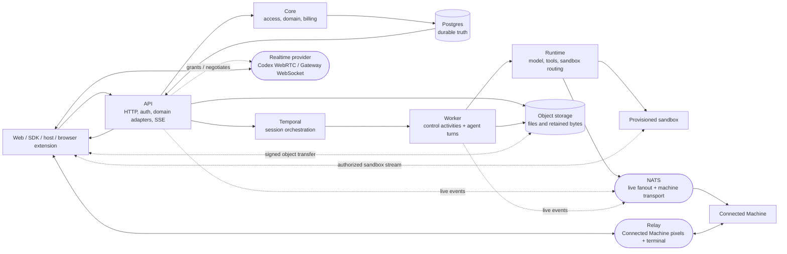
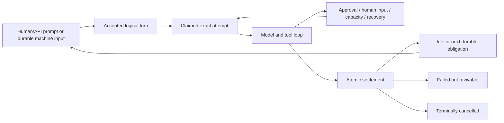

# OpenGeni architecture reference

> Setup: [`../AGENTS.md`](../AGENTS.md). Documentation index: [`README.md`](README.md).

## Navigation

Read §2–4 and §6. Subsystems: §13; updates: §14.

---

## 1. Startup

Preflight: `scripts/run-development-stack.ts`; ownership: `scripts/dev-stack-lock.ts`; readiness: `scripts/dev-stack.sh`.

---

## 2. OpenGeni

Self-hostable OpenGeni: Postgres persists state; Temporal coordinates execution;
NATS transports reconstructible events. The API authorizes; workers execute.

External users require live membership; `asUser()` supplies identity, labels do
not. Visibility differs from `agentAccess`; Personal Knowledge follows the
verified active-turn user. Task notes coordinate; linking never merges users.
[Product integration](product-integration.md),
[embedding authority](embedding-authority-internals.md),
[Skills](skills-lifecycle.md), [run lifecycle](run-lifecycle.md).
Skill removal deletes scoped heads/revisions with exact approval and Learning
enforcement, preserving conversation context.

Session `mcpApprovalPolicies` requires session-control authority. Frozen policies
retain catalog floors but grant no capabilities or credentials.

Account binding: [`mcp-account-bindings.ts`](../packages/core/src/domain/mcp-account-bindings.ts),
[`remote-mcp-credentials.md`](remote-mcp-credentials.md).

[`resolveTurnToolPolicy`](../packages/core/src/domain/session-tool-policy.ts)
owns effective turn refs: ordinary work uses session policy; scheduled work
retains its frozen selection. Credential-provider targeting and MCP preparation
consume those execution refs, never the queue's omitted-tools empty array.
Connection-backed MCPs remain exclusively native-authenticated and are excluded
from provider targeting and header application, even for historical work.

---

## 3. Core invariants

Hosted tool-call `status` survives persistence and Codex replay; function/message
annotations remain stripped. See `packages/codex/src/hosted-call-status.ts` and
[model providers](model-providers.md).

### 3.1 Postgres is durable truth; NATS is transport

Postgres commits precede notifications. NATS transports fanout, invalidations,
request/reply and machine streams—not durable commit evidence.

`session_event_cursors` verifies appends transactionally and owns monotonic
per-session sequencing/public `lastSequence`. Semantic writers lock sessions
for atomic state/event commits; `sessions.last_sequence` is compatibility-only.
Raw exact-attempt batches retain turn/attempt fences, hold session `FOR KEY SHARE`,
serialize on cursors, and never update sessions. Legacy SQL writers rebase at
the database boundary; late raw events roll back and retry semantic admission
before rejected audit persistence.

Unread/tree attention share the indexed meaningful frontier in
`packages/db/src/session-meaningful-events.ts`, excluding bookkeeping. Claimed
lifecycle content and exact parent reads acknowledge only the frozen human's
direct-child content. Complete finals cover earlier activity, never newer answers;
filtered reads cannot skip unseen content. Manual unread survives old replay;
newer consumed activity or explicit mark-read supersedes it.
[Bounded reads/reconciliation](session-monitoring-mcp.md).

SSE replays durable events, subscribes to fanout, and backfills gaps from Postgres.
NATS restarts affect delivery/reachability, never history or queued obligations.

Raw-isolation rollback:
`OPENGENI_SESSION_EVENT_RAW_LANE_ENABLED=false` keeps cursor allocation and
validation active while restoring wide-session locking and compatibility writes.

Commands acknowledge durable commits, independent of replayable NATS/Temporal notifications.

Task-tree [locking invariants](run-lifecycle.md).

Heartbeats refresh desktop availability without reconnecting or granting consent;
see `docs/connected-machines.md`.

Control revisions increase.

Canonical: `packages/events/src/index.ts`, `apps/api/src/http/sse.ts`,
`packages/sdk/src/stream.ts`, and [`run-lifecycle.md`](run-lifecycle.md).

### 3.2 Temporal coordinates; streams stay outside workflow history

Temporal coordinates execution; activities read Postgres obligations, not signals.
Conversation, goals, queues, usage and provider/tool transcripts stay outside
workflow history; streams use ordinary events.

Canonical: `apps/worker/src/workflows/session.ts` and
[`run-lifecycle.md`](run-lifecycle.md).

Control observation is not settlement: unavailable scoped reads and owned
attempts retain bounded, signal-interruptible waits without marking work idle,
revoking writers, or dispatching successors. Temporal metadata cannot prove
physical-writer quiescence.

Normal idle [omits grace](run-lifecycle.md), retaining durable fences.

### 3.3 Logical turns and physical attempts are different

A **turn** is accepted work; an **attempt**, replaceable execution without duplicate
effects. Updates form atomic batches; resumed attempts append batches, preserving
ordered, exactly-once history.

`wait_for_input` ends execution after tool-batch settlement, preserving trusted
wait authority and immutable same-turn deadlines. Command results remain durable;
alone, they wake only explicit waits. Notices cannot block other inbox input.
Batching preserves causal authority; messages/Steer inherit the sender’s human
independently of connections. See [`run-lifecycle.md`](run-lifecycle.md).

`runAgentTurn` is non-retryable by default: model/tool/sandbox/Git/connector/cloud
operations have external effects. Recovery is explicit and attempt-fenced.
Provider work stays outside retries; retry only idempotent settlement.
Accepted-policy [compatibility/recovery](run-lifecycle.md).
Replay: [notices/catalogs](run-lifecycle.md),
[compaction](context-compaction.md). `packages/runtime/src/prepared-compaction-request.ts`
shares prepared prefixes with both Responses compaction modes; Chat retains
its transcript adapter.

Failed-session retry differs from Pause/Resume and prompt admission.
`packages/db/src/session-retry.ts` fences failure identity, reserves actor-scoped
receipts, rejects unresolved execution and safety refusals, and re-enables the
original turn with retained history/authority and selected model policy—never
synthetic human input.

Active-run writes prove the exact current attempt/generation. Stale workers may
stay alive but cannot authoritatively write or settle replacements. Temporal
cancellation is intent; durable quiescence gates replacements, including closed
attempts' unresolved writers. After execution, finalization has per-stage
containment and heartbeat/metric evidence (`agent-turn/finalization-monitor.ts`).

Recoverable activity shutdown creates a transactional Postgres workflow-wake
obligation. Delivery stays unacknowledged until the exact closed attempt is
durably quiescent.
Each attempt-owned retained-process settlement advances the outbox atomically.
Workflow close or writer exit racing reconciliation cannot orphan recovery;
repeated Pause re-arms missing quiescence wakes.

A command remains attempt-owned until durable adoption of its exact provider
identity. Then turn completion and Steer detach; command cancellation, Pause,
and terminal Cancel control its lifetime. Instance stop/revocation/replacement
marks Connected Machine tracking `lost`, not process death. Temporary outages
preserve tracking. Reconciliation batches a fixed due-time frontier with shared
per-instance offline observations. Historical retirement preserves records
without input or wakes.
Terminal proof commits settlement and audit together. Nonterminal sessions receive
fallback input unless observed. Terminal reads suppress pending notifications,
never history; running reads do not. Failed/cancelled sessions retain audit only.
Fanout is replaceable and post-commit. Conversation history remains separate:
sequence cursors bound traversal, and `packages/db/src/session-event-slices.ts`
transfers large message scalars in bounded slices, not whole histories.
Full-history Find (`packages/db/src/session-message-search.ts`) coalesces authorized
scalar windows, returning bounded snippets/cursors, not histories. See
[`session-message-search.md`](session-message-search.md).

Docker/local SDK processes expose turn-scoped handles after a bounded wait.
They remain on the turn cancellation fence and stop before finalization, letting
agents test preview servers without awaiting exit.

`wait_for_input` persists its turn and deadline until input or timeout.
Acknowledgment cannot strand eligible input or due waits. `Session.inputWait`
drives working/recheck UI separately from unread. `session_wait`/`command_wait`
are in-turn reads; child results carry final answers. See
[durable-agent-inputs.md](durable-agent-inputs.md).

Canonical: `apps/worker/src/activities/agent-turn/`,
`apps/worker/src/activities/session-state.ts`, and
[`run-lifecycle.md`](run-lifecycle.md).

External SDK history and append verification: [`run-lifecycle.md`](run-lifecycle.md).

### 3.4 Long runs are bounded by policy and intent, not arbitrary loop caps

Run length does not prove stalled progress. Budget admission, provider capacity,
Pause/Cancel, goal state and host policy govern. Recovery preserves logical work.
Postgres owns continuation obligations, not Temporal. Goal edits apply directly
unless review is configured; human-owned constraints remain. Goals never live
in `Agent.instructions` or solely workflow memory.
Generic caps cannot replace lifecycle fixes.

Non-transient preclaim rejection parks accepted work behind a durable admission
block. Resume/Send/Steer rechecks without granting authority; operational outages
retain backoff.

Canonical: [`goals.md`](goals.md) and [`run-lifecycle.md`](run-lifecycle.md).

Reports default to chat; requested or large ones use native documents authored
via the Documents Skill; goal/artifact domains validate persisted
requirements/current inspection proof. See [`goals.md`](goals.md).

### 3.5 Each durable store has one job

| Store | Owns | Must not become |
| --- | --- | --- |
| `session_history_items` | Protocol-preserving conversation truth supplied to the model | An audit projection or mutable UI cache |
| `session_pending_tool_calls` | In-flight call/result receipts and the open suffix needed to resume | General conversation history |
| `agent_run_states` | Control snapshots and the open-suffix sentinel | Model memory |
| `session_events` | Exact append-only human/audit timeline and SSE replay | Model input |
| `session_system_updates` | Durable machine-origin inputs such as child results and schedules | Synthetic human messages |
| `session_goals` | The standing objective and continuation obligation | Workflow-local state |
| Sandbox leases and envelopes | Provider identity, routing, recovery, and workspace-generation truth | Session conversation state |
| Knowledge entries, instructions, Skills, and organization identity | Retrieval or governance authorities with their own scopes and lifecycle | Conversation history or temporary task notes |

[Chat delivery](run-lifecycle.md): lossless content, windowed history.

Knowledge revisions, evidence, and publication receipts live in Postgres;
originals in object storage. Scoped access precedes ranking. Chat attachments
remain conversation resources; agents select lasting findings/reference sources.
Default discovery excludes supporting evidence. Read-only save preparation fetches
collections and published/pending matches. See [`knowledge.md`](knowledge.md).

Unconditional CORE routes persistent behavior to instructions or Skills, not
Knowledge, preserving destination scope and review; see
[`company-brain-write-routing.md`](company-brain-write-routing.md).

Agent learning governs Knowledge, instructions, and Skills through Automatic,
Review first, and Off, with sparse chat/task overrides and frozen accepted-turn
policies. Review first stages inactive changes without pausing work. Explicit
pending reads support reuse/correction; ordinary reads show published entries
only. Pending entries grant no publication or instruction authority;
instructions and Skills keep their own authority. Instruction edits append to
the exact active baseline by default, update/remove by unique exact-text
anchor, and require explicit full replacement. All paths enforce active-head
compare-and-set and the instruction budget. Retired Memory and
reviewed-Knowledge authoring remain audit/compatibility evidence. See
[`knowledge.md`](knowledge.md).

Organization identity has a separate organization-owner autonomy policy: Off rejects
agent-authored changes before proposal creation, Require approval binds human
confirmation, and Autonomous activates eligible proposals without another
prompt. Every mode requires an exact live turn from the active organization
owner and the company-profile compare-and-swap lifecycle; workspace Learning
mode and admin authority cannot widen this scope.

Accepted conversation and tool content stays intact at its canonical boundary;
OpenGeni does not rewrite arbitrary credential-like text. Configured secrets
are encrypted at rest and exposed only through explicit permissioned
operations with metadata-only audit.

Generated media and editable artifacts are durable workspace artifacts, not
conversation blobs. Active image history resolves authorized references, including
compaction input. History preserves JSON key order; JSONB serves queries.

Canonical: [`run-lifecycle.md`](run-lifecycle.md),
[`hierarchical-memory.md`](hierarchical-memory.md),
[`scoped-knowledge.md`](scoped-knowledge.md),
[`company-brain-write-routing.md`](company-brain-write-routing.md), and
[`artifact-engine.md`](artifact-engine.md).

### 3.6 Tenancy and authority are established before resource access

Workspace-scoped access is the ordinary boundary. The API resolves an
authenticated principal into an access context and a permissioned grant before
domain code touches workspace data. Postgres FORCE RLS provides a second,
transaction-local boundary; a resource UUID by itself never authorizes access.

Organization membership, workspace membership, API keys, delegated grants,
private-session ownership, and personal-resource grants are distinct facts.
Organization keys with `workspace:admin` may configure their organization's
private-session product setting through the normal settings API. The shared
database administrator fence rechecks the live key even on command replay;
changing this setting grants no access to private session contents.
Sharing preserves accepted execution and connection selections while advancing
the viewer-access epoch. A separate execution epoch floor advances on
privatization or authority revocation. Privatization still requires quiescence
and clears staged personal selections; neither path rewrites accepted receipts.
Do not infer human authority from session creation, current UI identity, a
worker process, a connection row, or provenance metadata. A turn freezes its
initiating principal and the authority snapshots needed by later execution and
recovery.

Organization settings owns the cross-workspace roster and roles. A managed
browser administrator is the ordinary authority. Single-user local deployments
also admit only the access resolver's canonical `opengeni:local/default` + `dev`
browser context to organization metadata, shared-workspace, retention,
company-identity, and organization Codex controls. Provenance, not subject name,
governs; configured, delegated, API-key, service, and agent principals are excluded.
A shared-workspace creator gets an explicit named workspace-admin grant;
organization authority alone grants no operational access. Owners and
organization administrators may open `/workspaces/:workspaceId/settings` in
restricted mode for shared workspaces they cannot otherwise enter. It exposes
identity, direct access, and deletion only, never the workspace provider or
sessions, files, credentials, integrations, or other content. A shared workspace's
Members page is narrower: `members:manage` may add an already-active
same-organization human and change or revoke access only there. Personal or
cross-organization targets, self-demotion, and removing the final administrator
fail closed. Candidate inventory shows only active same-organization humans
lacking access, not their other workspace grants.

Managed browser login slots are explicit session-set actors, not tenant hints.
Organization recovery custody is a separate quorum and actor-fenced authority;
ordinary organization administration cannot transfer immutable workspace
ownership or bypass recovery settlement.

Personal connections and resources require the exact human authority that made
them executable. Workspace-owned credentials remain workspace-scoped and are
revalidated at use. An embedding host may narrow access through an explicit
port; it cannot grant access that OpenGeni denied.

The managed personal-workspace owner receives a closed permission projection
that includes `capabilities:manage`, so they can configure their own Plugins,
Integrations, and Codex subscription without receiving the `workspace:admin`
wildcard, member management, or API-key delegation.
`requireWorkspaceSettingsGrant` in the access resolver separately admits the
verified managed-cookie owner for Personal workspace preferences, model
configuration, runtime pause/resume, and instruction/Skill autonomy. It checks
the current active Personal pointer and returns the original closed grant;
organization authority or a delegated owner-shaped token cannot use this
exception. Membership, API-key management, and workspace deletion retain their
existing authorization boundaries.

An already-onboarded verified managed human may create additional independent
organizations from the organization switcher. The login and canonical human
identity remain global; each organization gets a separate owner membership and
Personal workspace. The creation lifecycle also creates one first shared
workspace with an explicit administrator grant, refreshes authoritative access
before navigation, and copies no tenant data from the current organization. A
subject-scoped database fence limits this self-service lifecycle to ten
additional organizations per human; invitation memberships do not consume it.
First-sign-in onboarding and invitation precedence remain a separate one-shot
path.

Canonical: `packages/core/src/access/index.ts`,
`packages/core/src/session-authorization.ts`, `packages/db/src/runtime-posture.ts`,
[`organization-tenancy.md`](organization-tenancy.md),
[`organization-recovery.md`](organization-recovery.md),
[`browser-login-session-sets.md`](browser-login-session-sets.md),
[`agent-session-authority.md`](agent-session-authority.md), and
[`credentials.md`](credentials.md).

### 3.7 Contracts and configuration are code-owned

`@opengeni/contracts` owns cross-boundary schemas, enums, permissions, event shapes,
capability descriptors, and token envelopes; `@opengeni/config` owns settings
parsing, defaults, validation, and derived runtime configuration.

Catalog membership, selectability, and cost are separate authorities. Deployment
membership comes from `code` or an operator-owned database singleton. Workspace
policy, connection readiness and model permissions, organization workspace assignments, and
provider health determine selectability; deployment cost policy sets `free`/`credits`
independently of upstream settlement. Workspace custom
Gateway, OpenRouter, Anthropic API and Claude subscription rows are provider-qualified workspace overlays, never
deployment catalog or billing rows. Deployment-managed `openrouter/*` and
workspace-managed `workspace-openrouter/*` remain separate provider and billing
identities for identical slugs. Claude setup: `apps/api/src/routes/workspace-model-providers.ts`; transport: `packages/runtime/src/anthropic-messages.ts`.
Accepted turns freeze provider identity, not cost policy. Drain or fence them
before changing `free`/`credits`. Database `codexModels` overrides membership,
not credentials; retirement preserves only exact accepted execution.

Cross-boundary enums are additive within major releases unless the release
train breaks compatibility. Contract-parity tests pin intentional client/deployment mirrors.

Canonical: `packages/contracts/src/index.ts`, `packages/config/src/index.ts`,
`packages/core/src/model-catalog.ts`, `packages/core/src/default-session-model.ts`,
[`model-providers.md`](model-providers.md),
[`model-connection-access.md`](model-connection-access.md),
and `packages/sdk/test/contract-parity.test.ts`.

### 3.8 A Connected Machine is first-class primary compute

Agents run on Connected Machines (`selfhosted`), without creating sandboxes.
Browser shutdown: [native lifecycle](../agent/README.md#distribution).
Mac updates preserve signed bundles; writes check ACLs
([native writer](../agent/TRANSACTIONAL-WRITES.md)).

The machine owns files, Git authentication, environment, and durable credentials.
OpenGeni neither clones repositories nor installs durable control-plane credentials;
authorized child processes receive only transient, exact-attempt Codemode authority.

Sandboxless attachment rebuilds native capabilities through [same-turn recovery](run-lifecycle.md), without replaying completed tools.

Machine paths are host-native and session-specific, not universal `/workspace`
aliases. Unavailability produces a typed operation outcome; text-only reasoning
can begin without contact. An offline machine never authorizes cold-creating a
rival box, snapshotting it, or provider-terminating the user's computer.

Structured Files exposes the selected machine's effective host-native working
directory as `FileSystem.root`; links and tree nodes share this namespace.
Connected Machine reads accept external absolute paths under the machine account's
OS permissions; working directories remain browsing defaults.
Managed reads and structured mutations stay workspace-confined, including `/`.
Requests carry capability epoch and root. The API binds one route per request;
target/root changes return retryable conflicts instead of reinterpreting paths
on another filesystem.

Generated-session schedules persist an exact workspace- or organization-scoped
machine target and seed its active pointer before the first turn. Ingress
rejects targetless `selfhosted` schedules; dispatch revalidates the frozen target
without managed-compute fallback. Manual and generated creates preflight target
liveness and workspace root, then recheck durable authority and atomically
commit the active pointer with the session row. Rejection leaves no queued
session shell in discovery or parent-tree projections.

Child workers keep the ordinary low-friction rule: omitting placement shares
the creator's box. Because a Connected Machine pointer is session-local, that
default copies the trusted parent's exact active machine and working directory
before the child's first turn. This includes a `backend:none` parent that has
attached a Connected Machine: the child keeps the shared backend-none home and
group while inheriting the exact active route. A selfhosted-only child with no
inherited or explicit machine fails at create rather than reaching an unbound
runtime.

A machine-home session does not pre-provision a hidden managed box. When the
deployment has a managed sandbox backend, its fleet nevertheless exposes the
session's synthetic managed group as a separate explicit target. Selecting
`session`/`default` clears the active machine pointer, verifies that managed
group through the ordinary viewer/lease lifecycle, and lets the next operation
or turn use it. This is an intentional user route change, not an
offline-machine fallback; deployments configured with only `none` or
`selfhosted` expose no managed group.

Connected Machine event ingestion cannot make every runner wait behind one
global database queue. The API drains the NATS event subscription immediately
into exact-process queues: different connection subjects progress concurrently
within a fixed database-concurrency bound, each subject preserves event order,
and only consecutive pending heartbeats collapse latest-wins. GoingOffline and
update-progress events remain ordering barriers. A database slowdown can
therefore delay current telemetry, but a backlog of old heartbeats from a killed
runner cannot renew its short ownership lease once per stale sample for minutes.
Canonical:
`apps/api/src/sandbox/metrics-ingestion.ts`.

Canonical: `packages/runtime/src/sandbox/selfhosted/`,
`apps/worker/src/activities/agent-turn/sandbox-establish.ts`,
`packages/core/src/domain/scheduled-tasks.ts`,
`apps/worker/src/activities/scheduled-tasks.ts`,
`agent/proto/opengeni_agent.proto`, [`connected-machines.md`](connected-machines.md),
and [`../AGENTS.md`](../AGENTS.md) Sandbox Notes.

### 3.9 Compute routing and sandbox ownership stay explicit

Modal recovery: singleton human consent (`packages/core/src/application/sandbox-recovery.ts`)
or proved provider loss (`packages/db/src/index.ts`): the quiescent group restores a
verified checkpoint, else continues empty, warning every member; never replays.
See migrations 0495/0526/0548, [run lifecycle](run-lifecycle.md).
Operator reauthorization supersedes verified public recovery;
[provenance and gaps persist](run-lifecycle.md#explicit-same-session-historical-checkpoint-consent).

Home-compute selection proves establishment authority; invalid pointers reconcile
visibly. Leases/reapers—not viewers—own sandboxes. Identity precedes setup; capture
fences writers. Exact-instance loss never authorizes ambiguous replay. Routing stays
lazy; raw handles serve setup/capture (`turn-sandbox-access.ts`).
Global Modal inventory uses an owner-only SELECT capability under FORCE RLS (0497).

Stock Modal non-PTY/no-`runAs` commands support native subreaper supervision.
Exact-instance capability verification precedes admission; durable invocation
retention precedes dispatch. The supervisor starts idle. Only original launch
releases user code; reconstructed observers never release abandoned reservations.
Invocation-authenticated quiescence
receipts are persisted before ACK permits supervisor exit. Canonical database
settlement additionally requires authenticated provider terminal evidence and
atomic output capture, on natural completion as well as cancellation. Deadline
cancellation intent is monotonic across reconciliation claims and fences new
stdin; already admitted writes remain blockers until settled. Provider loss,
missing proof, and descriptor-free legacy commands never become successful
supervision. See [command supervision](command-supervision.md).

Native Modal `TaskExecStart` recovery requires client-side channel readiness to
fail before any Start RPC is issued. The shell tool carries only this pre-dispatch
proof to bounded same-turn recovery; server-supplied DNS text and post-dispatch
errors never prove non-execution. Supervised retries first settle their exact
never-started reservation; retained or outcome-unknown causes block recovery.

Snapshots use `OPENGENI_SANDBOX_SNAPSHOT_TIMEOUT_MS`; zero-holder drains/rotations
may override with `OPENGENI_SANDBOX_DRAIN_SNAPSHOT_TIMEOUT_MS`. Boot reserves the
larger budget plus reaper period, including historical Modal leases after backend
changes. Drain budgets include dispatch/capture/retry within the lifecycle ceiling.
Warm-capture reclamation/heartbeat cleanup preserve holders through the original
deadline despite turn closure: no takeover or extended authority.

Legacy stopping-error containment requires owner quiescence and cancellation grace.
Supervision-key presence—even malformed—blocks enrollment/capture/publication/teardown.
Observation failure never proves exit; uncancelled running commands stay excluded.

Acquisition/mutation waits extend once through the first durable capture deadline
plus handoff grace (one-hour cap). Expired/replacement claims never replenish
budgets; zero-wait probes remain immediate. Expiry grants no capture/writer authority.
Policy: `packages/db/src/sandbox-transition-wait.ts`.

A settled capture rejection releases only its exact unpublished claim, allowing
waiters to re-arm the intact instance. Unresolved timeouts and publication/teardown
failures retain ownership. Fresh claims receive fresh provider request IDs;
uninterrupted replacements retain the stored ID so late results remain adoptable
without reusing pre-mutation snapshots after a release.

Rotation recovery: [lifecycle](run-lifecycle.md).

Archive capture/restore: [storage](workspace-archive-storage.md).

Lease liveness, provider existence, route attachment, archives, workspace readiness,
and operation availability are independent; a warm row does not prove executability.

Resolve synthetic groups' effective backend once from session policy and deployment
configuration. Fleet, swaps, viewers, API operations and worker turns share that answer.

The contracts enum and provider registry own backend membership and ordering.

Canonical: `packages/contracts/src/index.ts`,
`packages/runtime/src/sandbox/providers/index.ts`,
`packages/runtime/src/sandbox/routing/`,
`apps/worker/src/activities/sandbox-lease.ts`, and
[`connected-machines.md`](connected-machines.md).

Modal creation: `sandbox/providers/modal-create-session.ts` and `modal-create-boundary.ts`
persist an operation before dispatch and attribute its receipt before setup.
Unknown outcomes fence replacement; historical discovery requires exact provider
identity. Ordinary draining owns termination. See [lifecycle](run-lifecycle.md).

### 3.10 Client/server compatibility policy

Canonical policy: [`design/api-compatibility-policy.md`](design/api-compatibility-policy.md).
The `@opengeni/sdk` major is the API compatibility major. Within a major the
public surface (SDK-reachable `/v1` routes and their shapes, the session event
envelope and types, `@opengeni/sdk`/`@opengeni/react` exports, automation
ingress) evolves additively and both sides are tolerant readers. Breaking
changes need a deprecation with `Deprecation`/`Sunset` headers, at least 90
days on the managed service, and a new major. `bun run check:public-api` and
`bun run test:sdk-compat` enforce it in CI.

Official builds expose `serverVersion` in health and client-config responses;
there is no runtime negotiation protocol.

`x-opengeni-api-contract` fences only cookie-authenticated browser mutations
(stale tabs); bearer integrations stay admitted across revisions
([details](product-integration.md#api-contract-revision)).

An optional field that changes execution authority is not an ordinary additive
response field. Its readers must ship first, new external writes stay behind a
default-off admission switch until every shared-queue consumer is compatible,
and public projections must remain safe for indefinitely open old browser
bundles. Once admitted, upgraded readers preserve and execute the durable field
regardless of the local admission-switch value; activation switches gate
producers, not consumers.

Canonical: `packages/sdk/src/`, `packages/react/src/`,
`packages/contracts/src/index.ts`, `packages/sdk/test/contract-parity.test.ts`,
`scripts/public-api/`, and `apps/api/src/http/deprecation.ts`.

The root client in `packages/sdk/src/embedding-client.ts` adds server-side
administration; `/browser` and `/artifacts` keep narrower dependency boundaries.

### 3.11 Work discovery remains advisory and permission-first

Compact related-work discovery is a read projection over already-authorized
sessions, durable semantic titles, active goals, and bounded typed work claims.
Workspace/private-session rules, exact live-attempt validation, Slack-private
scope, and optional embedding-host list narrowing run before lifecycle filters,
matching, ranking, counts, cursors, or ancestor labels. A hidden session cannot
influence even aggregate discovery output.

Work claims are non-exclusive evidence. They do not reserve a repository,
transfer ownership, grant access, or trigger control. Exact-attempt mutation is
CAS- and operation-id-fenced; terminal goal/session lifecycle settles active
evidence while retaining immutable revisions. Search never includes opening
prompts, instructions, resources, tools, files, or full history, and no agent is
required to search before working.

Canonical: `packages/contracts/src/work-claims.ts`,
`packages/db/src/work-claims.ts`, `packages/db/src/index.ts`, and
[`work-discovery.md`](work-discovery.md).

---

## 4. System architecture

OpenGeni separates durable control from live transport and separates control
plane processes from the place where user code runs.



Artifact materializer and outbox sidecars have role-specific configuration in
`packages/config`: the materializer consumes storage configuration; the outbox
consumes broker configuration. Both retain telemetry and dedicated database
posture without inheriting API authentication or agent sandbox credentials.
Their startup adapters are `apps/worker/src/editable-artifact-materializer-service.ts`
and `apps/worker/src/editable-artifact-outbox-service.ts`.

### 4.1 Request and event path

1. A client calls `apps/api`. Middleware establishes the deployment perimeter,
   observability context, authentication, workspace, and permissioned grant.
2. HTTP routes adapt the request into `@opengeni/core` domain operations.
3. The domain operation validates the request and commits authoritative rows,
   events, queue/control state, audit facts, and workflow-wake intent in
   Postgres.
4. The API returns the committed projection. NATS fanout and immediate Temporal
   wake delivery happen as replayable follow-up work. Temporal transport
   acceptance does not acknowledge the current durable wake while an accepted
   human/API turn is still queued or an Agent Steer is still pending; only the
   attempt-fenced Postgres claim proves admission.
5. The session workflow observes the durable obligation and dispatches a turn
   activity.
6. The worker claims the logical turn, registers an exact attempt, freezes its
   execution and authority snapshots, then invokes `@opengeni/runtime`.
7. Runtime builds the model/tool environment and lazily establishes the
   selected provisioned sandbox or Connected Machine when an operation needs
   compute.
8. Worker events are appended durably before best-effort live publication.
   The API's SSE stream replays and gap-fills from Postgres.

### 4.2 Control path versus data path

The API, Postgres, Temporal, and worker form the durable control plane. NATS
session fanout is a live projection of that control state. Connected Machine
commands also cross NATS, but authorization and durable ownership are decided
before transport. Direct browser data planes are established only from a
short-lived API-authorized grant and never become an independent source of
session, tenant, or provider authority.

Large or high-frequency bytes take separate paths:

- files, generated media, recordings, and retained evidence use object storage;
- terminal and desktop streams use the sandbox/provider transport or the
  dedicated relay edge for Connected Machines;
- realtime voice uses Codex WebRTC or the AI Gateway WebSocket while durable
  ownership, ledger, delegation, context, and recovery remain in OpenGeni;
- model token and tool events use the session event stream, not Temporal; and
- editable artifacts use their typed artifact authority and kernels rather
  than treating Office files or rendered output as mutable truth.

Canonical realtime behavior is in [`run-lifecycle.md`](run-lifecycle.md) and
the public transport surface is in [`../packages/sdk/README.md`](../packages/sdk/README.md).

### 4.3 Dependency direction

At a high level, dependencies flow inward from process adapters toward stable
contracts and domain boundaries:

```text
contracts / config / network
          ↓
db / events / storage / documents / capabilities / provider leaves
          ↓
core / runtime
          ↓
apps/api and apps/worker

contracts → sdk → react → apps/web
```

The client closure remains server-free. `apps/web` consumes the SDK and React
packages; it does not own session or authorization semantics. Advanced hosts
may embed API/core/worker packages, but the same domain and persistence
boundaries still apply.

Console appearance: `apps/web/src/lib/appearance.tsx`; pre-paint bootstrap: `apps/web/index.html`.
Managed/broker sign-in: `apps/web/src/components/signed-out-page.tsx`; authentication unchanged.
Workspace management route classification lives in `apps/web/src/lib/workspace-management-location.ts`. The workspace route loads `components/settings/workspace-settings-shell.tsx` lazily only for management destinations, so session navigation does not import the settings interface.

---

## 5. Runtime spine: session → turn → attempt

### 5.1 The three identities

| Identity | Meaning | Lifetime |
| --- | --- | --- |
| Session | Durable conversation, workstream, policy, visibility, and compute context | Until archived or safely deleted |
| Turn | One accepted human, machine, goal, schedule, approval, or recovery unit | Until logically settled |
| Attempt | One physical worker execution of a turn | Until completion, interruption, loss, or replacement |

A new attempt does not imply a new prompt. A new prompt does imply a new turn.
This distinction is the basis for safe worker-death recovery and protection
against duplicate external effects.

Semantic naming is attempt-owned auxiliary work. Pending titles and exact-session
policy authorize one bounded, tool-less request parallel to the main stream,
metered separately. Normal completion joins it before atomic settlement;
exceptional/cancelled exits abort and join. Generic title writes lose to human
renames. Runtimes without this seam retain serialized `set_session_title`.

`packages/db/src/session-execution-policy.ts` projects defaults;
`packages/db/src/session-model-settings.ts` records boundaries, preserving accepted
execution. [Semantics](mcp-surfaces.md).

Active-source message-point forks preserve the current active model-history
prefix through the selected boundary, including authenticated compaction summaries.
Existing exclusive tenancy and workspace/source row locks
serialize validation/copying against history writers/compaction. Source execution
and whole-session fork quiescence stay unchanged. [Details](organization-tenancy.md#forking-at-a-message).

### 5.2 Lifecycle overview



Send and Steer create durable turn intent. A normal human Send is promoted to
Steer-equivalent replacement only when the active, unpaused branch is waiting in
`requires_action`; checked-out queue edits, paused sessions, and other active
lifecycle states keep ordinary Send ordering. Human prompts are the reorderable
queue surface; machine-origin inputs remain typed records and join a turn only
through the claim transaction. A `requires_action` resume preserves that rule
without violating provider protocol: it first writes the interrupted
call/result pair, then re-enters the exact attempt claim to attach only machine
input whose durable pending-event sequence was inside the resume attempt's
frozen start boundary. Pause blocks
admission without pretending that physical execution has already stopped.
Cancel fences a session subtree and is terminal for the affected sessions.

Steer ordinarily inserts at the head and immediately supersedes the live
direction. Active compaction is the exact exception: while a claimed standalone
compaction is running, or an ordinary attempt's latest compaction landmark is
`session.context.compaction.started`, Steer is accepted without inserting the
interruption that would fence the terminal checkpoint write. A durable
`compacted` or `skipped` landmark becomes the handoff: the ordinary turn settles
`superseded` before another model request, while standalone maintenance completes
and the waiting Steer is claimed next. Pause and Cancel retain immediate
interruption semantics. Automatic starts also maintain one content-free private
pending projection keyed by exact attempt; terminal landmarks, attempt closure,
and active-attempt replacement clear it so control-worker alerting survives
turn-worker loss without exporting session identity.

Pause and Resume are desired-state commands with durable semantic receipts. A
fresh key allocates a control revision, events, interruptions, and wakes only
when it changes direct blocker/override truth or repairs an uncovered lifecycle
effect. Effective state alone is insufficient: a later ancestor Pause must
invalidate newer descendant Resume overrides, and a narrower child Pause under
an inherited blocker remains a real change. Exact idempotency retries stay
`replayed`; represented intent with no repair stays `unchanged`. Human prompt
boundary retries also preserve committed truth across mutable prechecks: before
surfacing a pre-reservation model, limit, resource, or attachment failure, the
retry takes the actor/key prompt-operation fence and rechecks the completed
receipt so an overlapping committed Send or Steer is replayed exactly once.

Failed sessions can be revived by new accepted work. Cancellation remains the
terminal boundary.

An operational database failure after an exact claim but before turn-start
completion revalidates that immutable attempt and uses the ordinary same-turn
recovery and bounded redispatch path. A lost claim response that later reveals
the exact active attempt follows the same transition. Permanent database or
state failures remain terminal, and no model, tool, or provider work is replayed
or converted into a new queue item.

Transient provider recovery is bounded by a durable consecutive-failure streak,
not lifetime failures across a long turn. A completed model request
from the exact current attempt clears the durable streak atomically with its
timeline event, and the worker clears its in-memory copy only after that commit;
late attempt evidence cannot replenish the retry budget. See
[`run-lifecycle.md`](run-lifecycle.md) for pacing and exhaustion semantics.

### 5.3 Goals, schedules, automations, and child work

These producers all converge on the ordinary session/turn runtime:

- an active **goal** creates a durable continuation obligation;
- a **scheduled task** freezes one accepted occurrence and its execution
  authority before dispatch;
- an **automation** authenticates an external event, freezes the matching
  trigger revision, and creates an ordinary session/run; and
- a **child session** is a normal session with explicit lineage, depth, compute,
  visibility, and initiating-authority rules. Omitted child resources inherit
  repositories only; file attachments require explicit selection, and an
  omitted Sandbox Environment or Variable Set selection resolves like any new
  session rather than copying the parent's (see
  [`nested-agent-depth.md`](nested-agent-depth.md)).

Schedule indicators include authorized, non-deleted reusable-session targets and paused schedules.
Schedules API filtering uses `sessionId`.

Pre-admission refusals are immutable [run receipts](scheduled-admission-diagnostics.md); key-created schedules are ownerless; runs waiting on a person and their optional timeout are in [scheduled-task-access.md](scheduled-task-access.md#runs-waiting-on-a-person).

Scheduled turns inherit the session tool policy when `tools` is omitted;
`tools: []` remains an empty override. Standalone scheduler-owned turns use a
`user`-role task boundary with immutable task/run/update IDs. This conversation
role grants no human authority: scheduler initiation and causal-human/connection
snapshots remain frozen. Occurrences attached to human/API turns retain the
internal `system` envelope.

The `skip` policy locks and admits only idle existing/reusable sessions. Status,
goal reset, run settlement and update append share a transaction; admitted work
sets `queued` even when pause or realtime ownership withholds its wake. New
sessions admit their creating occurrence.

Pause/delete establishes a first-claim cutoff: runs without a scheduler-owned
turn become skipped, while already claimed turns remain recoverable. Deposit,
claim and task lifecycle locks serialize this decision. Resume never revives
pre-pause deposits, and a delivery fence rejects updates for terminal runs even
from old workers during a rolling deployment.

None of them creates a parallel agent engine. They differ in admission and
provenance, then use the same logical turn, attempt, event, recovery, and usage
boundaries.

Canonical: [`goals.md`](goals.md), [`automations.md`](automations.md),
[`nested-agent-depth.md`](nested-agent-depth.md), and
[`reliability-fixes.md`](reliability-fixes.md).

### 5.4 Approval and structured human input

Tool approval and structured human input are durable interruptions. The worker
stores enough exact protocol state to stop without pairing an unfinished call
into model history. A response must bind to the pending request, target turn,
execution generation, requester, and current authorization.

Tool approvals are human-only. Agents may answer an authorized structured
human-input request for another session where the agent-session authority model
allows it, but they cannot grant themselves tool approval.

Canonical: [`human-input.md`](human-input.md),
[`agent-session-authority.md`](agent-session-authority.md), and
[`run-lifecycle.md`](run-lifecycle.md).

### 5.5 Model, tool, and compute preparation

The accepted turn freezes its public model choice, provider/deployment routing,
billing attribution, governance context, initiating authority, and relevant
tool/connection delegations. Recovery reuses that accepted truth rather than
sampling mutable workspace defaults again.

Workspace built-in tool and MCP-server defaults inherit independently when
their respective `settings.sessionToolDefaults` key is absent. Existing arrays
remain exact custom selections (including empty arrays). The settings API
merges these nested keys atomically; explicit `null` removes only that override.
The UI requires deliberate customization and exposes partial selections;
saving plugin defaults never freezes built-in defaults. Persistence lives in
`packages/db/src/workspace-tool-defaults.ts`; deployment ceilings still apply,
and changing defaults never rewrites existing sessions or accepted attempts.

A fresh session selecting a workspace Gateway or OpenRouter custom model, an
existing session explicitly switching from another model, a new/materially
reaccepted scheduled task, automation trigger, or PR-review binding, or a fresh
generated-session scheduled occurrence rechecks that exact provider-qualified
active slug under the model catalog's shared transaction lock before the
session, turn, task, trigger, binding, or accepted occurrence can commit.
Adapter-rendered automation templates are the acceptance authority, so adapter
parameters cannot hide a model override from this gate. Deployment-curated
workspace provider models use their provider's public prefix but no mutable
custom row, so they do not enter this fence. Custom-model retirement holds the
exclusive counterpart; already accepted work, exact occurrence replay,
same-model/existing-session continuations, and administrative-only task,
trigger, or binding edits use retained definitions instead of reopening
fresh-selection authority. Committed keyed session shells replay before
active-only catalog checks, preserving repairable initialization.

Human preferences require frozen causal identity. Command/timeout successors
preserve immutable receipts, separate causal claims and live personal-grant
admission; see [run lifecycle](run-lifecycle.md).

`session_turns.initiating_human_subject_id` never authorizes alone:
`artifacts:publish`, archive, restore, and exact mutation fences apply;
pure service work fails closed. See [run lifecycle](run-lifecycle.md).

Tool disclosure is progressive, but authority is not. A tool may be eager or
lazy, local or MCP-backed, direct-model or Codemode-accessible; every invocation
still resolves through the current authorized catalog and the same execution
fences. Approval-required tools remain approval-required regardless of access
path.

The closed always-visible local first-request set is `exec_command`,
`write_stdin`, `apply_patch`, `view_image`, `skill_read`, `repository_skill_read`,
`request_human_input`, `list_models` (lists selectable models; never switches
them), and optional [`code_search`](code-search.md). Other non-MCP function tools and non-eager MCP schemas
remain behind progressive search.

Repository descriptors route IDs through sandbox-bound `repository_skill_read`;
managed `skill_read` remains separate. See [run lifecycle](run-lifecycle.md).

Repository `.agents/skills` holds maintainer and integration guidance. Runtime skills
ship from `packages/runtime/src/bundled_*_skills`. Worker defaults include
`opengeni-client`, `opengeni-help`, `opengeni-visualize`, and `document-parsing`,
unless explicitly overridden. `.agents/skills/opengeni-client` is canonical;
`scripts/sync-client-skill.ts` generates bundled assets with drift tests.
Every deployment can read it without installation or sandbox setup.

Sandbox-free reading, lazy management, and host selection: [Skill design](design/skills-system.md).

Before every follow-up provider request, the worker reconciles the SDK's
complete prior history into durable call/result truth; the first request has no
prior model/tool history to flush. An empty Responses terminal is reconstructed
from observed `output_item.done` events in numeric `output_index` order. Sparse
indices do not create synthetic history items, while duplicate indices remain
invalid.

Compute is established lazily where possible. A text-only turn can begin
without provisioning a box or contacting a Connected Machine. Once a tool
needs filesystem, process, Git, browser, or computer access, routing resolves
the exact current target and validates its epoch and authority.

Explicit Variable Sets are ordered from low to high precedence and are frozen
for execution. Reconfiguration is a quiescent session-control mutation that
rotates managed compute rather than hot-swapping credentials into active work.

Canonical: [`model-providers.md`](model-providers.md),
[`mcp-surfaces.md`](mcp-surfaces.md),
[`session-mcp-servers.md`](session-mcp-servers.md), and
[`connected-machines.md`](connected-machines.md). Variable Set lifecycle and
ordering are canonical in [`variable-sets.md`](variable-sets.md).

### 5.6 Files, knowledge, and artifacts

A file attached to a human prompt is eager model/compute input only for that
accepted turn. Accepted private uploads gain session read grants; original ownership
and Drive ACLs remain unchanged. Browser and agent reads enforce session access.
See `docs/session-attachments.md`. Generated media follows paid-operation and retention fences.

Knowledge is the product destination for retained sources and findings, with
Library, Instructions and Review tabs on the Knowledge page (`/state`).
`apps/web/src/components/knowledge/knowledge-page.tsx` owns that page's
navigation, including old Files, Skills, Memory and Documents links. Groups appear
as collections; detailed finding types are optional browsing metadata. File previews, revision-pinned
citations and shared groups connect information from different sources without
changing its ownership. Connector ingestion runs through ordinary scheduled
agents with frozen source selections and Agent learning policy. Attempt-bound
source tools retain files and prepare canonical source entries; agents save the
useful findings. Parsing and indexing remain mechanical services. Original bytes
and search caches have separate storage jobs. Review controls
publication, while action permissions remain independent.

Canonical: [`knowledge.md`](knowledge.md),
[`scoped-knowledge.md`](scoped-knowledge.md),
[`image-generation.md`](image-generation.md),
[`artifact-engine.md`](artifact-engine.md), and
[`artifact-collaboration.md`](artifact-collaboration.md).

### 5.7 Usage, limits, and billing

Blocked account switches: [Codex rotation](codex-subscription-rotation.md).

Usage is normalized at the provider boundary and recorded per authoritative
model call. Admission limits and entitlements are domain policy; provider
telemetry, comparison pricing, and dashboards do not independently debit or
grant capacity. The durable `agent.model.usage` event carries the accepted
billing path and any validated Gateway endpoint provider so the additive
Insights fact can be repaired exactly after a soft writer failure; repair
prefers those authorities over the logical Gateway provider and legacy
inference from `usage_events.model.tokens` and `usage_events.model.cost` rows.
Each new fact also freezes provider cost and equivalent OpenGeni credit price as
separate nullable comparisons, while `priced_cost_micros` remains the actual
credits-path price and is zero for externally billed calls.

Insights usage uses a four-column projection (0484), preserving full-row readers
and tenant/actor/visibility checks. Transaction-capability writes still
require a writable database.
Canonical: `packages/db/src/insights-usage-bundle.ts`.

Codex/SuperGrok pools preserve logical turns. Shared/Personal workspaces inherit
same-organization pools as separate allocator boundaries, not access grants.
SuperGrok freezes scope on acceptance. Vercel AI Gateway/OpenRouter BYOK keys
belong to workspaces or organizations; organization keys use encrypted FORCE-RLS,
inherit into same-organization shared workspaces, retain payer identity, and
never fall back across rails.
Provider-refusal cooldowns keep provenance and revisions: fresh usage repairs old
quota refusals, not backpressure or newer refusals. Capped admission and waits
use bounded refreshes. Codex quota labels require explicit `/wham/usage` window
durations, never primary/secondary position. Headers lacking both durations cannot
update labeled cache; absent reset timing does not clear an exhausted window.
Opening the account picker refreshes usage.

Claude setup and quota observations:
[`model-providers.md`](model-providers.md#claude-subscription-usage).

Codex turns require durable credential leases. `rotation_enabled` off waits on
capped accounts; on permits same-turn failover. First allocation freezes source,
active pointer, rotation, strategy, and pin in `codexCredentialPolicySnapshotV1`
before no-credential waits. Recovery retains that policy with current health and
cooldowns. Missing/expired deadlines fail closed; late heartbeats are discarded.
Expiry SQL reads database time after locking.

Source-advisory locks serialize changes. Accepted pools govern
allocation, recovery, capacity, tokens, and wakes. Guarded content-free capture
preserves legacy sources in `codex_turn_source_bindings` without rewriting history.
New work uses new settings; connecting preserves mode; Automatic prefers local
accounts. Token loading/refresh requires exact live leases.
Workspace lists use current pools; session pickers use accepted pools for waits,
current pools for new work. Membership, ownership, health, token-family CAS,
and live-lease disconnect fences remain enforced.

Migration 0492 requires maintenance: drain API/control/turn processes, supply
runtime logins, migrate, provision roles, then start compatible binaries.
Guards reject live runtime DB sessions; recover accepted turns from checkpoints.
Never restart pre-0492 binaries.

Canonical: `packages/core/src/billing/`, `packages/runtime/src/usage-telemetry.ts`,
[`credit-boundaries-rollout.md`](credit-boundaries-rollout.md),
[`model-providers.md`](model-providers.md),
[`codex-subscription-rotation.md`](codex-subscription-rotation.md), and
[`supergrok-subscription.md`](supergrok-subscription.md).

---

## 6. Repository layout

The TypeScript system is a Bun workspace over `apps/*`, `examples/*`, and
`packages/*`. Internal packages are consumed from source. The Connected Machine
agent and relay are a separate Rust Cargo workspace under `agent/`.

Package manifests and `.changeset/config.json` own exact publication status and
entrypoints. The lists below describe responsibility, not current publish
metadata.

### 6.1 Applications

| Path | Package | Owns |
| --- | --- | --- |
| `apps/api` | `@opengeni/api-router` | Hono HTTP composition, middleware, routes, MCP transport, SSE, and API-side control adapters over core |
| `apps/worker` | `@opengeni/worker-bundle` | Temporal workflows, control/turn activities, agent execution, maintenance pumps, and worker lifecycle |
| `apps/web` | `opengeni-web` | Stock React/Vite operator console consuming the public SDK and React packages |
| `apps/browser-extension` | `@opengeni/browser-extension` | Browser attachment extension and its control-plane protocol; a leaf client, not session authority. [Build and store packaging](../apps/browser-extension/README.md); [privacy notice](../apps/browser-extension/PRIVACY.md) |

The standalone `apps/api` entrypoint installs a one-shot fatal process
boundary before configuration or dependency startup. Startup failures,
unhandled promise rejections, and uncaught exceptions emit only reviewed
structural diagnostics plus an opaque correlation id, drain accepted OTLP
exports for a bounded interval, and then exit nonzero. Exception messages,
stacks, enumerable fields, and arbitrary rejection values never cross the
public telemetry boundary. Embedded API composition does not install process
handlers because its host owns process lifecycle.

### 6.2 Packages

| Path | Package | Owns |
| --- | --- | --- |
| `packages/contracts` | `@opengeni/contracts` | Cross-boundary schemas, enums, permissions, events, capability descriptors, and tokens |
| `packages/connect` | `@opengeni/connect` | Framework-neutral connection setup, navigation, polling and account-selection contracts |
| `packages/config` | `@opengeni/config` | Settings parsing, validation, defaults, and derived runtime configuration |
| `packages/network` | `@opengeni/network` | DNS-pinned, bounded credential-bearing HTTP transport and shared MCP OAuth discovery semantics |
| `packages/jev` | `@opengeni/jev` | Jev client and `code_search` engine |
| `packages/core` | `@opengeni/core` | Framework-neutral access, domain, billing, and dependency seams |
| `packages/db` | `@opengeni/db` | Drizzle schema, scoped repositories, migrations, RLS posture, and role provisioning |
| `packages/runtime` | `@opengeni/runtime` | Agent construction, model routing, tool execution, history projection, and sandbox abstraction |
| `packages/events` | `@opengeni/events` | NATS event bus, auth callout/JWT support, fanout, and SSE formatting helpers |
| `packages/storage` | `@opengeni/storage` | Object-storage abstraction for files, recordings, and retained bytes |
| `packages/documents` | `@opengeni/documents` | Document parsing/indexing and authority-first hybrid retrieval |
| `packages/capabilities` | `@opengeni/capabilities` | Integration definitions, facets, local MCP bridges, and protocol compilers |
| `packages/tool-gateway` | `@opengeni/tool-gateway` | Protocol-neutral tool identity, cataloging, schemas, validation, authorization, approval classification, and execution |
| `packages/codemode` | `@opengeni/codemode` | Attempt-frozen programmatic tool catalog and execution client |
| `packages/ogtool` | `@opengeni/ogtool` | CLI over the Codemode catalog and journal |
| `packages/codex` | `@opengeni/codex` | Codex subscription authentication, transport, and provider normalization |
| `packages/xai-subscription` | `@opengeni/xai-subscription` | SuperGrok/xAI subscription authentication and transport |
| `packages/github` | `@opengeni/github` | GitHub App installation discovery, proof, and token operations |
| `packages/interaction` | `@opengeni/interaction` | Provider-neutral browser and computer interaction control |
| `packages/browserd` | `@opengeni/browserd` | Placement-resident browser controller and audited browser adapter |
| `packages/artifact-tool` | `@opengeni/artifact-tool` | Editable document, spreadsheet, and presentation authoring facade |
| `packages/artifact-kernel-wasm-document` | `@opengeni/artifact-kernel-wasm-document` | Lazy document WASM kernel distribution |
| `packages/artifact-kernel-wasm-presentation` | `@opengeni/artifact-kernel-wasm-presentation` | Lazy presentation WASM kernel distribution |
| `packages/artifact-kernel-wasm-spreadsheet` | `@opengeni/artifact-kernel-wasm-spreadsheet` | Lazy spreadsheet WASM kernel distribution |
| `packages/agent-proto` | `@opengeni/agent-proto` | Generated TypeScript side of the Connected Machine wire protocol |
| `packages/sdk` | `@opengeni/sdk` | Framework-neutral API client, event streaming, and transport helpers |
| `packages/react` | `@opengeni/react` | React hooks and styled session, composer, artifact, and machine surfaces |
| `packages/observability` | `@opengeni/observability` | Structured logs, traces, metrics, and Prometheus exposition |
| `packages/deployment` | `@opengeni/deployment` | Typed deployment profiles, preflight, plans, and generated runtime artifacts |
| `packages/testing` | `@opengeni/testing` | Shared test services, fixtures, scripted models, and sandbox helpers |

### 6.3 Examples

| Path | Package | Owns |
| --- | --- | --- |
| `examples/embedded-product` | `@opengeni/example-embedded-product` | Loopback-only Connect/Sites host reference: explicit actor/CSRF adapter, server-selected return URL, shared components and synthetic browser acceptance; production authentication must be supplied by the host |
| `examples/chat-quickstart` | `@opengeni/example-chat-quickstart` | Backend-only chat example |
| `examples/northstar-support` | `@opengeni/example-northstar-support` | Standalone-product integration reference (proxy, MCP, React, event streams) |
| `examples/site-session-embed` | `@opengeni/example-site-session-embed` | Site SDK/React embed and sandbox preview reference |

### 6.4 Rust agent and relay

`agent/` is the Cargo workspace for Connected Machine execution and the relay
edge. `agent/proto/opengeni_agent.proto` is the single wire source, generated to
Rust and `@opengeni/agent-proto` TypeScript types.

One agent connects independently to multiple deployments and workspaces within
shared host containment. The relay carries terminal/desktop bytes, not durable
session or lease state. Install `latest` may serve baked binaries; version pins
resolve binaries/signatures from the immutable release archive.

Canonical: [`../agent/README.md`](../agent/README.md) and
[`connected-machines.md`](connected-machines.md).

### 6.5 Deployment, docs, scripts, and tests

- `deploy/helm/opengeni` owns the Helm chart for OpenGeni services and
  integration resources.
- `deploy/terraform/` contains cloud-specific infrastructure roots;
  `deploy/stacks/` wraps external dependencies.
- `docs/` contains current topic docs and point-in-time records; its canonical
  index is [`README.md`](README.md).
- `docs-site/` is the public documentation site (Mintlify; published at
  docs.opengeni.ai from `main`, subdirectory `/docs-site`). It is product-facing
  and links to `docs/` for engineering detail rather than restating it.
- `scripts/` owns development, static checks, release mechanics, deployment
  helpers, and operator-only utilities.
- `test/` contains integration, end-to-end, and live suites; package-local
  tests stay with their owners.
- `docker/sandbox.Dockerfile` is the stock headless sandbox image;
  `docker/desktop.Dockerfile` is the desktop/browser image.

---

## 7. Ownership boundaries

### 7.1 API adapters versus core domain behavior

`apps/api` owns HTTP concerns: middleware, request/response translation,
cookies and bearer extraction, route composition, SSE, callbacks, and API-side
control adapters. `@opengeni/core` owns reusable access, domain, billing, and
admission behavior. Routes reuse domain rules shared with MCP, workers, and embedded hosts.

Composer submission's shared command, `packages/core/src/application/composer-submit.ts`,
serves stock HTTP and in-process embedding hosts, owning validation, draft rotation,
event append, turn routing, receipt/replay behavior, and the response contract.
Web Send rebases drafts (including unavailable files), aligns
file-only text with create, freezes edits, preserves late voice transcripts
(`packages/react/src/hooks/use-voice-input.ts`, `apps/web/src/lib/use-new-session-draft.ts`,
`apps/web/src/routes/sessions-index.tsx`), and protects sibling drafts.

Canonical: `apps/api/src/app.ts`, `apps/api/src/routes/`, and
`packages/core/src/`.

### 7.2 Worker orchestration versus runtime execution

`apps/worker` owns durable activity/workflow sequencing, turn claim and
settlement, recovery, capacity waits, scheduling, and injected process
dependencies. `@opengeni/runtime` owns provider-neutral agent construction,
model input/output handling, tool execution, progressive disclosure, and the
sandbox interface.

The embedding process—not the Agents SDK—owns process-global rejection and
termination policy. SDK background lifecycle work must settle an owned promise;
it may not detach a rejecting task or install an `unhandledRejection` handler
that exits the shared worker. The worker's global rejection listener is a
last-resort observational boundary, while deliberate restart remains an
OpenGeni drain-and-checkpoint decision.

The worker supplies frozen authority and durable sinks. Runtime must not invent
tenancy or persistence authority from its in-memory agent context.

Canonical: `apps/worker/src/workflows/`,
`apps/worker/src/activities/agent-turn/`, and `packages/runtime/src/`.

### 7.3 Persistence, events, files, and retrieval

`@opengeni/db` owns relational truth and tenant-scoped repositories.
`@opengeni/events` owns live NATS transport. `@opengeni/storage` owns retained
object bytes. `@opengeni/documents` owns parsing, indexing, and retrieval after
authority has selected eligible content.

Do not move durable event authority into NATS, large bytes into relational
conversation rows, or authorization into vector ranking.

### 7.4 Capabilities, connections, and MCP

Projects uses the shared catalog/reader; hosts can exclude `builtin:opengeni-projects`.

Capabilities define integration/tool shapes. Connections bind credentials and
ownership. Session policy selects authorized tools.
MCP/Codemode execute tools; neither grants authority.

Omitted personal selections restore existing exact-owner grants; explicit empty
selections suppress restoration. Children inherit captured authority. Canonical:
`packages/core/src/domain/personal-connection-delegations.ts` and
[shared connection presentation](connection-presentation.md).

Connector permission management: `packages/core/src/domain/connector-tool-permissions.ts`.
See [`session-mcp-servers.md`](session-mcp-servers.md).

[MCP recovery](mcp-operation-recovery.md) observes outcomes without mutation replay.

`@opengeni/tool-gateway` owns protocol-neutral catalogs, validation, authorization,
approval classification, and execution. Runtime builds one enabled first-party
and integration MCP catalog. Model, exact-attempt Codemode, current-human MCP,
and workspace HTTP/SDK adapters share its executor closures. Friendly names and
JavaScript paths project opaque `{serverId, toolName}` identities, never authority.
Bounded MCP aliases preserve readable actions; historical hashes resolve only
against the current authorized catalog. Event display metadata never changes
call identity or approval authority.
Normalized paths receive identity-derived suffixes, remaining stable across
neighbor changes. Allocation rejects namespace/tool-prefix and exact collisions
before publication. Local model tools bind only to the final combined local/MCP
attempt environment used by Codemode, never a provisional local-only gateway.

Managed-client delivery: `packages/runtime/src/sandbox/codemode-client.ts`.
Mid-turn home repair fences client-only preparation to the exact replacement
lease/provider before publishing handles/cache; failures publish neither.
Preparation is singleflight per epoch; unchanged identities and Connected Machines
skip it. No hooks replay, provider creation, or manifest changes.
Wiring: `apps/worker/src/sandbox-routing.ts` and
`apps/worker/src/activities/agent-turn/sandbox-runtime.ts`.

Codemode adds only attempt scope, active-attempt fencing, its durable operation
journal, sandbox delivery, and recovery semantics. Input and authorization
preflight finish before its execution-start marker. The API exposes a stable
pre-creation `codemode_catalog_stale` response, allowing one safe client refresh
and path/identity re-resolution without retrying an existing or ambiguous
operation. Deterministic submission conflicts are never reconciled to an
existing row; ambiguous submission failures may adopt a row only after exact
attempt scope, catalog, identity, and canonical-argument comparison.
Admitted-operation recovery never replays the tool; see
[run lifecycle](run-lifecycle.md#codemode-recovery). The current-human gateway
rebuilds live authority for each request. Browser callers use
`client.tools.forWorkspace(...)`; opaque-origin Sites use the narrower
parent-held `@opengeni/sdk/site` MessagePort adapter and receive neither bearer
credentials nor workspace routing context. The active immutable Site version's
retained tool identities are its direct-call allowlist: the parent intersects
them with the current viewer's live gateway, and the API revalidates the exact
active version and identity on every call. Publishing grants no tool authority:
requested identities are only a maximum allowlist, and ordinary live gateway
approval still applies at execution. An agent-authored version may retain any
identity present in its exact attempt catalog. The host
injects a pre-application bootstrap receiver into the exact iframe document so
a Site client constructed after `load` can use the retained document port; the
port and every derived tool-call port are revoked on document navigation or replacement.

HTML-only Sites and inline chat previews share the SDK bridge and renderer.
See [embedding authority internals](embedding-authority-internals.md#inline-html-and-chat-previews)
for loading, versioning, visualization assets, and retained images.

Multiple SDK clients in the same document retain independent ports; connecting
one must not cancel another. Workspace SDK requests have no endpoint allowlist:
the host binds routing; API handlers authorize. Published calls use viewer auth;
previews retain the Codemode permission ceiling and cancellable streaming.
Build/edit shortcuts send user prompts without authority overrides.
Archived Sites receive no bridge.
Every immutable version retains its causal session/turn/attempt provenance.
List projections omit those source identifiers, and artifact detail exposes a
source-session link only when the current viewer can read that session; private
session relationships otherwise remain redacted.
Provider construction is permission-filtered and resource-filtered before any
connection or `tools/list` traffic.

Current-human approval capabilities bind a private provider-authority digest in
addition to the public catalog identity and arguments. Integration revision,
instance, or connection changes therefore invalidate older approvals without
changing the public catalog. Connection-backed approval issuance uses a
credential preflight mode that never refreshes tokens or records provider usage;
an approval-required provider adapter without that seam is omitted from the
current-human catalog until it can fail safely before capability issuance. A
pre-execution reapproval may replace an unconsumed capability, but consumption
retains a hash-only operation tombstone permanently: an ambiguous provider
outcome cannot reapprove and replay the same operation id. Live issuance and
expiry queries use a subject-scoped partial index that excludes those permanent
tombstones, so replay evidence does not make later approvals progressively more
expensive.

External MCP clients may use the opt-in OAuth authorization server. Its public
metadata and dynamic registration lead to an authorization-code flow with
mandatory PKCE S256, one exact RFC 8707 workspace MCP resource, issuer-bound
redirects, opaque short-lived access tokens, and rotating refresh tokens.
Consent freezes the current human's permissions and tool identities; every MCP
request intersects that snapshot with live workspace authority and the current
gateway catalog. OAuth persistence accepts the same 4,096-entry ceiling as the
canonical gateway catalog. Reuse of a rotated refresh-token generation revokes
every refresh and access token in that family. OAuth bearer tokens are never
accepted as REST credentials. Because MCP currently has no server-verifiable one-shot
human approval capability, the MCP projection omits entries classified for
human approval and rejects direct calls to their projected names; those entries
remain available through the current-human HTTP/SDK approval path and the Site
direct-call path.

Provider adapters may narrow destinations, credentials, and retries, never
weaken shared connection, approval, idempotency, or audit boundaries.

The attempt-frozen Allow/Ask/Block policy and `connector_action_requests` apply
to model and Codemode execution. Human HTTP/SDK and workspace MCP calls use
`requireApproval`; provider handling may retain caller operation IDs. Sites
approve each call after active-Site and version-allowlist checks. Older versions
expose their declared tools under current viewer permissions. These paths create
no attempt-owned connector rows or duplicate exactly-once journal.

GitHub App binding offers explicit selection of existing owner-authorized
installations or GitHub's new-installation flow for another personal account/organization.
Both preserve signed-state and exact owner revalidation.

GitHub connection policies keep routine writes, reviews, and merges independent.
Canonical sources: `packages/core/src/domain/github-action-policies.ts` (groups),
`apps/api/src/routes/github.ts` (authorized API), and
`apps/web/src/components/capabilities/use-github-integration.tsx` (sheet).
DB connector-policy rows and accepted-attempt snapshots govern execution.

Canonical: [`capabilities.md`](capabilities.md),
[`integrations-design.md`](integrations-design.md),
[`mcp-surfaces.md`](mcp-surfaces.md), and [`credentials.md`](credentials.md).

MCP OAuth redirects carry a short signed reference to encrypted, time-limited
Postgres state under workspace RLS, then check the existing one-use nonce.

### 7.5 Artifacts, browser control, and managed computer sessions

Editable artifacts use `@opengeni/artifact-tool` and durable collaboration.
Attempt-scoped `BrowserSession`/`ComputerSession` tools use
`@opengeni/interaction` and `@opengeni/browserd` on the selected sandbox or
machine. Bounded reads/stills authenticate session/controller/target. SDK/viewer retain
full observations; Code Mode receives local image handles. Human computer control
requires consent. Computer frames bind screenshot digest to controller/session/target;
runtime, API and SDK independently verify. The browser extension only attaches;
Lightpanda supports semantic observations only.

Typing batches: [React](../packages/react/README.md).

Native macOS operations drain Cocoa pools and clean up pending capture starts.
Desktop discovery proceeds independently of semantic inspection.

New capability negotiation advertises only `manual` and `on-verify` recording.
Historical `ComputerUse`, `on-turn`, and `computer_screenshot` contract shapes
remain parseable for old events, SDK clients, and retained evidence, but they do
not register a runnable legacy computer tool.

Sites retain immutable HTML, optional source, tool allowlists and rollback,
separately from Documents/editable artifacts. Agents publish signed-upload IDs,
without hashes/sizes. Source JSON allows 64 MiB; HTML follows storage limits.
Retrieval yields download URLs; the opaque-origin srcDoc viewer/bridge also
serves session docks, filtered before pagination by version `sourceSessionId`.

Workspace/session discovery shares `/artifact-catalog` across Sites, editable
artifacts, generated images, and published files, preserving existing content
authority. File provenance stays separate from bytes; `kind:id` identifies list
entries. Browsing never executes Sites or wakes compute.

Published-file links use `Markdown.artifactHref`; `retained-file-preview.tsx`
previews media/PDF via authorized APIs; `sandbox:` opens the inspector.
Stored-byte routes share `http/user-content.ts` ([`artifact-library.md`](artifact-library.md)).

Canonical: [`site-conversations.md`](site-conversations.md), [`artifact-engine.md`](artifact-engine.md),
[`artifact-collaboration.md`](artifact-collaboration.md), and
[`connected-machines.md`](connected-machines.md).

### 7.6 SDK, React, web, and embedding

`@opengeni/sdk` owns client contracts; `@opengeni/react` owns hooks/UI.
`apps/web` consumes them, never owns hidden domain semantics.

`ConnectPanel`, `ConnectionDiscovery` and `McpConnectionCard` share console/embed
connection inventory and OAuth setup. Presentation filters never authorize
acquisition. Session-targeted setup preserves exact personal consent/tool
selection; connection-only setup never mutates sessions.
Canonical mechanics: [shared connection presentation](connection-presentation.md).

`SessionConversation` includes feed, queue/actions, durable composer, model policy,
tool approvals, attachments, human-input forms and history; `ChatComposer` is input-only. Sites supply Site-bound
clients. Foreground/background share tokens; light embeds set iframe
`data-og-theme="light"`.

`conversationTimeline`, `SessionChrome`, `SessionCommands` and `ChatComposer`
share reconciliation/controls. Commands mount only in open activity drawers.
`SessionConnectionRequest` requires exact native identities, failing closed on
missing/ambiguous matches. Selection/grant helpers: `packages/react/src`.

Sites install exact SDK/React/Codemode/CLI versions via virtual skill file
`package-versions.json`: source-manifest defaults or canary
`OPENGENI_SITE_PACKAGE_VERSIONS`, without worker-directory writes.
`OPENGENI_LOCAL_SITE_PACKAGES` builds unreleased `/opt/opengeni/site-packages`
archives locally, never in deployed images.

`packages/react` owns timeline history; `use-session-events.ts` fences navigation by
session/client lifetime independently of SSE reconnects. Web supplies source
events and session keys. Overlap uses retained event identity; prepends may change
partial-message row IDs. `timeline-anchor.tsx` captures pre-mutation position;
`message-timeline.tsx` corrects residual browser-anchor movement without resuming
tip-follow. Upward input loads bounded older pages despite collapsed rows.
Underfill preserves tails, offers explicit earlier navigation at limits, never
auto-pages forward; Jump to latest restores live tails. Normalization
joins chunks by provider identity; each message completes once, in order, with
`phase` (see `docs/run-lifecycle.md`).
Pre-transfer metadata planning bounds database batches to 256 events and the
default 1 MiB full-payload page budget.

The lazy rail dialog and Find bar search retained user/completed-assistant text
through the browser SDK—not DOM, tools, reasoning or unfinished deltas. Rail
providers retain dialog state across session navigation and collapsed/mobile rails.
Links carry query, event sequence and original UTF-16 offset.
`useSessionEvents.jumpToSequence` loads cancellable,
bounded target windows; `MessageTimeline.searchTarget` owns disclosure/occurrence
navigation. Browser batches/scan continuations are bounded; counts remain
provisional until traversal ends. Labeled, bounded Markdown source excerpts
prevent raw offsets selecting wrong rendered occurrences. Closing Find removes
highlights but preserves excerpt/reading position; formatted restoration is explicit.

Web imports `@opengeni/sdk/browser`; operator backfills use
`@opengeni/sdk/document-authority`. Root/`core` retain compatibility.
Bundle tests keep non-web methods outside direct-session bundles.

Web lazily mounts questions, commands and attachments; text/repository chips stay
eager. Suspense preserves transcripts; `test/e2e/session-lazy-panels.browser.e2e.ts`
checks desktop/mobile chunks.

Products use server-side SDK proxies and optional React surfaces; in-process
embedding preserves boundaries.

`.agents/skills/opengeni-client` guides implementation only. Product backends
select end-user runtime Skills independently; never attach implementation guidance. See
[`product-integration.md`](product-integration.md).

Package READMEs and [embedding](embedding.md) document these surfaces.

---

## 8. Compute and sandbox model

Three compute shapes:

1. **Managed sandboxes:** provider-adapter provisioning and recovery.
2. **Connected Machines:** user/workspace/organization enrollment; Rust-agent addressing.
3. **No compute:** model and non-sandbox tools work; filesystem/process operations
   require target attachment.

Each backend has one registered capability descriptor and implementation.
Additions require contracts, runtime, SDK/deployment parity, tests, and map updates.

Managed sandboxes are grouped, lease-owned, and lazily provisioned after session
creation. Leases track provider identity, epoch, holders, workspace mutation
generation, archive/recovery state, and teardown authority. The active session
pointer selects a target without rewriting durable home policy.

Repository skill discovery skips definite path misses. Other failures reach
turn settlement; rotation resumes through the durable lifecycle wake.

Immutable sandbox environment setup is lease-boundary single-flight. Exact lease epoch, provider
instance, and non-secret setup hash own a durable claim/revision/settlement receipt.
Siblings join/reuse it through backed-off durable reads; after owner loss, a
deadline successor re-enters the box-local marker guard. Receipts never contain
or cover per-turn credentials, repository authorization, Codemode tokens, cloud
login, attachments, or generated media.

Sandbox Environments layer versioned setup and checks on the deployment-owned platform sandbox
base; they cannot replace that base image. A verified provider-native Sandbox Environment image
is only a physical cold-create optimization and never changes the logical lease
image, workspace archive, session snapshot, or credential authority.

Sandbox snapshots/provider-native checkpoints are recovery artifacts, not history.
Capture requires proof against unaccounted racing writers. Failed/unverifiable
captures are not empty successes; teardown must preserve the only recoverable workspace state.

Provider-deadline rotation preempts turns when its durable lead-time request
fences mutations. Finalizers drain tool and credential writers before releasing
holders. Only the zero-holder reaper may adopt an in-flight same-request capture,
publish the exact workspace generation, then terminate the provider. The Agents
SDK closes its readable stream before completion rejects; EOF is not success.
The worker awaits completion and routes rejection through
`sandbox_deadline_rotation` before `turn.completed`.

BrowserSession/ComputerSession holders remain durable despite old heartbeats.
Only finite-provider handoff deadlines override them: the reaper marks exact
controllers `lost`, deterministically fails prepared operations, marks dispatched
operations `outcome_unknown`, and preserves bindings for cleanup. The bounded
deadline batch selects interaction-held leases, including already-draining ones;
unrelated overdue leases cannot starve it. Lease-free Connected Machine/device
transitions use owner-only FORCE-RLS inventory and canonically ordered workspace
fences before mutation visibility. Healthy interactions have no independent age
limit. Existing browser/computer control, including suspension, retains its provider across
image updates. Admission locks and checks provider identity; replacements and
capture/rotation bypasses are forbidden. New work enforces the deployment image.
See `docs/run-lifecycle.md` for rotation and capture ordering.

Modal commands use authenticated task-router byte offsets owned by the retained
process. Output and cursor commit atomically under an expected-cursor fence;
losing readers reread without duplicating output or settling uncaptured tails.
Router credentials remain in memory. Legacy batch readers only drain existing
commands; their locators are never reinterpreted as offsets. The reaper drains
progressing output within a bounded claim, since exit requires both streams at EOF.

Idle, unobservable Modal commands use the existing drain after group-wide agent,
holder, mutation, and idle-grace checks. Records remain until termination;
unobserved outcomes become lost. Command backoff never suppresses rotation's
provider-lifecycle checks. Details: `docs/run-lifecycle.md`.

`apps/worker/src/retained-process-retry.ts` caps retained observation backoff at
the exact Modal lease's rotation lead boundary, then reaper cadence; cancellation,
capture and settlement proofs remain unchanged.

Scheduled deadline rotation stops legacy commands where possible, then captures
after bounded grace under a quiesced owner, exact lease fence, and no other
holders or mutation admissions. Surviving commands settle lost after capture;
supervised commands keep separate proof. Details:
`docs/design/modal-workspace-durability-2026-09-23.md`.

Desktop/browser images and daemons release separately. Desktop/terminal data
use the relay; the control plane retains authority. Large file writes require
connection-fenced transactional transfers and verified receipts, never blind replay.

Canonical: `packages/runtime/src/sandbox/`,
`apps/worker/src/activities/sandbox-lease.ts`,
`apps/worker/src/sandbox-snapshot-diagnostics.ts` (shared redacted warm/drain failure classification),
[`connected-machines.md`](connected-machines.md), [`rigs.md`](rigs.md), and
[`deployment.md`](deployment.md).

---

Turn-end review capture yields to queued turns and fences late commits. Single-read files and unique storage keys isolate cleanup. Recovery snapshots retain their separate fifteen-minute cadence.

## 9. Data and storage

| System | Architectural role | Recovery expectation |
| --- | --- | --- |
| Postgres | Sessions, turns, attempts, events, authority, configuration, ledgers, goals, usage, and workflow obligations | Durable system of record |
| Temporal | Long-lived orchestration and activity dispatch | Reconstructs behavior from workflow history plus Postgres activities |
| NATS Core | Live fanout, invalidation, request/reply, and Connected Machine transport | Reconnect and rebuild from durable truth |
| Object storage | Files, generated media, recordings, exports, retained evidence, and portable sandbox archives | Provider durability plus Postgres ownership receipts |
| Sandbox/provider storage | Live workspace and optional native checkpoints | Must be fenced and represented by durable lease/checkpoint evidence |
| Search indexes | Canonical Knowledge retrieval projections | Rebuildable from authorized source records |

`@opengeni/db` owns cross-service Postgres contracts, forward migrations, and
runtime-role/RLS posture.
Managed PostgreSQL may preinstall pgvector for restricted migrators. The
explicit initial-migration opt-in verifies its public extension-owned type;
see [deployment](deployment.md#database-identities-and-runtime-posture).

Postgres owns file access/liveness; fork screenshots require ancestry and copied receipts, preserving RLS.
Storage endpoints and signed URLs are transport details; keep URLs, object keys,
and provider identities out of prompt history when a provider-neutral receipt suffices.

Search resolves authorized organization/workspace/user scope before ranking;
ACL tags and relevance never replace access control.

Canonical: `packages/db/src/schema.ts`, `packages/db/src/runtime-posture.ts`,
`packages/storage/src/index.ts`, `packages/documents/src/index.ts`,
[`knowledge.md`](knowledge.md), and
[`force-rls-migration-backfills.md`](force-rls-migration-backfills.md).

---

Verified human Skill approvals activate folders under scope/head checks;
agents/delegates cannot authorize them. Editor removal uses the human-authorized
content API/SDK and replayable lifecycle. See [`skills-lifecycle.md`](skills-lifecycle.md).

## 10. Security and access model

- **Authenticate, authorize, then query.** API middleware establishes the
  principal and deployment perimeter; core resolves workspace/account grants;
  database transactions install matching RLS context.
- **RLS is a real boundary.** Standalone runtime roles are non-owner,
  non-superuser, and non-bypass. Missing or mismatched tenant context fails
  closed.
- **Human, service, API-key, and agent identities are distinct.** Provenance is
  not authority. Personal-resource execution requires the exact permitted
  human snapshot; worker identity never substitutes for it.
- Personal workspaces exclude organization callbacks; disabled providers
  pause inheritance. MCP credentials bind URLs; identity is informational.
- **Secrets and arbitrary content are different.** Configured credentials are
  authenticated-encrypted and read through explicit capability boundaries.
  Conversation, source, tool, and error text is not centrally regex-redacted.
- **Tool visibility is not permission.** Session selection, capability state,
  connection ownership, action policy, approval, exact attempt, and live
  provider authority all participate in execution.
- **External side effects require replay policy.** Safe reads may retry within
  a reviewed boundary. Mutations use idempotency receipts or stop as
  outcome-unknown after an ambiguous provider start.
- **Network destinations are constrained.** Credential-bearing HTTP uses the
  shared pinned transport or a reviewed provider adapter. Tool arguments do not
  choose arbitrary credential destinations.
- **Connected Machine transport is tenant-scoped.** NATS credentials, subjects,
  enrollment generation, connection instance, operation identity, and relay
  tokens prevent machine/viewer access across workspaces or epochs.
- **Sandbox credentials are least-lived and least-scoped.** Ambient credentials enter
  managed sandboxes only through host preparation profiles and explicit allowlists.
  Connected Machines retain their environment.

Canonical: [`../SECURITY.md`](../SECURITY.md),
[`credentials.md`](credentials.md), [`variable-sets.md`](variable-sets.md),
[`session-mcp-servers.md`](session-mcp-servers.md),
[`organization-tenancy.md`](organization-tenancy.md), and
[`agent-session-authority.md`](agent-session-authority.md).

---

## 11. Build, test, and release

Production npm availability reconciles independently of acceptance; see `reconcile-production-packages.yml`.

Toolchains: Bun/strict TypeScript; Cargo for the Rust agent/relay.
Unit tests and typechecking are infrastructure-free; integration, end-to-end,
browser, artifact-runtime, and live lanes explicitly add required services/credentials.

Evidence-bound publication covers npm packages, container images, Helm,
Rust agent, and retained source identity. Manifests, Changesets, CI,
and release scripts own closure/procedure. Web assets compile natively for both CPU targets.

Commands:
[`../AGENTS.md`](../AGENTS.md) and [`../CONTRIBUTING.md`](../CONTRIBUTING.md).
Toolchain: [`toolchain.md`](toolchain.md).

---

## 12. Deployment

Typed `@opengeni/deployment` profiles derive standalone/embedded deployments'
validated environment requirements, preflights, stack plans, and runtime artifacts.

Helm owns application components and integration resources; cloud Terraform
roots/stack wrappers compose external infrastructure. Bundled Postgres, Temporal,
NATS, and object-storage templates serve development, CI, conformance, or documented
single-machine fixtures—not production defaults.

Procedures, provider requirements, activation boundaries, and recovery:
[`deployment.md`](deployment.md). Advanced host ports/in-process composition:
[`embedding.md`](embedding.md).

---

## 13. If you are changing X, read Y first

Subsystem routing; complete topic map: [`README.md`](README.md).

### Runtime and orchestration

| Change area | Canonical source | Read first |
| --- | --- | --- |
| Session workflow, wake delivery, or `continueAsNew` | `apps/worker/src/workflows/session.ts` | [`run-lifecycle.md`](run-lifecycle.md) |
| Turn claim, execution, settlement, or recovery | `apps/worker/src/activities/agent-turn/`, `packages/runtime/src/provider-quota.ts` | [`run-lifecycle.md`](run-lifecycle.md) |
| Session Debug model-visible context | `packages/runtime/src/model-request-capture.ts`, `packages/runtime/src/model-provider-client.ts`, `packages/runtime/src/model-context-inspector.ts`, `apps/web/src/components/session/model-context-inspector.tsx`, `apps/web/src/components/session/context-text-reader.tsx` | [`run-lifecycle.md`](run-lifecycle.md#debug-context-capture) |
| Goals and continuations | `apps/worker/src/activities/goals.ts`, `packages/db/src/` | [`goals.md`](goals.md) |
| Approval or structured human input | `apps/worker/src/activities/agent-turn/stream-attempt.ts`, `apps/api/src/routes/sessions.ts` | [`human-input.md`](human-input.md) |
| Schedules | `packages/core/src/domain/scheduled-tasks.ts`, `apps/worker/src/activities/scheduled-tasks.ts` | [`reliability-fixes.md`](reliability-fixes.md), [`scheduled-task-access.md`](scheduled-task-access.md), [`slack-bot.md`](slack-bot.md) |
| Event-triggered automations | `packages/core/src/domain/automations.ts`, `apps/worker/src/activities/automations.ts` | [`automations.md`](automations.md) |
| Child sessions or depth policy | `packages/core/src/domain/sessions.ts`, `packages/core/src/session-authorization.ts` | [`nested-agent-depth.md`](nested-agent-depth.md) |
| Automatic or human session titles | `packages/contracts/src/session-titles.ts`, `apps/api/src/mcp/server.ts`, `packages/core/src/domain/sessions.ts`, `apps/worker/src/activities/agent-turn/session-title.ts`, `packages/db/src/` | [`run-lifecycle.md`](run-lifecycle.md) |
| Realtime browser conversation | `packages/sdk/src/realtime.ts`, `packages/react/src/realtime/`, `apps/api/src/session-realtime-context.ts` | [`run-lifecycle.md`](run-lifecycle.md), package READMEs |

### Contracts, access, and persistence

External actors and Site viewer authority: [embedding authority internals](embedding-authority-internals.md).
External membership lookup and opt-in grant/cancellation receipts reuse native
organization-workspace lifecycle authority; see [external membership operation recovery](external-membership-operations.md).

| Change area | Canonical source | Read first |
| --- | --- | --- |
| Wire type, enum, permission, or event | `packages/contracts/src/` | §3.7 and contract-parity tests |
| Setting, default, or boot validation | `packages/config/src/index.ts` | [`deployment.md`](deployment.md) when operator-visible |
| Authentication or workspace grants | `packages/core/src/access/index.ts`, `apps/api/src/http/auth.ts` | [`../SECURITY.md`](../SECURITY.md) |
| Managed browser login actors or session sets | `packages/contracts/src/managed-auth-session-sets.ts`, `packages/core/src/managed-auth-session-sets.ts`, `apps/api/src/routes/managed-auth-session-sets.ts` | [`browser-login-session-sets.md`](browser-login-session-sets.md) |
| Agent access to peer sessions or memory scope | `packages/core/src/session-authorization.ts`, `test/session-agent-access-contract-surface.test.ts` | [`agent-session-authority.md`](agent-session-authority.md) |
| Advisory work discovery or durable work claims | `packages/contracts/src/work-claims.ts`, `packages/db/src/work-claims.ts`, `packages/db/src/index.ts`, `apps/api/src/` | [`work-discovery.md`](work-discovery.md), [`agent-session-authority.md`](agent-session-authority.md) |
| Schema, repository, RLS, or migration | `packages/db/src/`, `packages/db/drizzle/` | [`force-rls-migration-backfills.md`](force-rls-migration-backfills.md) |
| Organization, personal resources, or private sessions | `packages/db/src/`, `packages/core/src/access/` | [`organization-tenancy.md`](organization-tenancy.md) |
| Organization recovery custody or workspace ownership | `packages/contracts/src/organization-recovery.ts`, `packages/db/src/organization-recovery.ts`, `apps/api/src/routes/organization-recovery.ts` | [`organization-recovery.md`](organization-recovery.md), [`organization-tenancy.md`](organization-tenancy.md) |
| Variable Sets, ordered session attachment, or secret reads | `packages/core/src/`, `packages/db/src/`, `apps/api/src/routes/` | [`variable-sets.md`](variable-sets.md) |
| Connections and credential ownership | `apps/api/src/routes/connections.ts`, `packages/db/src/connection-token-resolver.ts` | [`credentials.md`](credentials.md) |
| Integration policy | `packages/db/src/organization-integration-policy.ts`, `apps/api/src/routes/organization-integration-policy.ts` | [`organization-integration-policy.md`](organization-integration-policy.md) |

### Models, tools, and compute

| Change area | Canonical source | Read first |
| --- | --- | --- |
| Model registry, routing, pricing, provider identity, OpenAI-compatible or Claude inference | `packages/config/src/index.ts`, `packages/runtime/src/model-provider*.ts`, `packages/runtime/src/anthropic-messages.ts` | [`model-providers.md`](model-providers.md) (start at Configuring inference) |
| Codex subscription authority or capacity | `packages/codex/`, `apps/worker/src/activities/codex-rotation.ts` | [`codex-subscription-rotation.md`](codex-subscription-rotation.md) |
| SuperGrok/xAI subscription authority or capacity | `packages/xai-subscription/`, `packages/db/src/xai-subscription.ts`, `packages/db/src/organization-xai-subscriptions.ts` | [`supergrok-subscription.md`](supergrok-subscription.md) |
| First-party MCP, Codemode, or tool selection | `apps/api/src/mcp/`, `packages/codemode/`, `packages/runtime/src/` | [`mcp-surfaces.md`](mcp-surfaces.md) |
| Compact MCP session discovery and child management | `packages/contracts/src/session-mcp-projections.ts`, `apps/api/src/mcp/session-view.ts`, `apps/api/src/mcp/server.ts`, `packages/db/src/index.ts` | [`session-monitoring-mcp.md`](session-monitoring-mcp.md) |
| Per-session MCP or action approval | `packages/core/src/domain/sessions.ts`, `apps/worker/src/activities/agent-turn/tool-environment.ts` | [`session-mcp-servers.md`](session-mcp-servers.md) |
| Standalone inline MCP credential rotation | `packages/core/src/application/session-mcp-credential-rotation.ts`, `packages/db/src/session-mcp-credential-rotation.ts` | [`session-mcp-servers.md`](session-mcp-servers.md#standalone-inline-credential-rotation) |
| Capabilities or integration definitions | `packages/capabilities/`, `packages/core/src/domain/capabilities.ts` | [`capabilities.md`](capabilities.md) |
| Sandbox backend or provider registry | `packages/runtime/src/sandbox/providers/`, `packages/contracts/src/index.ts` | §3.9 and [`../AGENTS.md`](../AGENTS.md) Sandbox Notes |
| Lease, snapshot, reaper, or active target | `apps/worker/src/activities/sandbox-lease.ts`, `packages/runtime/src/sandbox/routing/` | §8 and [`connected-machines.md`](connected-machines.md) |
| Connected Machine agent or protocol | `agent/`, `agent/proto/opengeni_agent.proto`, `packages/runtime/src/sandbox/selfhosted/` | [`connected-machines.md`](connected-machines.md) |
| Browser or computer interaction | `packages/interaction/`, `packages/browserd/`, `apps/browser-extension/` | [`connected-machines.md`](connected-machines.md), [experimental context pooling](design/ephemeral-chromium-context-pool.md) |

### Knowledge, artifacts, integrations, and clients

| Change area | Canonical source | Read first |
| --- | --- | --- |
| Knowledge retrieval, source preparation, or review | `packages/db/src/knowledge-entries.ts`, `packages/core/src/domain/knowledge*.ts`, `apps/api/src/routes/knowledge.ts` | [`knowledge.md`](knowledge.md), [`scoped-knowledge.md`](scoped-knowledge.md) |
| Knowledge, Skills, instructions, organization identity, or Agent learning | `packages/db/src/`, `packages/runtime/src/workspace-governance.ts` | [`workspace-state.md`](workspace-state.md) and the linked authority doc |
| Editable artifacts | `packages/artifact-tool/`, `packages/core/src/domain/editable-artifacts/` | [`artifact-engine.md`](artifact-engine.md), [`artifact-collaboration.md`](artifact-collaboration.md) |
| Generated images or media | `apps/worker/src/activities/generated-images.ts`, `packages/contracts/src/image-generation.ts` | [`image-generation.md`](image-generation.md) |
| Composer voice input or resumable transcription | `packages/contracts/src/transcription-recordings.ts`, `apps/api/src/routes/transcription-recordings.ts`, `packages/react/src/hooks/use-voice-input.ts` | [`transcription.md`](transcription.md) |
| Composer draft submission or native embedding host seam | `packages/core/src/application/composer-submit.ts`, `apps/api/src/routes/sessions.ts`, `packages/react/src/embedded-session-client.ts` | [`embedding.md`](embedding.md), package READMEs, and §7.1 |
| Providers and social connectors | `apps/api/src/integrations/`, `apps/api/src/mcp/server.ts`, `packages/core/src/application/new-session-drafts.ts`, `packages/network/src/mcp-oauth-discovery.ts`, `packages/github/` | [`integrations-design.md`](integrations-design.md), [`github-app.md`](github-app.md), [`google-drive.md`](google-drive.md), [`slack-bot.md`](slack-bot.md), [`social-connectors.md`](social-connectors.md), [`fiken.md`](fiken.md) |
| Slack task files | `apps/api/src/integrations/slack-task-file-upload.ts`, `apps/api/src/integrations/slack-file-upload-flow.ts`, `packages/db/src/slack-file-uploads.ts` | [`slack-bot.md`](slack-bot.md#explicit-file-delivery-in-the-task-thread) |
| OpenGeni Review Bot and pull-request automation | `packages/core/src/domain/pr-review.ts`, `apps/api/src/routes/pr-review.ts`, `apps/api/src/routes/pr-review-github.ts` | [`automations.md`](automations.md), [`pr-review.md`](pr-review.md) |
| HTTP routes or SSE | `apps/api/src/app.ts`, `apps/api/src/http/sse.ts` | §4, [`../packages/sdk/README.md`](../packages/sdk/README.md), and [`design/api-compatibility-policy.md`](design/api-compatibility-policy.md) for public routes |
| SDK, React, or browser bundle surface | `packages/sdk/src/`, `packages/react/src/`, `packages/sdk/test/core-bundle-boundary.test.ts`, `packages/sdk/test/browser-client-surface.test.ts`, `scripts/public-api/` | Package READMEs, §3.10, §7.6, and [`design/api-compatibility-policy.md`](design/api-compatibility-policy.md) |
| Startup loading, per-turn activity rows, timing diagnostics | `packages/react/src/timeline/activity-rail.tsx`, `projection.ts`, `apps/web/src/components/session/inspector.tsx` | [`design/genie-loading.md`](design/genie-loading.md) |
| Stock web console | `apps/web/src/` | [`command-palette.md`](command-palette.md) for command behavior |
| Standalone product integration | `packages/sdk/`, `packages/react/`, `.agents/skills/opengeni-client/` | [`product-integration.md`](product-integration.md), [`embedding-workbench.md`](embedding-workbench.md), [`workspace-integrations.md`](workspace-integrations.md) |
| Organization/workspace callbacks | `packages/db/src/workspace-integrations.ts`, `apps/api/src/routes/workspace-integrations.ts`, `apps/api/src/routes/organization-integrations.ts`, `apps/api/src/workspace-webhook-dispatch.ts`, `apps/worker/src/activities/workspace-credential-provider.ts` | [`workspace-integrations.md`](workspace-integrations.md) |
| Advanced in-process embedding | `packages/core/`, `apps/api/`, `apps/worker/` | [`embedding.md`](embedding.md) |

### Operations

| Change area | Canonical source | Read first |
| --- | --- | --- |
| Deployment profile, Helm, Terraform, or conformance | `packages/deployment/`, `deploy/` | [`deployment.md`](deployment.md) |
| Build, CI, publishing, or release evidence | `package.json`, `.github/workflows/`, `scripts/release/` | [`../CONTRIBUTING.md`](../CONTRIBUTING.md), [`../AGENTS.md`](../AGENTS.md) |
| Logs, traces, metrics, or dashboards | `packages/observability/`, `deploy/observability/` | [`application-observability.md`](application-observability.md), [`deployment.md`](deployment.md) Observability |

---

## 14. Keeping this current

Update ownership, invariants, flows, lifecycles and sources.
Keep mechanics and rollout in [`README.md`](README.md)'s focused docs.

Goal resume/pause semantics: [goals](goals.md).

Filtered session page ownership and its maintenance boundary: [session pagination](session-pagination.md).

Workspace timers: [implementation and rollout](workspace-pause-timers.md).

### In-conversation connection setup

`SessionCapabilityCard` shares native Connection APIs; hosts retain authorization.
OAuth never replays tools. Skills retain workspace scope/reviewed hashes.
Messages authorize sender accounts; queues, retries and children retain that
identity. Personal schedules have immutable owners. Personal/Workspace setup
uses provider defaults unless explicitly chosen; reconnect preserves ownership.
See [sender-owned connections](design/sender-owned-connections.md) for account
selection, provider checks and migration.

`apps/worker/src/activities/mcp-credentials.ts` binds native credentials/refresh
to accepted user, connection, turn and attempt; physical requests recheck authority.
Gateway calls also recheck the caller. Shared turns never borrow credentials;
empty realtime creates capture none. Session-local definitions govern continued
turns and existing-session schedules. Retries retain selection.

Host callback/registry APIs and flags are removed; host references fail closed.
Historical replay guards grant no access. Cleanup and verification are tracked in
[MCP connection cutover](remote-mcp-credentials.md) and
[embedding authority internals](embedding-authority-internals.md).
Future suppliers must reuse native connections.

### Embeddable connection presentation

Shared connection presentation and host boundaries: [embedding authority internals](embedding-authority-internals.md#connection-presentation).

### Public skill discovery

Workspace-authorized `GET /v1/workspaces/:workspaceId/skills/search?q=...` uses the
unauthenticated skills.sh adapter: no Vercel account, linking or key required.
The undocumented upstream compatibility endpoint's failures remain visible and
retryable, never empty results.

Embeds use `OpenGeniClient.searchPublicSkills`, `SkillDiscovery` from
`@opengeni/react/connect`, and `@opengeni/react/connect.css`. Hosts supply queries
and preview/import callbacks. Debounced search requires two characters, never
auto-installs, and reuses source preview/pinned installation. Popular/trending
feeds are excluded.

Existing library installations remain manageable; uninstalled legacy entries
are unadvertised. `bundled_default_skills` includes document parsing independently
of editable-artifact tools.

Plugin marketplace discovery uses `scripts/refresh-plugin-catalog.ts` →
`data/catalog/plugins-snapshot.json` → the workspace-authorized capabilities
API → SDK `discoverPlugins` → shared React `PluginDiscovery`. This metadata
catalogue does not confer installation compatibility. See [plugin catalogue](plugin-catalog.md).

[Headless-shell](headless-shell.md).
